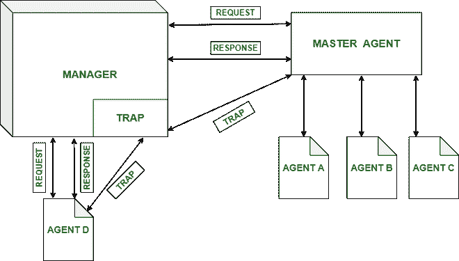

# SNMP v3

概述

> 原文:[https://www.geeksforgeeks.org/overview-of-snmpv3/](https://www.geeksforgeeks.org/overview-of-snmpv3/)

在本文中，我们将讨论计算机网络的 SNMPv3 体系结构。

SNMP 代表 [**标准网络管理协议**](https://www.geeksforgeeks.org/simple-network-management-protocol-snmp/) 。它基本上是一个互联网标准协议，用于通过发送和接收请求来监控和组织关于 IP 网络上设备的信息。该协议用于组织来自交换机、调制解调器、路由器、服务器、打印机等设备的信息。

目前，SNMP 有 3 个版本——SNMP v1、SNMPv2、SNMPv3。

SNMPv3 架构

**SNMP 在网络中的使用:**

*   它主要用于监控和组织网络资源。
*   这是一个标准的互联网协议，每个人都应该遵守。它为每个人的网络管理、数据库管理和组织数据对象设定了一个标准。
*   管理员计算机(管理员)使用 SNMP 监控网络中的客户端。
*   该协议允许使用管理信息库等应用程序进行管理活动。

**关于 SNMPv3 的特色:**

*   v3 是 SNMP 的最新版本，它涉及具有增强安全性的出色管理服务。
*   SNMPv3 体系结构使用基于用户的安全模型(USM)来保证消息的安全性&使用基于视图的访问控制模型(VACM)来访问对服务的控制。
*   SNMP v3 安全模型支持身份验证和加密。
*   SNMPv3 支持引擎标识标识符，它唯一标识每个 SNMP 标识。引擎标识用于生成验证消息的唯一密钥。
*   v3 通过验证用户身份和加密通过网络发送的数据包，提供对发送陷阱的设备的安全访问。
*   它还介绍了使用针对 MIB 对象的 SET 来配置和修改 SNMP 代理的能力。这些命令可以远程删除、修改、配置和添加这些条目。
*   USM–用于促进安全模块的远程配置和管理。
*   VACM–便于远程配置和管理控制模块的访问。

**SNMPv3 架构:**

v3 的架构包括–

*   数据定义语言，
*   管理信息库的定义
*   协议定义
*   安保和行政。

**版本 3 的机制:**

*   发送方和接收方之间的 16 字节密钥
*   三重数据加密标准
*   高级加密标准
*   数据加密标准密码块链接模式
*   MD5 消息摘要算法