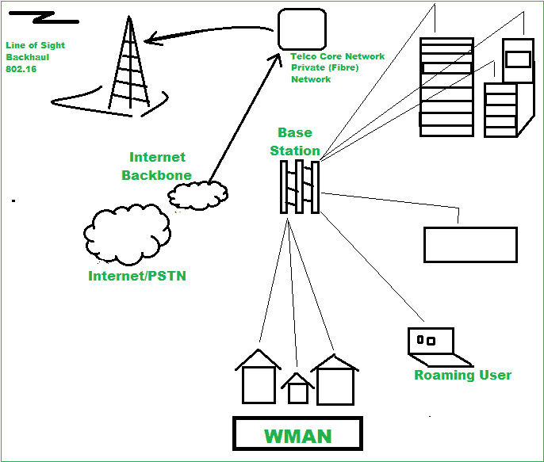

# 无线城域网(WMAN)概述

> 原文:[https://www . geesforgeks . org/overview-of-wireless-城域网-wman/](https://www.geeksforgeeks.org/overview-of-wireless-metropolitan-area-network-wman/)

**WMAN :** 无线城域网(WMAN)是[城域网(MAN)](https://www.geeksforgeeks.org/man-full-form-in-computer-networking/) 的一种，唯一的一点就是连接是无线的。它跨越一个地理区域内的多个位置，服务范围大于 100 米。这是一种无线网络，其覆盖面积大约相当于一个城市。一般来说，它跨越或覆盖的区域大于[无线局域网](https://www.geeksforgeeks.org/wlan-full-form/)，但小于无线广域网(WWAN)。WMAN 连接可以是点对点或点对多点网络。它是一种新型的网络技术，是对千兆以太网、弹性分组环(RPR)、SONET 等有线技术的补充。

WMAN 大部分由单一实体管理，如互联网服务提供商、政府实体或任何其他大公司。用户必须从提供商处获得授权访问才能使用 WMAN，因为访问仅限于授权用户/订户。
下图为 WMAN

**WMAN 类型:**
无线城域网有两种基本类型，即

**1。回程-**
这是一种企业类型的网络，蜂窝塔连接。它还可以使用 WiFi 热点。在这种类型的网络中，使用固定无线，这每年节省大量的钱。[数字用户线路(DSL)](https://www.geeksforgeeks.org/digital-subscriber-line-dsl/#:~:text=Related%20Articles&text=Digital%20Subscriber%20Line%20(DSL%2C%20originally,through%20copper%20wire%20telecommunication%20line.&text=Its%20aim%20is%20to%20maintain,of%20the%20internet%20being%20transfered.) 也可用于回程，但无线连接比普通光纤连接更快，成本更低。

**2。最后一英里–**
它用于临时网络，意味着网络需求是暂时的。像一些常规网络服务(如 DSL 宽带和电缆调制解调器)中断的大型建筑/场所。

**WMAN 特色:**

1.  连接可以是点对点或点对多点网络。
2.  从一个接入点向多个节点提供服务。
3.  覆盖半径达 50 公里的更大区域。
4.  与终端的稳定连接。

**WMAN 科技:**

1.  [无线互操作城域交换网(WiMAX)](https://www.geeksforgeeks.org/wimax-in-computer-network/)–
    WiMAX 主要使用基于 IEEE 802.16 标准集的无线城域网(WMAN)技术。它提供多物理层(PHY)和媒体访问控制(媒体访问控制)选项。它充当以太网的替代无线版本，部署在各种频谱频段:2.3 千兆赫、2.5 千兆赫、3.5 千兆赫和 5.8 千兆赫。

2.  **本地多点分布式服务(LMDS)–**
    是一种宽带微波无线传输技术，提供可靠的数字双向语音、数据和互联网服务。这是一种无线点到多点通信系统，因此被称为本地多点分配系统，其中本地指信号范围限制，多点指广播接入，分布式指大范围数据传输，服务指运营商和用户之间的关系。它通常使用低功率、高频率，即 25 至 31 千兆赫的短距离。

3.  **多通道多点分布式服务(MMDS)–**
    MMDS 以前被称为无线电缆或宽带无线电服务(BRS)。它是一种无线电信技术，工作在 2.5 千兆赫至 2.7 千兆赫之间的超高频无线电频谱部分，用于电信技术和通用宽带网络。

**WMAN 的好处:**

*   覆盖大都市区域内的多个地点。
*   在铺设光纤或铜缆以及租赁线路时，不需要高昂的基础设施成本。
*   作为有线网络的备份。
*   易于使用、扩展、交换。

**WMAN 示例:**

*   全球微波接入互操作性
*   维哥
*   在建建筑之间的联网。