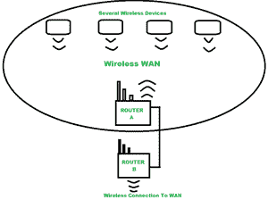

# 无线广域网(WWAN)概述

> 原文:[https://www . geesforgeks . org/overview-of-wireless-广域网-wwan/](https://www.geeksforgeeks.org/overview-of-wireless-wide-area-network-wwan/)

**WWAN :** WWAN(无线广域网)是一个 [WAN(广域网)](https://www.geeksforgeeks.org/wan-full-form/)唯一的是连接是无线的。它提供区域、全国和全球无线覆盖。在广域网可以是有线或无线的地方，无线广域网连接是完全无线的。在我们今天的生活中，我们使用不同大小的无线广域网，并依靠它来传送电话、网页和流式视频，实现数据共享。

[WLAN(无线局域网)](https://www.geeksforgeeks.org/wlan-full-form/)在技术方面与 WWAN(无线广域网)不同，例如当 WLAN 使用 [WiFi](https://www.geeksforgeeks.org/basics-of-wi-fi/) 连接和传输数据时，WWAN 使用电信蜂窝网络技术，如 2G、3G、4G LTE 和 5G 来传输数据。

WWAN 不仅总是指广阔的区域而不是封闭的区域，具有大的地理覆盖范围也被认为是 WWAN。例如在建筑物、塔或飞机上有节点的移动自组织网络。低功耗、低比特率的无线广域网也被认为是无线广域网。例如，在物联网应用的情况下，物与物之间的小信息包传输。

我们在日常生活中使用的 WWAN 的一个常见例子是，安装了 WWAN 卡的笔记本电脑建立了一个安全且最快的连接，并将我们带到网上，这样我们就可以在任何地方工作。

下图显示了与广域网的无线连接。

上图中，多台无线设备配置了路由器-A 服务的 [WLAN(无线局域网)](https://www.geeksforgeeks.org/wlan-full-form/)，路由器-B 是通过以太网连接到路由器-A 的无线路由器，通过 DD-WRT 无线闪连到 WAN(广域网)。

**WWAN 家族:**

WWAN 技术的三个主要家族包括

1.  GSM/UMTS
2.  [WiMAX](https://www.geeksforgeeks.org/wimax-in-computer-network/)
3.  [CDMA One/CDMA2000](https://www.geeksforgeeks.org/cdma-full-form/)

**WWAN 的特点:**

1.  与物理连接相比，传输速度降低。
2.  它基于 IEEE 802.16 标准。
3.  随着距离的增加，吞吐量下降，反之亦然。
4.  由于千兆级长期演进，速度更快。

**WWAN 的优势:**

*   全球无线覆盖
*   灵活的云管理、部署和重新定位
*   比无线局域网更好的安全性
*   面向数据应用的多样化、经济高效的备份。
*   快速部署新应用程序。

**WWAN 的缺点:**

*   更换丢失的 WWAN 可能成本很高。
*   保持可靠的网络连接。
*   构建经济高效的解决方案是一项挑战。
*   大覆盖区域期间吞吐量下降。