# 不同网络中的分组流

> 原文:[https://www . geesforgeks . org/packet-异网流/](https://www.geeksforgeeks.org/packet-flow-in-different-network/)

先决条件–[ARP 如何工作](https://www.geeksforgeeks.org/computer-network-arp-works/)、[数据包在同一网络中流动](https://www.geeksforgeeks.org/computer-network-packet-flow-network/)

要将数据包传送到目的主机，应该知道源 IP、目的 IP、源 MAC 地址和目的 MAC 地址。数据包流的一些基本规则:

1.  如果目的主机在同一个网络中，数据包将直接传送到目的主机。
2.  如果目的主机位于不同的网络中，则数据包首先被传送到默认网关，然后默认网关再将数据包传送到目的主机。
3.  如果没有解析 ARP，那么将首先解析 ARP。
4.  媒体访问控制地址从不跨越它的广播域。

**解释–**

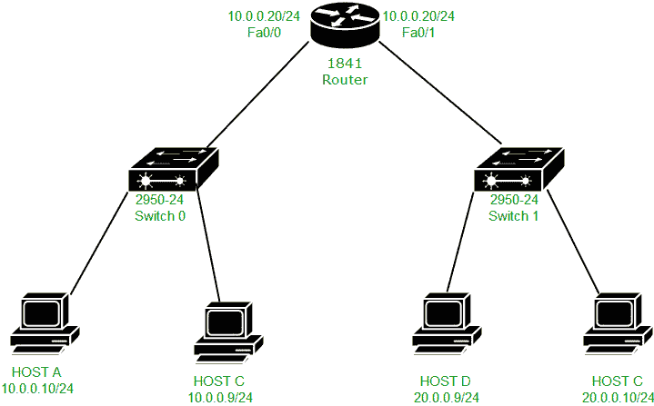

这里是一个拓扑，其中有主机 A (IP 地址–10 . 0 . 0 . 10 和 MAC 地址–000D。BD22.7C22)、主机 C (IP 地址–10 . 0 . 0 . 9)、主机 B (IP 地址–20 . 0 . 0 . 10)、主机 C (IP 地址-20.0.0.9 和 MAC 地址–00e 0。A3E2.03DC)和路由器(IP 地址–10 . 0 . 0 . 20 和 MAC 地址–000B。fa0/0 上的 BE8E.5201，IP 地址–20.0.0.20，MAC 地址–000B。fa0/1 上的 BE8E.5202)。

现在，我们将尝试从主机 A (IP 地址–10 . 0 . 0 . 10)ping 主机 B (IP 地址–20 . 0 . 0 . 10)。首先，源主机在源 IP 地址、源子网掩码和目的 IP 地址、源子网掩码之间执行**与运算**，以了解目的是否存在于相同或不同的网络中。

如果结果相同，则目的地在相同的网络中，否则在不同的网络中。这里，目的地存在于不同的网络中，因此，结果会不同，数据包将被传送到默认网关。

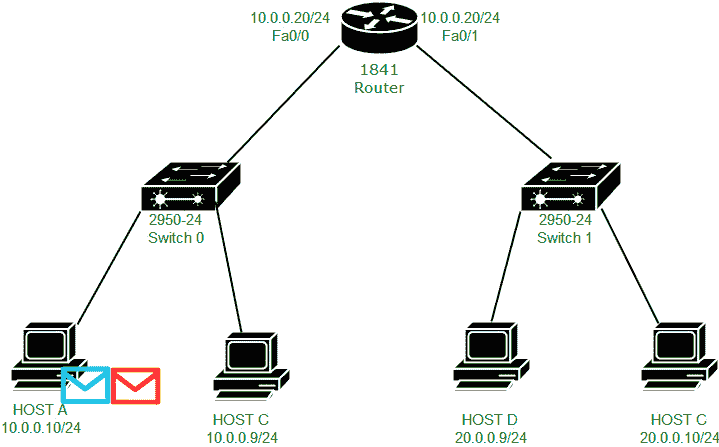

我们看到生成了两条消息:ICMP(紫色)和 ARP(绿色)。因为尚未解析 ARP，所以已生成 ARP。

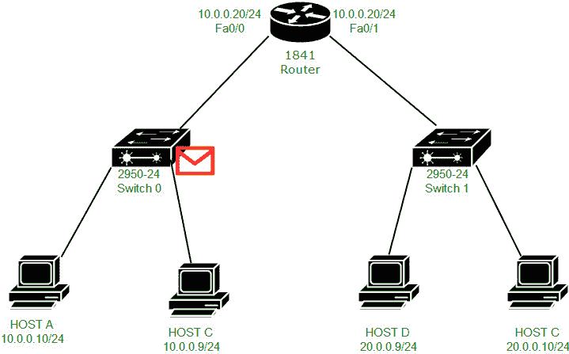

现在，由于应该首先解析 ARP，因此将广播由交换机接收的 ARP 请求:

交换机依次向主机和路由器广播 ARP 请求。电脑放弃请求，路由器接受请求。

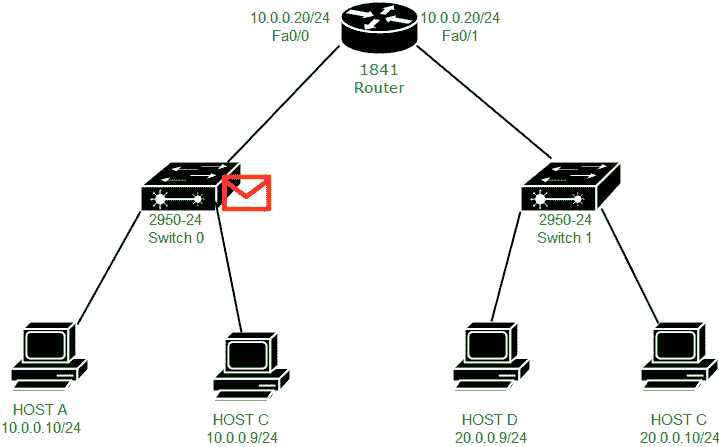

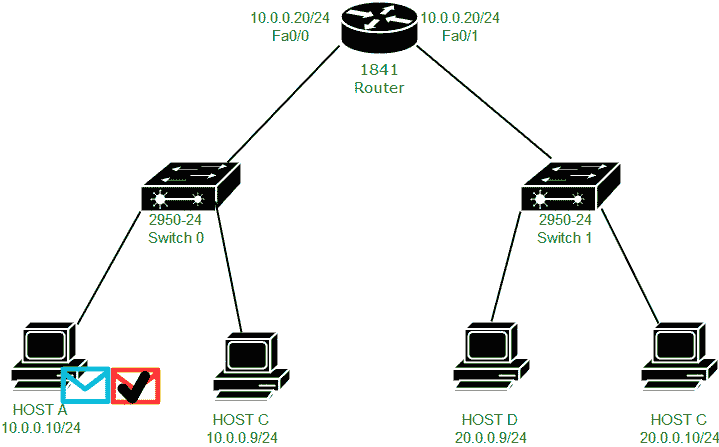

现在 ARP 回复被路由器单播到主机 A，如上图所示。

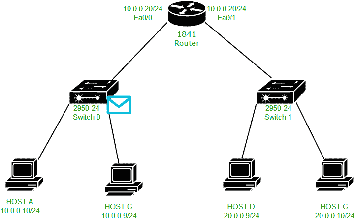

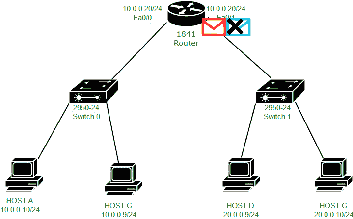

现在，ICMP 数据包将被单播到默认网关(IP 地址–10 . 0 . 0 . 20 和 MAC 地址–000B。BE8E.5201)如上图所示。

**注意–**由于 ARP 现已解决，ICMP 数据包将被单播到默认网关。

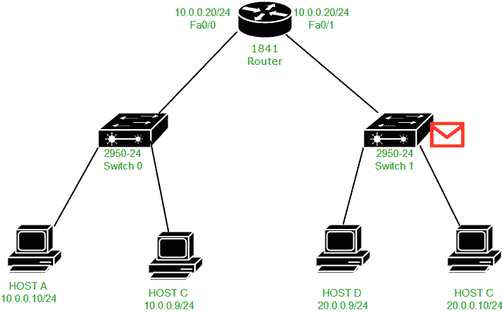

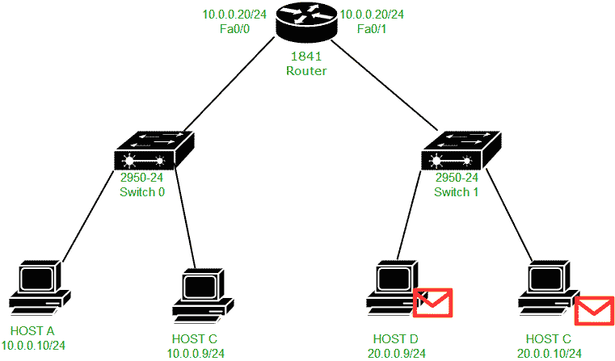

现在必须再次解析 ARP，因为路由器必须将数据包传送到主机 B，并且 ARP 表中没有主机 B 的条目。因此，ARP 请求在网络 20.0.0.0/24 中广播。交换机接收到数据包，然后向主机 B 和主机 D 广播该请求。主机 D 将拒绝该请求，主机 B 将接受该请求，并为媒体访问控制地址 000B 生成一个 ARP 回复。BE8E.5202(路由器 fa0/1 媒体访问控制地址)，因为必须向接收到 ARP 请求的媒体访问控制地址发送 ARP 回复。

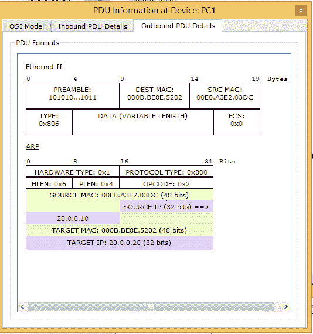

如图所示，ARP 回复数据包被单播到路由器的接口 fa0/1 MAC 地址(000B。BE8E.5202)，源 MAC 为 00E0.A3E2.03DC。

**注意–**这里，目标 MAC 地址是主机 B (000B)的 MAC 地址。BE8E.5202)。目标媒体访问控制地址是主机希望通过其 ARP 请求来解析 ARP 的设备的媒体访问控制地址。

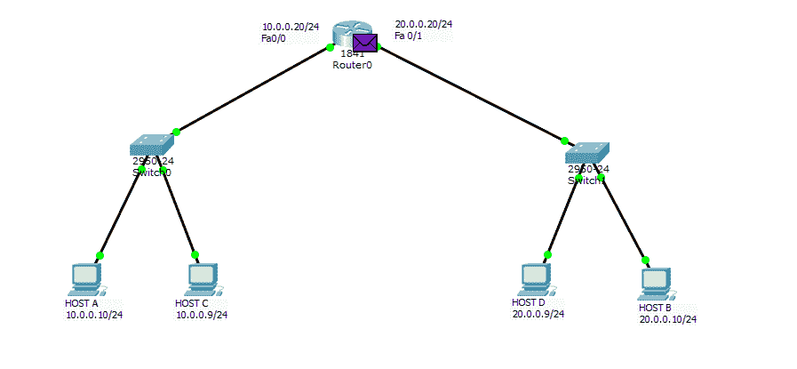

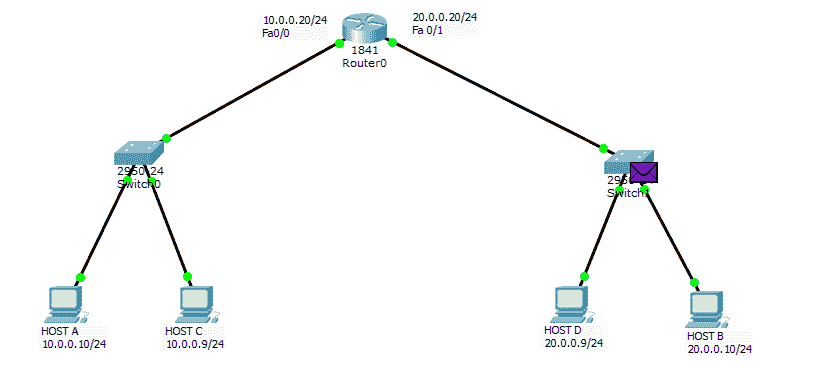

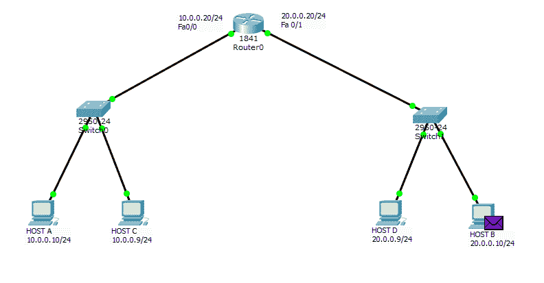

现在，ICMP 回应请求数据包将被单播到主机 B，如上图所示。

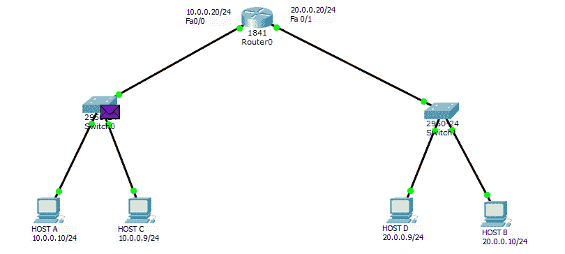

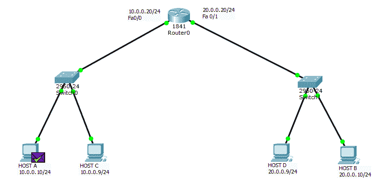

主机 B 将生成一个 ICMP 回送回复，以响应主机 A 的 ICMP 回送请求，该请求将首先传送到 20.0.0.20(路由器的接口 IP 地址)，然后单播到主机 A

****MAC 地址怎么从来不跨广播域？****

**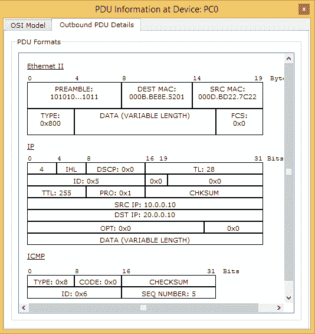**

**这是主机 A 将 ICMP 回应请求转发到其默认网关时的 IP 和以太网报头。因此源 IP 为 10.0.0.10，目的 IP 为 10.0.0.20，源 MAC 地址为 000D。BD22.7C22(主机 A MAC 地址)，目的 MAC 地址为 000B。BE8E.5201(路由器的 fa0/0 接口 MAC 地址)。**

**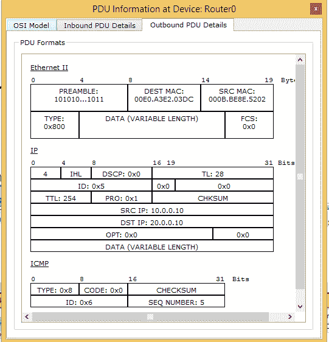**

**但是现在，当 ICMP 回应请求消息从路由器的 fa0/1 接口转发到主机 B 时，源 MAC 地址将更改为 000B。BE8E.5202(路由器的 fa0/1 接口 MAC 地址)，目的 MAC 地址为 00E0。A3E2.03DC(主机 B 的 MAC 地址)。**

**这里，路由器的 fa0/0 接口 MAC 地址不被用作源 MAC 地址，而是 fa0/1 MAC 地址被用作 MAC 地址。因此，fa0/0 不会在其他广播域(20.0.0.0/24 网络)中使用，因此 MAC 地址永远不会跨越其广播域。这样，PING 在两个不同的网络中执行。**