# 同一网络中的分组流

> 原文:[https://www . geesforgeks . org/packet-flow-in-同网/](https://www.geeksforgeeks.org/packet-flow-in-the-same-network/)

先决条件–[ARP 是如何工作的？](https://www.geeksforgeeks.org/computer-network-arp-works/)
要将数据包从源传输到目的地，目的地的 MAC 地址和 IP 地址都应该是已知的。如果目的地媒体访问控制地址不存在，那么 ARP 将首先解决这个问题，然后数据包将被传送到目的地主机。

网络中的数据包流有一些简单的规则:

1.  如果目的主机与源主机在同一个网络中，数据包将使用媒体访问控制地址直接传送到目的主机。
2.  在网络中，数据包将根据媒体访问控制地址传送。
3.  媒体访问控制地址从不跨越它的广播域。

现在，首先，我们要了解一下 ARP。

**地址解析协议–**
地址解析协议是第 2 层(数据链路层)协议，用于查找已知 IP 地址的 MAC 地址。

有一些与 ARP 相关的重要术语:

**ARP 缓存**是一个由 ARP 维护的表，包含一个 IP 地址及其相关的 MAC 地址和类型。如果媒体访问控制地址是动态学习的，那么类型将是动态的，如果媒体访问控制地址是手动添加的，那么类型将是静态的。

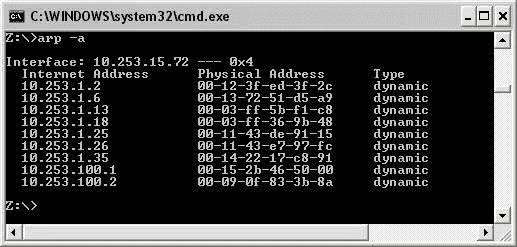

**ARP 请求**是在 ARP 最初没有解析的情况下，由源生成的查找目的 MAC 地址的广播消息。

**ARP 回复**是从目的地到源设备的单播消息，包含目的地 MAC 地址。

**解释–**

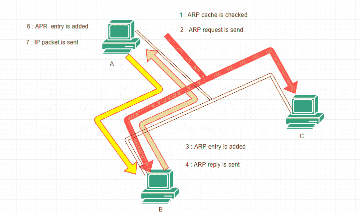

ARP 过程中包括的步骤如下

当源设备想要向目的设备发送数据包时，

1.如果解析或未解析 ARP，将检查源 ARP 缓存。如果 ARP 未被解析，它会暂停数据包并生成一个 ARP 请求。

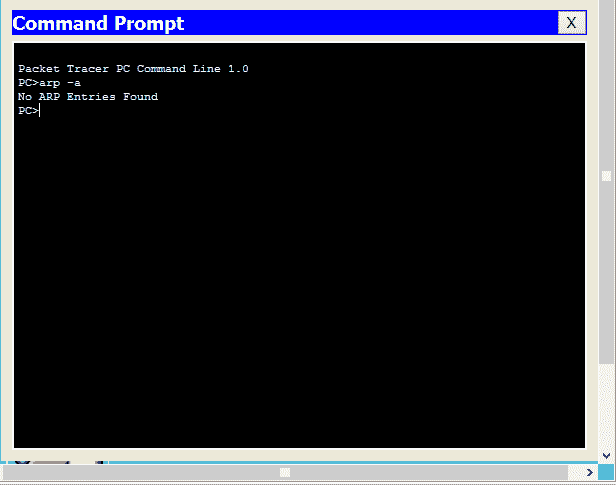

2.如果 ARP 已经被解析，那么数据包将被传送到目的主机。

3.ARP 请求会在整个网络上广播，以确定设备是否有目的 IP 地址。
**注意–**如果目的地在同一个网络中，那么 ARP 将找出目的地 MAC 地址，但是如果它在不同的网络中，那么 ARP 将找出默认网关 MAC 地址。

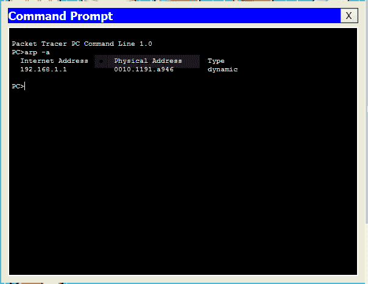

4.当拥有目的 IP 地址的设备收到 ARP 请求时，它会更新自己的 ARP 缓存。

5.目的主机生成一个包含自己的媒体访问控制地址的 ARP 回复。

6.现在，拥有源 IP 地址的设备接收到 ARP 回复并更新其 ARP 缓存。

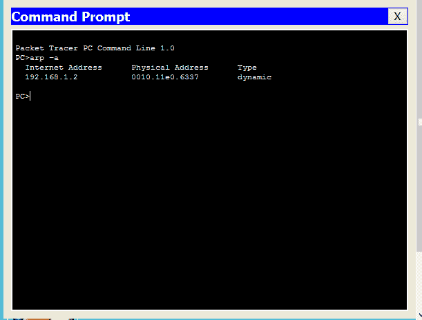

7.因为现在源和目的地的 IP 地址和 MAC 地址都可用，所以数据包被传送到目的地主机。

现在，我们已经了解了 ARP 协议。让我们看看**包流**。

现在，我们将了解当目的地位于同一网络(源的网络)中时，数据包是如何传递到目的地的。

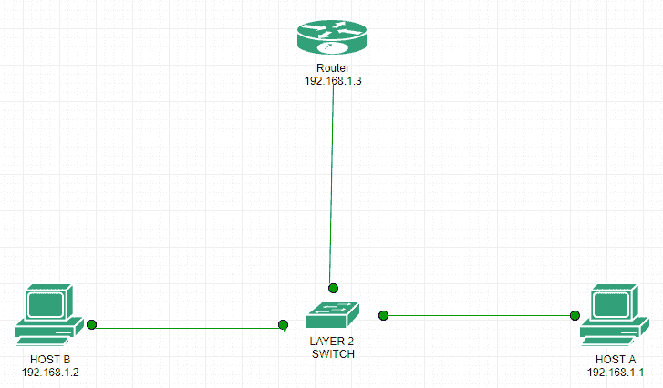

以下是主机 A 的 IP 地址为 192.168.1.1，主机 B 的 IP 地址为 192.168.1.2，路由器的接口 fa0/0 上的 IP 地址为 192.168.1.3 的拓扑结构。

现在如何源设备将知道目的地存在于相同或不同的网络中。让我们明白:-

**在源 IP 地址、源子网掩码和目的 IP 地址、源子网掩码之间进行“与”运算**。如果两者的结果相同，则目的地在同一网络中，否则在不同的网络中。

让我们尝试从主机 a ping 主机 B。

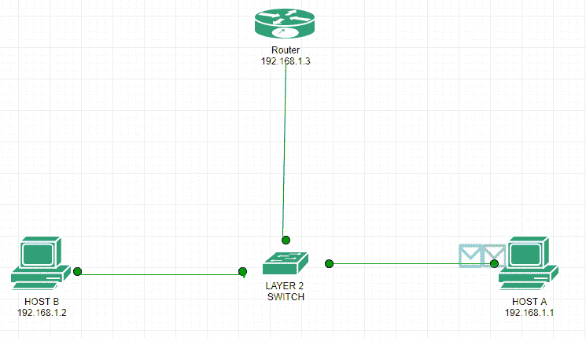

如您所见，生成了两个数据包，一个是 ICMP，另一个是 ARP(绿色)。生成 ARP 帧是因为主机 A 尚未与主机 B 通信，即 ARP 尚未解析，即 ARP 将首先解析，以便主机 A 拥有主机 B 的 MAC 地址条目。

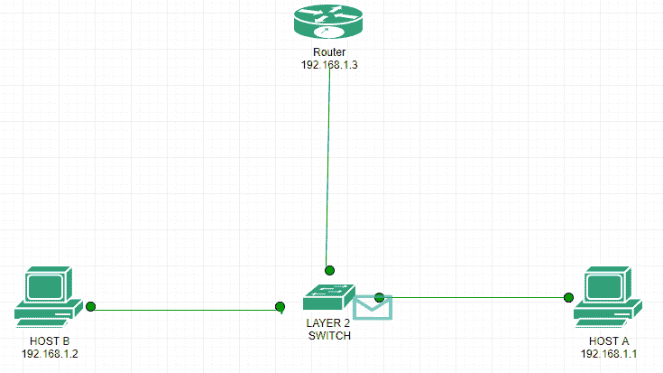

如前所述，因为路由器不转发广播数据包，所以 ARP 请求将首先针对网络中的目标 IP 地址进行广播。如上图所示，交换机接收到广播请求。

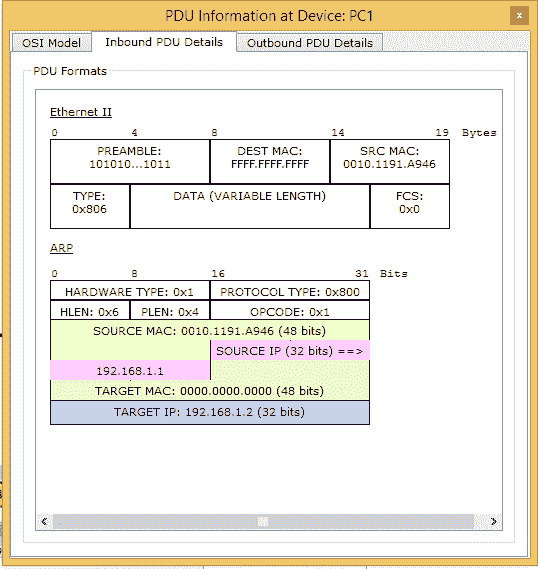

交换机广播 ARP 请求，因为以太网报头中的条目是 FFFF。FFFF FFFF(广播媒体访问控制地址)。

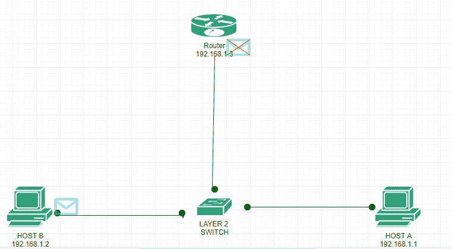

主机 B 收到该请求，如上图所示。主机 B 立即生成一个 ARP 回复，指定自己的媒体访问控制地址。

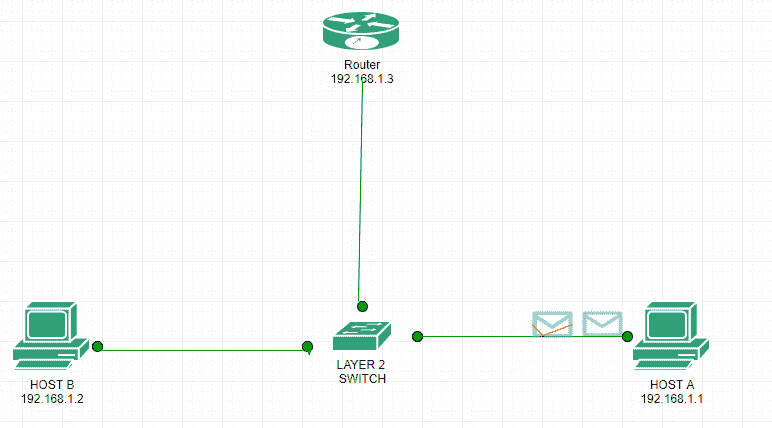

现在，主机 B 向主机 A 单播 ARP 回复，该回复由交换机接收，然后转发给主机 A，如上图所示。

**注意–**
交换机能够单播回复，因为当主机 A 广播 ARP 请求时，交换机在其 MAC 表中为主机 A 添加了一个条目。同样，当交换机接收到 ARP 请求时，交换机也为主机 B 添加了一个条目

ARP 回复。

 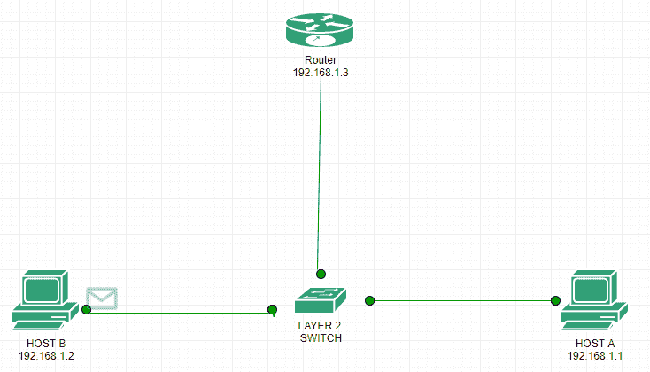

现在 ARP 已经解决，ICMP 将从主机 A 单播到主机 B(如上所示)。

 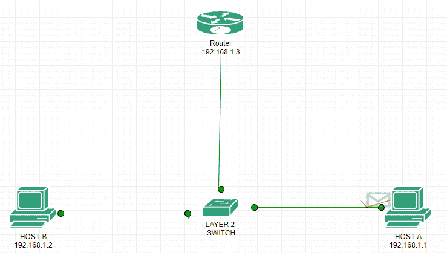

现在，ICMP 确认数据包将从主机 B 单播到主机 A，即主机 B 从主机 A 成功 ping 通，如上图所示。