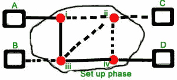
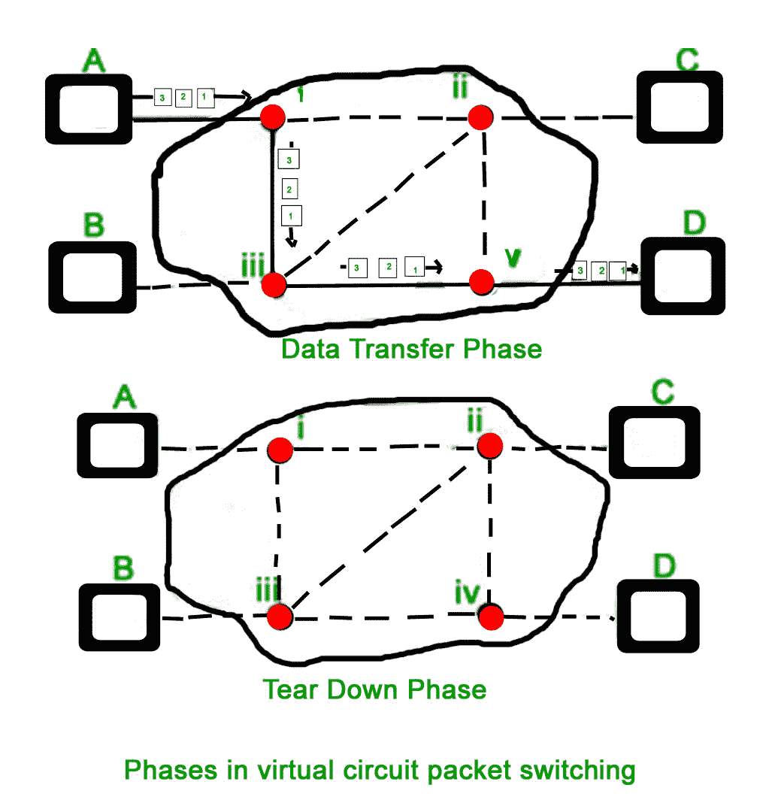
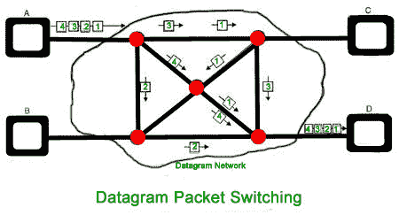

# 计算机网络中的分组交换和延迟

> 原文:[https://www . geeksforgeeks . org/分组交换和计算机网络延迟/](https://www.geeksforgeeks.org/packet-switching-and-delays-in-computer-network/)

**分组交换**是一种以分组的形式将数据传输到网络的方法。为了在网络上快速高效地传输文件，并最大限度地减少传输延迟，数据被分成可变长度的小块，称为**数据包**。在目的地，所有这些小的部分(包)必须重新组装，属于同一个文件。数据包由有效载荷和各种控制信息组成。不需要预先设置或预留资源。

分组交换在交换分组时使用**存储和转发**技术；转发数据包时，每一跳首先存储该数据包，然后转发。这种技术非常有益，因为由于某种原因，数据包可能会在任何一跳被丢弃。一对源和目的地之间可能有多条路径。每个数据包都包含源地址和目的地址，它们独立地通过网络传输。换句话说，属于同一文件的数据包可能会也可能不会通过同一路径。如果某条路径出现拥塞，数据包可以在现有网络上选择不同的路径。

分组交换网络旨在克服电路交换网络的弱点，因为电路交换网络对于小消息不是很有效。

**分组交换相对于电路交换的优势:**

*   在带宽方面更有效率，因为保留电路的概念不存在。
*   最小传输延迟。
*   更可靠，因为目的地可以检测到丢失的数据包。
*   容错性更高，因为与电路交换不同，在任何链路断开的情况下，数据包都可能遵循不同的路径。
*   性价比高，实施起来也相对便宜。

**分组交换在电路交换上的劣势:**

*   分组交换没有按顺序给分组，而电路交换提供了分组的有序传递，因为所有的分组都遵循相同的路径。
*   由于数据包是无序的，我们需要为每个数据包提供序列号。
*   每个节点的复杂性都更高，因为它可以遵循多条路径。
*   传输延迟更多是因为重路由。
*   分组交换仅对小消息有益，但对突发数据(大消息)电路交换更好。

**分组交换模式:**

**1。面向连接的分组交换(虚拟电路):**
在开始传输之前，它使用信令协议在发送方和接收方之间建立逻辑路径或虚拟连接，并且属于该流的所有分组将遵循该预定义的路由。虚拟电路标识由交换机/路由器提供，用于唯一标识该虚拟连接。数据被分成小单元，所有这些小单元都在序列号的帮助下被追加。总的来说，这里有三个阶段——设置、数据传输和拆除阶段。

 

所有地址信息仅在设置阶段传输。一旦发现到目的地的路由，条目就被添加到每个中间节点的交换表中。在数据传输过程中，数据包报头(本地报头)可能包含长度、时间戳、序列号等信息。
面向连接的交换在交换广域网中非常有用。使用虚拟电路交换方法的一些流行协议是 x25、帧中继、自动柜员机和多协议标签交换。

**2。无连接分组交换(数据报):**
与面向连接的分组交换不同，在无连接分组交换中，每个分组包含所有必要的寻址信息，如源地址、目的地址和端口号等。在数据报分组交换中，每个分组都被独立处理。属于一个流的数据包可能会采用不同的路由，因为路由决策是动态做出的，所以到达目的地的数据包可能会出现故障。它没有连接建立和拆卸阶段，就像虚拟电路一样。
无连接分组交换中不能保证分组传递，因此必须由使用附加协议的终端系统提供可靠的传递。



```
A---R1---R2---B

A is the sender (start)
R1, R2 are two routers that store and forward data
B is receiver(destination)
```

从 A 向 B 发送数据包会有延迟，因为这是一个存储转发网络。

### 分组交换中的延迟:

1.  传输延迟
2.  传播延迟
3.  排队延迟
4.  处理延迟