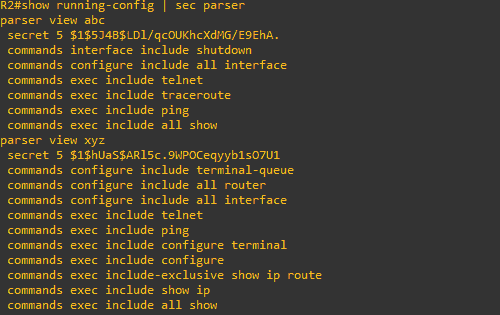
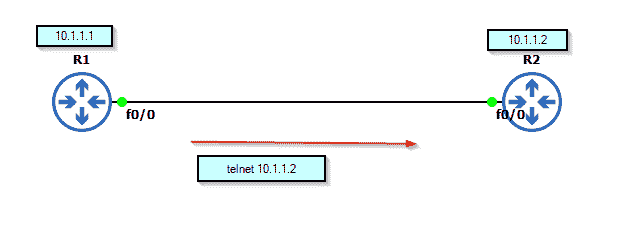
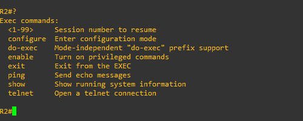

# 解析器视图(基于角色的命令行界面访问)

> 原文:[https://www . geesforgeks . org/parser-view-基于角色-cli-access/](https://www.geeksforgeeks.org/parser-view-role-based-cli-access/)

先决条件–[**基于角色的访问控制**](https://www.geeksforgeeks.org/role-based-access-control/)

解析器视图用于创建或修改基于角色的 CLI 访问视图，并进入视图配置模式，为访问网络资源提供安全性。

修改解析器视图的命令:

1.  **包括**:在视图中添加任何命令
2.  **排除**:删除任何命令
3.  **include-exclusive**:include 命令独占解析器视图，不包括其他视图(如果有)。

解析器视图可以通过使用本地数据库(设备的运行配置)来实现。在这里，我们将讨论仅在本地设备上的解析器视图配置，并通过另一台路由器 telnet 相同的内容，并使用不同的视图访问其 CLI:

**配置:**

*   **在路由器(R2)上启用 AAA:**

```
R2(config)#aaa new-model
R2(config)#enable secret cisco123
R2(config)#aaa authentication login default local
R2(config)#aaa authorization exec default local
R2(config)#exit
```

*   **进入根视图创建自定义视图:**

```
R2#enable view
```

*   **创建自定义解析器视图–ABC&XYZ:**

```
R2(config)#parser view abc 
R2(config-view)#secret 123
R2(config-view)#commands exec include ping 
R2(config-view)#commands exec include all show
R2(config-view)#commands exec include telnet
```

```
R2(config)#parser view xyz
R2(config-view)#secret 234
R2(config-view)#commands exec enclude ping
R2(config-view)#commands exec enclude telnet
R2(config-view)#commands exec enclude all show
R2(config-view)#commands exec enclude configure terminal
R2(config-view)#commands configure include all interfaces
R2(config-view)#commands configure include all router
R2(config-view)#commands interface include shutdown 
R2(config-view)#commands interface include no shutdown 
```

*   **将解析器视图与本地数据库绑定，并编写所有配置:**

```
R2(config)#username sam view abc password 123
R2(config)#username ram view xyz password 234
R2(config)#do write
```

*   **查看解析器视图及其相关命令:**

```
R2#show running-config | sec parser
```



running-config(本地数据库)中的解析器视图配置

*   **通过 R1 路由器远程登录 R2 路由器:**

```
R1#telnet 10.1.1.2
```

(输入与之相关的用户名和密码，telnet 将会成功)



*   **您可以使用以下命令启用视图:**

```
R2#enable view abc
(enter the password for view abc)
```

*   **要检查当前视图有多少个命令，请键入“？”:**

```
R2#?
(list of commands in the current view as shown in the image below)
```

