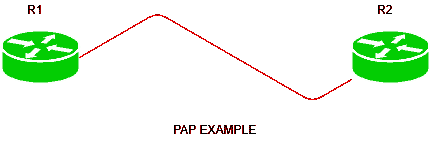

# 密码认证协议(PAP)

> 原文:[https://www . geesforgeks . org/password-authentication-protocol-pap/](https://www.geeksforgeeks.org/password-authentication-protocol-pap/)

有两种简单的方法来认证 PPP 链路，即密码认证协议(PAP)和[挑战握手认证协议(CHAP)](https://www.geeksforgeeks.org/computer-network-challenge-handshake-authentication-protocol-chap/) 。

从这两种身份验证协议来看，PAP 的安全性较低，因为密码是以明文形式发送的，并且只在初始链路建立时执行。

**密码认证协议(PAP)–**
PAP 是 PPP 链路用来验证用户的密码认证协议。PAP 身份验证要求呼叫设备输入用户名和密码。如果凭证与被叫设备的本地数据库或远程 AAA 数据库匹配，则允许访问，否则拒绝访问。

**功能–**
PAP 的一些功能有:

1.  密码以明文形式发送。

2.  所有网络操作系统都支持 PAP。

3.  它使用双向握手协议。

4.  它是非交互式的。

5.  PAP 支持单向身份验证(单向)和双向身份验证(双向)。

**配置–**



有一个小拓扑，其中有两台路由器，即 R1 和 R2。R1 在 s0/0 上的 IP 地址为 10.1.1.1/30，R2 在 s0/0 上的 IP 地址为 10.1.1.2/30。

首先，我们将通过提供用户名和密码在 R1 创建一个本地数据库:

```
R1(config)#username Router1 password GeeksforGeeks 
```

在 R2 配置本地数据库:

```
R2(config)#username Router2 password GeeksforGeeks 
```

请记住，默认情况下，HDLC 是在思科路由器上配置的，因此首先我们必须将封装更改为 PPP 并启用 PAP。

```
R1(config)# int s0/0
R1(config-if)#encapsulation ppp
R1(config-if)#ppp authentication pap 
R1(config-if)#ppp pap sent-username Router2 password GeeksforGeeks 
```

在 R2 启用 PAP:

```
R2(config)# int s0/0
R2(config-if)#encapsulation ppp
R2(config-if)#ppp authentication pap
R2(config-if)#ppp pap sent-username Router1 password GeeksforGeeks 
```

这里，请注意用户名和密码区分大小写。此外，在路由器 R1 上，我们必须给出用户名和密码。

**注意–**
在单向认证的情况下，也可以在想要认证的路由器(主叫路由器)上使用该命令，即只有主叫路由器进行认证。
如果双向身份验证正在运行，即客户端和远程设备都将相互进行身份验证，那么我们必须创建一个本地数据库，并在两个设备上使用此命令。

此外，如果我们想在 CHAP 失败时首先使用 CHAP 并使用 PAP 作为备份，我们可以通过命令进行配置。

```
R1(config)#int s0/0 
R2(config-if)#ppp authentication chap pap
```

此外，如果我们希望 CHAP 作为备份，请使用命令。

```
R1(config)#int s0/0 
R2(config-if)#ppp authentication pap chap
```

**何时使用 PAP–**
PAP 通常用于以下场景:

1.  当应用程序不支持 CHAP 时。

2.  需要发送纯文本密码来模拟在被叫设备(远程主机)上登录的情况。

3.  当 CHAP 的不同供应商之间出现不兼容时。

**CHAP 相对于 PAP 的优势–**
一些优势是:

1.  CHAP 比 PAP 更安全。

2.  CHAP 可以定期提供身份验证，以识别访问 PPP 链路的用户是否相同。

3.  在 CHAP 中，真实密码从不在链路上共享，而是计算并传输其哈希值。

**PAP 相对于 CHAP 的优势–**
PAP 相对于 CHAP 的唯一优势是它得到了所有网络操作系统供应商的支持，因此可以说 PAP 被用在了不支持 CHAP 的地方。但是如果支持 CHAP，则建议使用 CHAP，因为这样更安全。