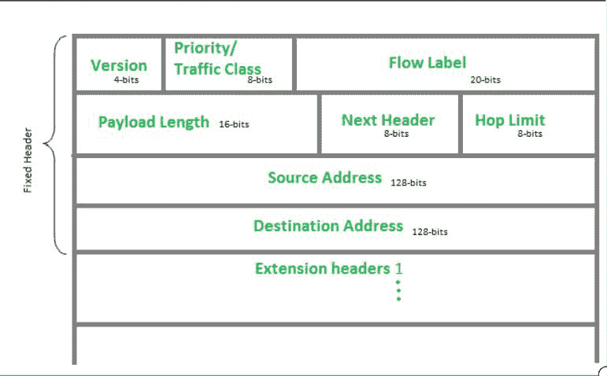
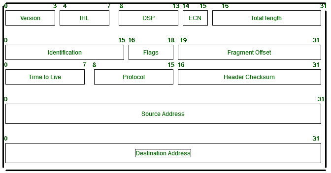

# 计算机网络中的有效载荷

> 原文:[https://www.geeksforgeeks.org/payload-in-computer-networks/](https://www.geeksforgeeks.org/payload-in-computer-networks/)

**有效载荷**通过互联网协议从发送方向接收方传输数据期间。数据以数据包的形式发送，单个数据包包含一个报头，由发送方发送的数据称为有效负载。报头被附加到用于传输的有效载荷上，然后在它们成功到达目的地时被丢弃。他们转移病毒的主要来源是有效载荷

IPv6:



这是最新的 IPv6 报头格式。有效载荷的长度为 16 位。

**有效载荷长度:**

1.  有效负载长度列显示了 1Pv6 中数据有效负载的长度。
2.  有效负载长度字段是上图中 IPv6 的长度，不包括报头跳跃限制的长度，但这些字段在有效负载长度字段中。
3.  该字段的 16 位大小将其最大值限制为 65，535 (64KB)，这适用于有效负载长度。

IP v4:



*   整个 IP 数据包的长度(包括 IP 报头和 IP 有效负载)。
*   IP 数据包封装了从网络层接收的数据单元，并添加到自己的报头信息中。封装的数据被称为 IP 负载。
*   此字段长度的 16 位大小。

**有效载荷示例:**

1.  在编程中，发送数据的术语是 JSON 格式和 XML 格式:

    ```
    { “data”: { “message”: “Welcome, GFG!” } } 
    ```

2.  在互联网中，安全负载就像黑客在发现他们执行恶意软件的特定系统的漏洞后最重要的工具，称为恶意软件负载。它们在网络钓鱼电子邮件的帮助下分发，并将有效负载与其他应用程序绑定。今天的黑客对有效载荷进行加密，因此网络安全和系统安全部门无法找到有效载荷的签名。
3.  有效载荷包括数据破坏、带有侮辱性文本的消息或发送给大量人员的大量电子邮件。