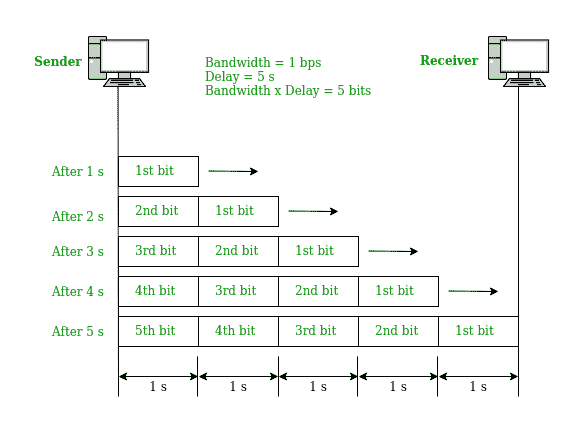
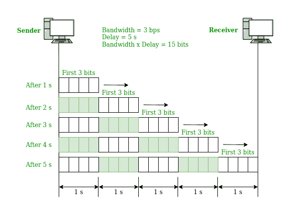
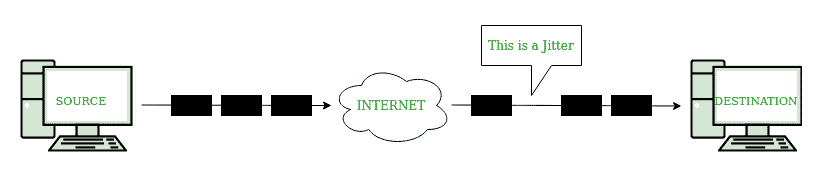

# 网络性能

> 原文:[https://www.geeksforgeeks.org/performance-of-a-network/](https://www.geeksforgeeks.org/performance-of-a-network/)

网络性能与用户感知的网络服务质量的度量有关。根据网络的性质和设计，有不同的方法来衡量网络的性能。衡量网络性能的特征有:

*   带宽
*   吞吐量
*   延迟(延迟)
*   带宽-延迟乘积
*   振动

**带宽**
网站性能的最基本条件之一是分配给网络的带宽量。带宽决定了网络服务器上传请求信息的速度。虽然网站的性能需要考虑不同的因素，但带宽仍然是制约因素。

带宽的特征是可以在固定时间内传输的数据或信息的度量。该术语可以在两个不同的上下文中使用，具有两个不同的估计值。对于数字设备，带宽以每秒位数(bps)或每秒字节数来衡量。就模拟设备而言，带宽以每秒周期或赫兹(Hz)为单位进行测量。

带宽只是个人眼中网络速度的一个组成部分。鉴于互联网服务提供商(ISPs)倾向于声称他们在广告活动中拥有快速的“40Mbps 连接”，人们经常将带宽误认为互联网速度。真正的互联网速度实际上是你每秒钟接收的数据量，这也与延迟有很大关系。
**“带宽”表示“容量”，“速度”表示“传输速率”。**

更大的带宽并不意味着更高的速度。让我们举一个例子，我们有两倍的自来水管宽度，但是水的流量仍然和自来水管宽度的一半时一样。因此，速度不会提高。当我们考虑广域网链路时，我们主要是指带宽，但当我们考虑局域网时，我们主要是指速度。这是因为我们通常受限于广域网上昂贵的电缆带宽，而不是局域网上的硬件和接口数据传输速率(或速度)。

*以赫兹为单位的带宽:*它是复合信号中包含的频率范围或信道可以通过的频率范围。例如，让我们将用户电话线的带宽视为 4 千赫。

*每秒比特数的带宽:*指的是一条信道、一条链路或者更确切地说一个网络每秒可以传输的比特数。例如，我们可以说快速以太网的带宽最大为 100 Mbps，这意味着网络可以发送 100 Mbps 的数据。

***注:**以赫兹为单位的带宽和以比特每秒为单位的带宽之间存在明确的关系。以赫兹为单位的带宽增加意味着以比特每秒为单位的带宽增加。这种关系取决于我们使用的是基带传输还是调制传输。*

**吞吐量**
吞吐量是单位时间内成功传输的消息数。它由可用带宽、可用信噪比和硬件限制控制。因此，网络的最大吞吐量可能高于日常消费中实现的实际吞吐量。术语“吞吐量”和“带宽”通常被认为是相同的，但它们是不同的。带宽是对链路的潜在度量，而吞吐量是对我们发送数据的速度的实际度量。

吞吐量是通过将特定时间段内多个位置之间传输的数据量制成表格来衡量的，通常以每秒比特数(bps)为单位，该单位已发展为每秒字节数(Bps)、每秒千字节数(KBps)、每秒兆字节数(MBps)和每秒千兆字节数(GBps)。吞吐量可能会受到许多因素的影响，例如底层模拟物理介质的阻碍、系统组件的可用处理能力以及最终用户行为。当考虑大量协议费用时，传输数据的使用率可能明显低于可实现的最大吞吐量。

**让我们考虑一下:**一条可以移动的高速公路，比如说一次可以移动 200 辆车。但是在一个随机的时间，有人只注意到，比如说，由于道路上的一些拥堵，有 150 辆车通过。因此，单位时间的生产能力可能是 200 辆车，而生产能力可能是 150 辆车。

**示例:**

```
Input:A network with bandwidth of 10 Mbps can pass only an average of 12, 000 frames 
per minute where each frame carries an average of 10, 000 bits. What will be the 
throughput for this network?

Output: We can calculate the throughput as-
Throughput = (12, 000 x 10, 000) / 60 = 2 Mbps
The throughput is nearly equal to one-fifth of the bandwidth in this case.
```

关于带宽和吞吐量的区别，[参考](https://www.geeksforgeeks.org/difference-between-bandwidth-and-throughput/)。

**延时**
在网络中，在数据通信过程中，延时(也称为延迟)被定义为一条完整的消息到达目的地所花费的总时间，从消息的第一位从源发送出去的时间开始，到消息的最后一位到达目的地的时间结束。出现小延迟的网络连接称为“低延迟网络”，出现长延迟的网络连接称为“高延迟网络”。

高延迟会导致任何网络通信出现瓶颈。它会阻止数据充分利用网络管道，并最终降低通信网络的带宽。延迟对网络带宽的影响可能是暂时的，也可能是永无止境的，这取决于延迟的来源。延迟也称为 ping 速率，以毫秒(ms)为单位。

简单来说:延迟可以定义为通过网络成功发送数据包所需的时间。

*   它是用很多方式来衡量的，比如往返、单程等。
*   它可能会受到链中用于传输数据的任何组件的影响，如工作站、广域网链路、路由器、局域网、服务器，最终可能会受到光速的限制。

```
Latency = Propagation Time + Transmission Time + Queuing Time + Processing Delay
```

**传播时间:**是一个比特从源到目的地所需的时间。传播时间可以计算为通信介质上链路长度(距离)和传播速度之间的比率。例如，对于电信号，传播时间是信号通过导线所花费的时间。

```
Propagation time = Distance / Propagation speed
```

**示例:**

```
Input: What will be the propagation time when the distance between two points is
12, 000 km? Assuming the propagation speed to be 2.4 * 10^8 m/s in cable.

Output: We can calculate the propagation time as-
Propagation time = (12000 * 10000) / (2.4 * 10^8) = 50 ms 
```

**传输时间:**传输时间是基于信号沿传输线路发送所需时间的时间。它包括电磁信号从一端传播到另一端的时间成本，或者像发送方通常放在数据包前面的训练信号这样的成本，这有助于接收方同步时钟。消息的传输时间取决于消息的大小和信道的带宽。

```
Transmission time = Message size / Bandwidth
```

**示例:**

```
Input:What will be the propagation time and the transmission time for a 2.5-kbyte 
message when the bandwidth of the network is 1 Gbps? Assuming the distance between
sender and receiver is 12, 000 km and speed of light is 2.4 * 10^8 m/s.

Output: We can calculate the propagation and transmission time as-
Propagation time = (12000 * 10000) / (2.4 * 10^8) = 50 ms
Transmission time = (2560 * 8) / 10^9 = 0.020 ms

Note: Since the message is short and the bandwidth is high, the dominant factor is the
propagation time and not the transmission time(which can be ignored).
```

**排队时间:**排队时间是基于数据包必须在路由器中停留多长时间的时间。线路经常占线，因此我们无法立即传输数据包。排队时间通常不是一个固定的因素，因此它随着网络中的负载推力而变化。在这种情况下，数据包在队列中等待，准备发送。这些延迟的主要特征是系统流量的度量。流量越多，数据包越有可能卡在队列中，只是坐在内存中等待。

**处理延迟:**处理延迟是基于路由器计算出数据包发送到哪里所需时间的延迟。路由器一发现，就会将数据包排队等待传输。这些成本主要基于协议的复杂性。路由器必须解密足够多的数据包，才能知道将数据包放入哪个队列。通常，堆栈的较低层有更简单的协议。如果路由器不知道将数据包发送到哪个物理端口，它会将数据包发送到所有端口，并立即将数据包排入多个队列。不同的是，在更高的层次上，像在 IP 协议中，处理可以包括在排队传输分组之前发出 ARP 请求以找出目的地的物理地址。这种情况也可以被认为是处理延迟。

**带宽-延迟乘积**
带宽和延迟是链路的两个性能指标。然而，在数据通信中重要的是两者的乘积，即带宽延迟乘积。

让我们举两个假设的例子。

**情况 1:** 假设链路带宽为 1bps，链路延迟为 5s。让我们找到这种情况下的带宽延迟积。从图片中，我们可以说这个产品 1 x 5 是可以填充链接的最大位数。链路上任何时候都可能有近 5 位。



**情况 2:** 假设链路带宽为 3bps。从图像中，我们可以说线路上最多可以有 3 x 5 = 15 位。原因是，在每一秒，线路上有 3 个比特，每个比特的持续时间是 0.33 秒。



对于这两个例子，带宽和延迟的乘积是可以填充链路的位数。在我们必须以突发形式发送数据并在发送下一个突发之前等待每个突发的确认的情况下，这种估计是有意义的。为了利用链路的最大能力，我们必须使突发的大小是带宽和延迟的乘积的两倍。此外，我们需要填满全双工通道。发送方应该发送(2 *带宽*延迟)位的数据突发。此时，发送方在发送另一个突发之前，会等待接收方对部分突发的确认。数量:2 *带宽*延迟是在任何时候可以转换的位数。

**抖动**
抖动是另一个与延迟相关的性能问题。用技术术语来说，抖动是一种“数据包延迟差异”。它可以简单地表示，当不同的数据包在网络中面临不同的延迟，并且接收器应用程序中的数据是时间敏感的，即音频或视频数据时，抖动被认为是一个问题。抖动以毫秒(ms)为单位。它被定义为正常发送数据包顺序中的干扰。例如:如果第一个数据包的延迟为 10 毫秒，第二个数据包的延迟为 35 毫秒，第三个数据包的延迟为 50 毫秒，则使用数据包的实时目的地应用程序会出现抖动。

简而言之，抖动是高频数字信号中信号脉冲的任何偏差或位移。偏差可能与信号脉冲的幅度、宽度或相位定时有关。抖动的主要原因是电磁干扰和信号间的串扰。抖动会导致显示屏闪烁，影响台式机或服务器中处理器按预期运行的能力，在音频信号中引入咔哒声或其他不良影响，并丢失网络设备之间传输的数据。

抖动是负面的，会导致网络拥塞和数据包丢失。

*   拥堵就像高速公路上的交通堵塞。在交通堵塞时，汽车不能以合理的速度前进。就像堵车一样，在拥堵的时候，所有的包同时来到一个路口。什么都装不下。
*   第二个负面影响是丢包。当数据包在意外的时间间隔到达时，接收系统无法处理信息，这导致信息丢失，也称为“数据包丢失”。这对视频观看有负面影响。如果视频像素化并跳过，则网络会出现抖动。抖动的结果是丢包。当你在网上玩游戏时，数据包丢失的影响可能是玩家开始在屏幕上随机移动。更糟糕的是，游戏从一个场景跳到下一个场景，跳过了游戏的一部分。



在上图中，可以注意到，发送数据包所需的时间与他到达接收方的时间不同。其中一个数据包在途中面临意外延迟，在预期时间后收到。这就是抖动。

抖动缓冲器可以减少抖动的影响，无论是在网络中、在路由器或交换机上，还是在计算机上。目的地接收网络数据包的系统通常从缓冲区接收，而不是直接从源系统接收。每个数据包都以固定的速率从缓冲器中送出。在流量有多条路径的情况下，另一种减少抖动的方法是有选择地沿着最稳定的路径路由流量，或者总是选择最接近目标数据包传送速率的路径。