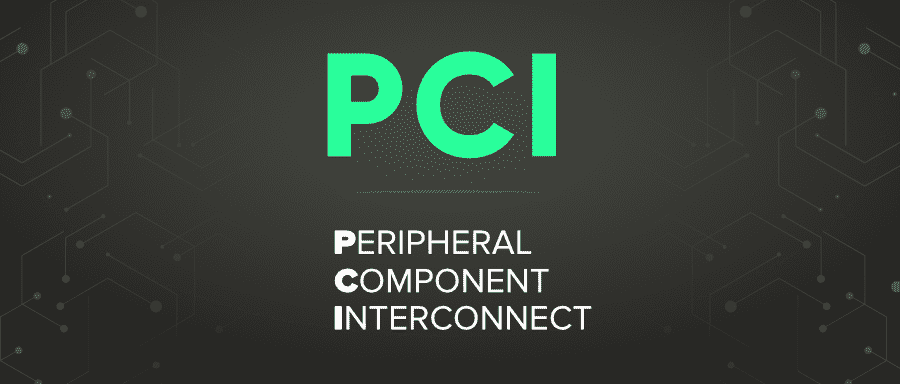
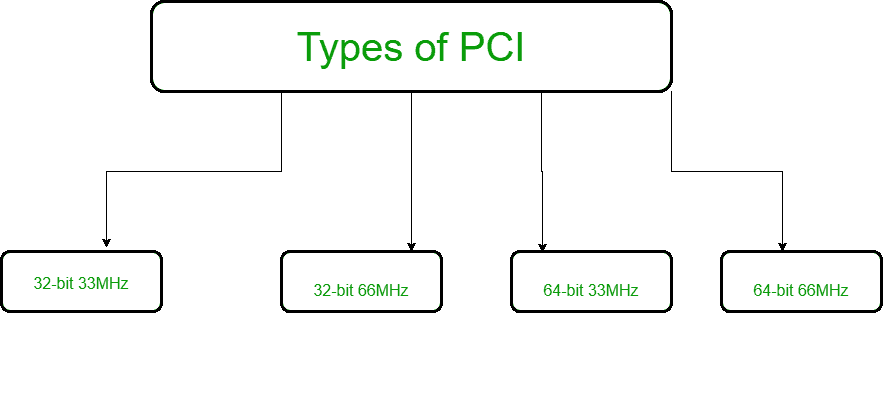

# 外围组件互连(PCI)

> 原文:[https://www . geesforgeks . org/外设-组件-互连-pci/](https://www.geeksforgeeks.org/peripheral-component-interconnect-pci/)

PCI 代表**外围组件互连**。

它可能是 1993 年至 2007 年左右计算机中常见的标准信息传输。很长一段时间，它是计算机中扩展卡的标准传输，如声卡、网卡等。这是一种并行传输，在其最常见的形状中，时钟速度为 66 兆赫，可以是 32 或 64 位宽。此后，它被 PCI Express 所取代，PCI Express 可能是一种与 PCI 相矛盾的串行传输。PCI 端口，或者更准确地说，PCI 开口，本质上是用于将卡连接到传输设备的连接器。清洗时，它基本上坐在那里，什么也不做。

**PCI 的类型:**
这些是各种类型的 PCI:

*   PCI 32 位的传输速度为 33 MHz，工作速度为 132 MBps。
*   PCI 64 位传输速度为 33 MHz，工作速率为 264 MBps。
*   PCI 64 位的传输速度为 66 MHz，工作速度为 512 MBps。
*   PCI 64 位传输速度为 66 兆赫，工作在 1 GBps。

**PCI 的功能:**
PCI 插槽用于安装声卡、以太网和远程卡，以及目前采用 NVMe 创新技术的固态硬盘，提供比 SATA 固态硬盘速度快许多倍的固态硬盘速度。PCI 开口也允许独立的设计卡包含在计算机中。

PCI 开口(及其变体)允许您将扩展卡连接到主板。扩展卡增加了机器的功能，超过了主板可能单独创建的功能，例如:升级的插图、扩展的声音、扩展的通用串行总线和困难的驱动器控制器，以及额外的排列接口选项。

**PCI 优势:**

*   您将把五个组件中最大的一个连接到 PCI，而且您将能够用主板上固定的小工具取代它们。
*   同一台计算机上有不同的 PCI 总线。
*   PCI 传输将把交换速度从 33 兆赫兹提高到 133 兆赫兹，传输速率为每秒 1 千兆字节。
*   PCI 可以处理使用最大 5 伏电压的小工具，所使用的引脚可以通过一根棍子交换不止一个标志。

**PCI 的劣势:**

*   PCI 显卡无法访问系统内存。
*   PCI 不支持流水线。