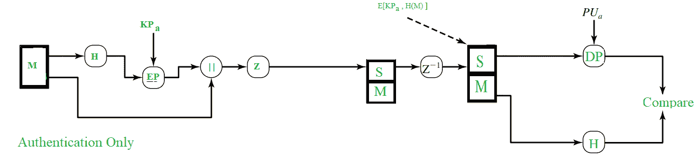
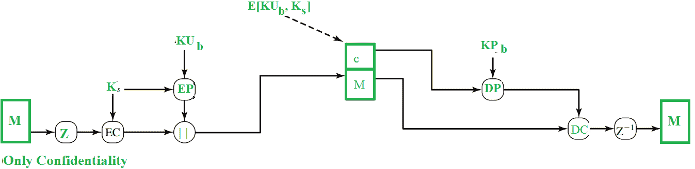

# PGP–认证和保密

> 原文:[https://www . geesforgeks . org/PGP-认证和保密/](https://www.geeksforgeeks.org/pgp-authentication-and-confidentiality/)

2013 年，当 *NSA(美国国家安全局)丑闻*被泄露给公众时，人们开始选择能够为他们的数据提供强大隐私的服务。在人们选择的服务中，尤其是电子邮件服务，有不同的浏览器插件和扩展。有趣的是，在人们开始使用的各种插件和扩展中，有两个主要程序专门负责人们所需的完整电子邮件安全。一个是 **S/MIME** ，我们稍后会看到，另一个是 **PGP** 。

如上所述， **PGP(相当好的隐私)**，是一个流行的程序，用于为电子邮件和文件存储提供机密性和认证服务。早在 1991 年，它就由菲尔·齐默曼设计。他是这样设计的，最好的密码算法如 RSA、Diffie-Hellman 密钥交换、DSS 用于公钥加密(或)非对称加密；CAST-128、3DES、IDEA 用于对称加密，SHA-1 用于散列目的。PGP 软件是开源软件，不依赖于操作系统或处理器。该应用程序基于一些非常容易使用的命令。

以下是 PGP 提供的服务:

```
1. Authentication
2. Confidentiality
3. Compression
4. Email Compatibility
5. Segmentation 
```

在本文中，我们将了解身份验证和机密性。

**1。认证:**
认证基本上是指用来验证某事是真实或真实的东西。为了登录一些网站，有时我们会给出我们的帐户名和密码，这是一个身份验证过程。

在电子邮件世界里，检查电子邮件的真实性无非是检查*它是否真的来自它所说的人*。在电子邮件中，必须检查身份验证，因为有些人会欺骗电子邮件或一些垃圾邮件，有时会造成许多不便。PGP 中的身份验证服务提供如下:



如上图所示，哈希函数(H)计算消息的哈希值。出于哈希目的，使用了 **SHA-1** ，它产生一个 **160 位**输出哈希值。然后，使用发送方的私钥(KP <sub>a</sub> ，对其进行加密，并将其称为**数字签名**。该消息随后被附加到签名中。所有发生到现在的过程，有时被描述为*签署消息*。然后，该消息被压缩以减少传输开销，并被发送到接收器。

在接收端，数据被解压缩并获得消息和签名。然后使用发送方的公钥(PU <sub>a</sub> )解密签名，并获得哈希值。该消息再次被传递给哈希函数，并计算和获得其哈希值。

比较两个值，一个来自签名，另一个来自散列函数的最近输出，如果两者相同，这意味着电子邮件实际上是从一个已知的发送的，并且是合法的，否则这意味着它不是合法的。

**2。保密:**
有时我们会看到一些包裹被贴上“保密”的标签，这意味着这些包裹并不面向所有人，只有被选中的人才能看到。这同样适用于电子邮件的保密性。这里，在电子邮件服务中，只有发送者和接收者应该能够阅读消息，这意味着除了这两个人之外，内容必须对其他所有人保密。

PGP 以下列方式提供保密服务:



消息首先被压缩，由 PGP 生成的 128 位会话密钥(K <sub>s</sub> 用于通过对称加密对消息进行加密。然后，会话密钥(K <sub>的</sub>)本身通过公钥加密(EP)使用接收者的公钥(KU <sub>b</sub> )进行加密。这两个加密的实体现在被连接并发送到接收器。

正如您所看到的，原始消息被压缩，然后最初被加密，因此即使任何人可以获得流量，他也不能读取内容，因为它们不是可读的形式，他们只能在拥有会话密钥的情况下读取它们(K <sub>s</sub> )。即使会话密钥被传输到接收方，并因此存在于流量中，它也是加密形式的，并且只有接收方的私钥(KP <sub>b</sub> )可以用来解密它，因此我们的消息将是完全安全的。

在接收端，使用接收方的私钥(KP <sub>b</sub> )解密加密的会话密钥，并用获得的会话密钥解密消息。然后，消息被解压缩以获得原始消息(M)。

公钥加密使用 RSA 算法，对称 jey 加密使用 CAST-128(或 IDEA 或 3DES)。

实际上，**和**认证和保密服务并行提供，如下所示:


**注:**
M–消息
H–哈希函数
K<sub>s</sub>–为对称加密目的创建的随机会话密钥
DP–公钥解密算法
EP–公钥加密算法
DC–非对称加密算法
EC–对称加密算法
KP<sub>B</sub>–公钥加密过程中使用的用户 B 的私钥
KP<sub>A</sub>–A 在公钥加密过程中
PU<sub>A</sub>–公钥加密过程中使用的用户 A 的公钥
PU<sub>B</sub>–公钥加密过程中使用的用户 B 的公钥
| | |–串联
Z–压缩功能
Z<sup>-1</sup>–解压缩功能