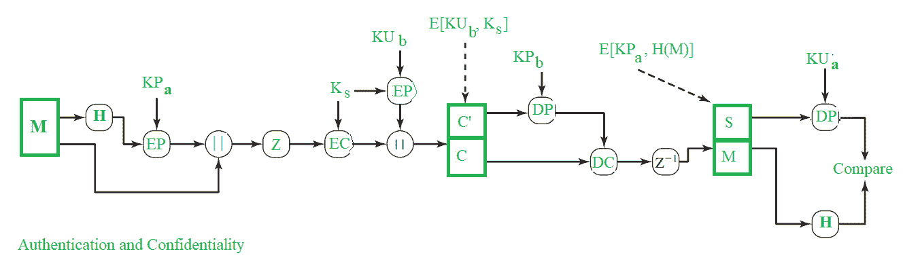

# PGP–压缩

> 原文:[https://www.geeksforgeeks.org/pgp-compression/](https://www.geeksforgeeks.org/pgp-compression/)

每天，超过 2500 亿封电子邮件在互联网上交换。从发送者到接收者的电子邮件传输涉及一系列处理。关于电子邮件的数据(*通常是关于发送者、接收者和域*)以及消息，必须由传输中涉及的系统和服务器处理。为所有 2500 亿封电子邮件做这件事是一项艰巨的任务。有时也可能导致*拥堵*。因此，电子邮件服务提供商使用**压缩**作为减少要传输的数据量的机制。

压缩基本上是使用压缩算法将 n 比特的消息转换成 m 比特(n > m)。压缩有助于电子邮件服务提供商提高工作效率，因为存储开销、处理和维护服务器所花费的人力减少了。

PGP 中的压缩服务使用 **ZIP** 算法提供。压缩包含在 PGP 的组合认证&机密性中，如下所示:

图中，
**Z**–压缩功能
**Z-1**–解压缩功能

在 PGP 中，消息只有在应用签名后才被压缩。压缩的数据在接收端被解压缩以获得原始消息和签名。然后，我们可以从签名中提取哈希值，然后通过简单地计算消息的哈希值并将其与从签名中获得的值进行比较，就可以直接确定真实性。

如果在应用签名之前进行了压缩，这意味着签名中的哈希值不是原始消息的哈希值，而是压缩消息的哈希值。因此，为了在接收端检查真实性，我们必须要么保持压缩的消息，要么重新压缩消息。由于 PGP 算法，我们在再压缩时会遇到另一个问题，因为该算法可能会根据其实现为一个输入产生各种结果，因此我们从它们获得的哈希值可能不一致。因此，在真实性验证中将存在不一致。

即使我们用不同的算法实现得到不同的压缩消息输出，但当任何实现的压缩消息作为输入时，产生相同的输出用于解压缩。因此，为了实现一致的真实性过程，我们必须用单个版本实现压缩。因此，为了更安全的使用，PGP 在应用签名后进行压缩。

通常，当消息和签名都被压缩时，它们被加密。这是为了提供加密分析的额外安全层，因为冗余比明文少。