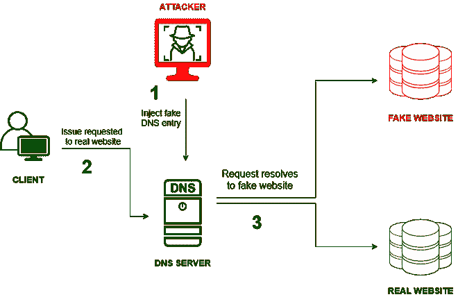

# 药物攻击预防和示例

> 原文:[https://www . geesforgeks . org/pharmang-攻击-预防-和-示例/](https://www.geeksforgeeks.org/pharming-attack-prevention-and-examples/)

术语“*域名欺诈*”是使用农业和网络钓鱼形成的组合词。域名欺诈是网络犯罪分子的一种在线欺诈方式，他们通过欺诈网站在您的计算机或服务器上安装一些恶意代码。该代码通过一个伪造的网站发送给用户，用户可能会欺骗提供个人信息。通过这种方式，欺诈者还可以立即获得用户名和密码等用户个人信息。

**域名欺诈攻击:**
域名欺诈攻击是一种网络攻击形式，其中网络罪犯发送一个假网站而不是真实网站，并且该假网站看起来与真实网站相似(几乎相同)。网络犯罪分子利用域名系统服务器的漏洞。DNS 服务器负责将域名转换为 IP 地址。域名欺诈有两种方式，一种是利用域名系统服务器软件中的漏洞，另一种是更改受害者计算机上的主机文件。网络犯罪分子故意将用户重定向到假版本的网站，以访问和窃取用户名和密码。

**药剂攻击工作:**

药物攻击

*   每当用户访问一些欺诈网站时，恶意软件就会被安装在计算机上，并破坏信息，这被证明是一种欺骗攻击。
*   每当用户通过任何浏览器访问任何网址，如 Chrome、Mozilla Firefox、Opera 等。浏览器联系 DNS 服务器并请求所需域的 IP 地址。这将改变域名系统服务器本身，并变成一个域攻击。

**如果药物攻击发生在:**

1.**客户端**–如果在客户端发生域欺骗攻击，那么它就是

*   对本地主机文件的攻击。
*   对家庭路由器的攻击。
*   对浏览器代理配置的攻击。

2.**服务器端**–如果在服务器端发生域欺骗攻击，那么它会导致

*   缓存 DNS 服务器中毒，放入欺诈条目。
*   用户和互联网之间的代理服务器上的透明度。
*   利用入侵者操纵任何选定网站的解析条目。

**防御药物攻击:**

1.  使用可信的互联网服务提供商来减少攻击。
2.  也可以使用具有信誉良好的域名系统服务器的虚拟专用网服务。
3.  始终在提供双因素身份验证的网站上启用双因素身份验证。
4.  避开可疑网站，因为它们可以窃取数据。
5.  更改消费级路由器和无线接入点的默认密码。
6.  打开来源不明的链接或附件时要小心。
7.  尽可能使用经过验证的互联网服务提供商。
8.  安全软件是减少域名欺诈攻击的必备软件。
9.  确保您使用的是安全的网络连接(例如:网址中的 HTTPS)。

**药物攻击示例:**

*   由于域名欺诈攻击，美国和亚洲的许多金融公司都受到了影响。
*   一家墨西哥银行受到影响，因为客户家庭路由器的域名系统被更改，他们甚至不知道自己的所有数据都被黑客入侵了。赛门铁克报告称这是一次域欺骗攻击。