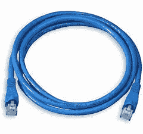
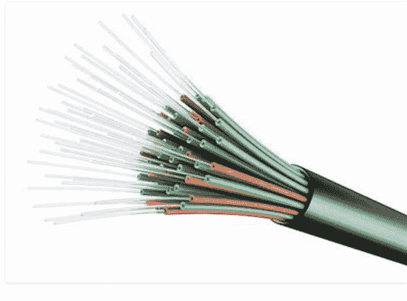
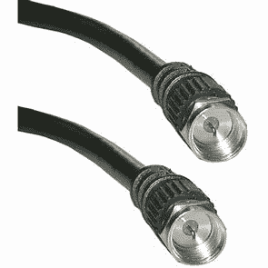
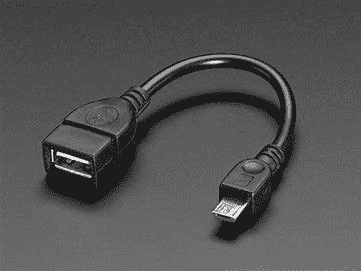

# 计算机网络的物理组件

> 原文:[https://www . geesforgeks . org/physical-components-of-computer-network/](https://www.geeksforgeeks.org/physical-components-of-computer-network/)

[计算机网络](https://www.geeksforgeeks.org/elements-of-computer-network/)的主要组成部分有:

**1。节点:**
节点是一个术语，用来指任何计算设备，如通过网络发送和接收网络数据包的计算机。两种类型的节点是:

*   **终端节点–**
    这类节点将成为通信的起点或终点。例如计算机、安全摄像机、网络打印机等。
*   **中间节点–**
    这些节点将位于端点节点的起点或终点之间。例如交换机、网桥、路由器、蜂窝塔等。

**2。媒体:**
也称为链路，将数据从一端传输到另一端。该链路可以是有线介质(引导介质)和无线介质(非引导介质)。

有线媒体的例子有:

*   **Ethernet –**
    These are of two types :
    *   **(一)。**以太网直通电缆(用于两种不同的设备)。
    *   **(二)。**以太网交叉电缆(用于两个相同的设备)。

    

*   **Fibre Optic Cable –**
    In this data is transferred in the form of light waves.

    

*   **Coaxial Cable –**
    Mainly used for audio and video communications.

    

*   **USB Cable –**
    Stands for Universal Serial Bus. Mainly used to connect PC and smartphone.

    

**无线媒体的例子有:**

*   红外(例如短程通信-电视遥控)。
*   无线电(例如蓝牙、Wi-Fi)。
*   微波(如蜂窝系统)。
*   卫星(例如远程通信-全球定位系统)。