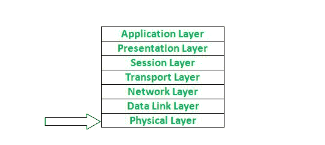

# OSI 模型中的物理层

> 原文:[https://www.geeksforgeeks.org/physical-layer-in-osi-model/](https://www.geeksforgeeks.org/physical-layer-in-osi-model/)

物理层是 [**开放系统互连**](https://www.geeksforgeeks.org/layers-of-osi-model/) **(OSI)模型**中最底层的一层，它是系统的物理和电气表示。它由各种网络组件组成，如电源插头、连接器、接收器、电缆类型等。物理层将数据位从一个设备(如计算机)发送到另一个设备。物理层定义了编码的类型(这就是 0 和 1 在信号中的编码方式)。物理层负责非结构化原始数据流在物理介质上的通信。

**由物理层执行的功能:**
以下是由现场视察模型的物理层执行的一些重要的基本功能–

1.  物理层保持数据速率(发送方每秒可以发送多少位)。
2.  它执行位同步。
3.  它有助于传输介质决策(数据传输方向)。
4.  它有助于物理拓扑(网状、星形、总线、环形)决策(我们可以通过拓扑将设备相互连接)。
5.  它有助于提供物理介质和接口决策。
6.  它提供两种类型的配置点对点配置和多点配置。
7.  它提供了设备(如个人电脑或计算机)和传输介质之间的接口。
8.  它有一个以位为单位的协议数据单元。
9.  集线器、以太网等。该层中使用了设备。
10.  这一层属于硬件层的范畴(因为硬件层也负责所有物理连接的建立和处理)。
11.  它提供了一个称为调制的重要方面，调制是通过将信息添加到电或光神经信号中，将数据转换成无线电波的过程。
12.  它还提供了交换机制，其中数据包可以从一个端口(发送方端口)转发到领先的目的端口。

**物理拓扑:**
物理拓扑或网络拓扑是链接设备的地理表示。以下是四种类型的物理拓扑-

1.  **网状拓扑–**
    在网状拓扑中，每台设备都应该与网络中的每台其他设备建立专用的点对点连接。这里有更高的数据安全性，因为两个设备之间有专用的点对点连接。网状拓扑很难安装，因为它更复杂。
2.  **星型拓扑–**
    在星型拓扑中，设备应该与中央控制器或集线器建立专用的点对点连接。与网状拓扑相比，星型拓扑易于安装和重新连接。星型拓扑没有容错技术。
3.  **总线拓扑–**
    在总线拓扑中，多个设备通过一根电缆连接，该电缆在分接和引入线的帮助下被称为主干电缆。与网状拓扑和星型拓扑相比，它的成本更低。重新连接和重新安装很困难。
4.  **环形拓扑–**
    在环形拓扑中，每台设备都与中继器连接成一个环形，这就是为什么它被称为环形拓扑。在环形拓扑中，设备只有在拥有令牌时才能发送数据，没有令牌，任何设备都不能发送数据，令牌由环形拓扑中的监视器放置。

**点对点配置:**
在点对点配置中，有一条线路(链路)完全专用于在两台设备之间传输数据。

**多点配置:**
在多点配置中，有一条线路(链路)连接多个设备。

**传输介质的模式:**

1.  **单工模式–**
    在该模式下，两台设备中，只有一台设备可以传输数据，另一台设备只能接收数据。示例-来自键盘、显示器、电视广播、无线电广播等的输入。
2.  **半双工模式–**
    在此模式下，两台设备中，两台设备都可以发送和接收数据，但一次只能发送一个，不能同时接收。示例-对讲机、铁路轨道等。
3.  **全双工模式–**
    在该模式下，两台设备可以同时发送和接收数据。例如电话系统、聊天应用等。