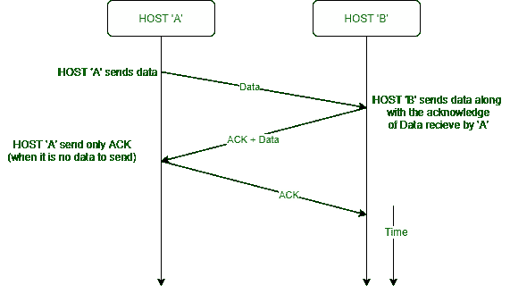

# 搭载在计算机网络中

> 原文:[https://www . geesforgeks . org/计算机网络搭载/](https://www.geeksforgeeks.org/piggybacking-in-computer-networks/)

在本文中，我们将涵盖网络通信的概述，并主要关注网络中捎带的概念。我们还将讨论在网络中使用捎带的优缺点。最后，我们会看到结论。我们一个一个来讨论。

**网络通信:**
滑动窗口算法是网络数据传输的流量控制方法。数据链路层使用一个发送方同时拥有多个确认数据包，这提高了网络吞吐量。发送方和接收方都维护一个有限大小的缓冲区来保存来自另一方的传出和传入数据包。发送方发送的每个数据包都必须得到接收方的确认。发送方为发送的每个数据包保持一个计时器，任何在某个时间未被确认的数据包都会被重新发送。发送者可以在接收到对窗口中的第一个分组的确认之前发送整个分组窗口。这将导致更高的传输速率，因为发送方可能会发送多个数据包，而无需等待每个数据包的确认。接收方通告窗口大小，告知发送方不要填满接收方缓冲区。

利用全双工传输也可以提高效率。**全双工传输**同时是双向定向通信。它提供了比简单和半双工传输模式更好的性能。

全双工传输

**解决方案 1–**
实现全双工传输的一种方法是有两个独立的通道，一个用于转发数据传输，另一个用于反向数据传输(接受)。但这将几乎完全浪费反向信道的带宽。

**解决方案 2(捎带)–**
一个更好的解决方案是使用每个通道双向(前后)传输帧，两个通道具有相同的容量。假设 A 和 B 是用户。然后，从 A 到 B 的数据帧与从 A 到 B 的确认互连，并且可以通过检查接收帧的报头中的分类字段来识别为数据帧或确认。

还可以做一个改进。当数据帧到达时，接收器等待，不会立即发回控制帧(确认)。接收器等待，直到其网络层移动到下一个数据包。

确认与这个输出数据帧相关联。因此，确认会与下一个数据帧一起传输。

**捎带的定义:**
*这种发送确认被暂时延迟的技术被称为**捎带**。*

正如我们在图中所看到的，我们可以看到在捎带的情况下，一条消息(确认+数据)代替了两条单独的消息。搭载提高了双向协议的效率。

**搭载优势:**

1.  搭载的主要优势是更好地利用可用的信道带宽。这是因为确认帧不需要单独发送。
2.  降低使用成本
3.  改善数据传输的延迟

**背驮的缺点:**

1.  搭载的缺点是额外的复杂性。
2.  如果数据链路层在发送确认之前等待很长时间(将确认阻塞一段时间)，帧将会重新广播。

**注意–**为了避免帧传输的延迟和重播，捎带使用非常短的持续时间计时器。

**结论:**
关于这是合法还是非法活动存在争议，但捎带仍然是 Wi-Fi 的阴暗面。印度的网络恐怖袭击清楚地提醒我们，我们无法控制世界任何地方发生的事件，也无法控制不安全的无线网络。因此，所有者和管理员有责任保护他们的无线连接。