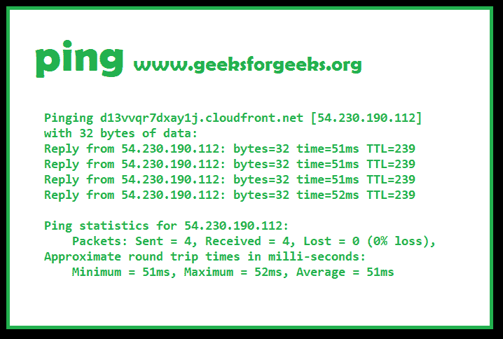
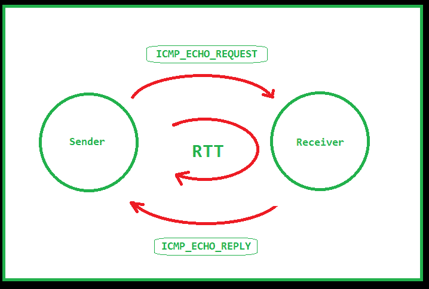

# Ping in C

> 原文:[https://www.geeksforgeeks.org/ping-in-c/](https://www.geeksforgeeks.org/ping-in-c/)

**先决条件** : [ICMP](https://www.geeksforgeeks.org/internet-control-message-protocol-icmp/) | [原始套接字](https://opensourceforu.com/2015/03/a-guide-to-using-raw-sockets/) | [互联网校验和](https://www.geeksforgeeks.org/error-detection-computer-networks/) | [DNS](https://www.geeksforgeeks.org/dns-domain-name-server/)

Ping 是调试互联网的必要条件。
Ping 是一种基本的互联网工具，允许用户验证特定的 IP 地址是否存在，并且可以接受请求。，配有其他设施。

[](https://contribute.geeksforgeeks.org/ping-in-c/ping/)

Ping 通过打开一个 [RAW 套接字](https://opensourceforu.com/2015/03/a-guide-to-using-raw-sockets/)发送 ICMP 数据包，这个套接字与 TCP 和 UDP 是分开的。

因为 IP 没有任何发送错误和控制消息的内置机制。它依赖于[互联网控制消息协议](https://www.geeksforgeeks.org/internet-control-message-protocol-icmp/) (ICMP)来提供错误控制。它用于报告错误和管理查询。

**Ubuntu Ping 示例**

```
ping www.google.com
PING www.google.com (172.217.194.105) 56(84) bytes of data.
64 bytes from 172.217.194.105 (172.217.194.105): icmp_seq=1 ttl=46 time=116 ms
64 bytes from 172.217.194.105 (172.217.194.105): icmp_seq=2 ttl=46 time=102 ms
64 bytes from 172.217.194.105 (172.217.194.105): icmp_seq=3 ttl=46 time=119 ms
^C
--- www.google.com ping statistics ---
3 packets transmitted, 3 received, 0% packet loss, time 3110ms

```

**工作机制**
互联网 Ping 程序的工作原理很像声纳回声定位，向指定的计算机发送包含 ICMP ECHO_REQUEST 信息的小数据包，然后计算机发送 ECHO_REPLY 数据包作为回报。
数据包具有决定路由器最大跳数的 TTL(生存时间)值。

如果数据包没有到达，则发送方会被记录回错误。

错误类型如下:

*   在途时间过期
*   目标主机不可达
*   请求超时，即没有回复
*   未知主机

[](https://contribute.geeksforgeeks.org/ping-in-c/rtt/)

**实现**
简单 ping 程序遵循的步骤是:

1.  输入一个**主机名**
2.  Do a **DNS lookup**

    可以使用 **gethostbyname()** 进行 DNS 查找。gethostbyname()函数转换一个正常的人类可读网站，并返回一个类型为 **hostent** 的结构，该结构包含二进制点标记形式的 IP 地址和地址类型。

3.  Some ping programs like the one given with ubuntu support **reverse DNS lookup**.
    Reverse DNS lookup is performed using **getnameinfo()**, and it converts dot notation IP address to hostname.

    例如，google.com 的平宁经常给出一个奇怪的地址:
    bom07s18-in-f14.1e100.net

    这是反向域名系统查找的结果。

4.  使用协议为 IPPROTO_ICMP 的 SOCK_RAW 打开一个**原始套接字**。
    注意:原始套接字需要超级用户权限，因此您必须使用 sudo 运行此代码
5.  当按下 crtl + C 时，ping 会给出一个报告。这个中断被一个中断处理程序
    捕获，它只是将我们的 ping 循环条件设置为 false。
6.  主 ping 发送循环来了。
    我们必须:
    1.  将 **ttl 选项**设置为套接字中的一个值
        TTL 值被设置为限制数据包可以跳的次数。
    2.  设置 recv 功能
        的**超时**如果没有设置超时，recv 将永远等待，停止循环。
    3.  按如下方式填写 **icmp 数据包**
        :
        1.  将数据包报头类型设置为 ICMP_ECHO。
        2.  将 id 设置为进程的 pid
        3.  随机填充味精部分。
        4.  计算校验和并将其填入校验和字段。
    4.  **发送**数据包
    5.  Wait for it to be **received**.
        The main problem here is that the packet received does not mean that that the destination is working.
        Echo reply means destination is OK. Echo reply is sent from destination OS kernel.

        [这个](https://www.ibm.com/support/knowledgecenter/en/SS42VS_7.3.1/com.ibm.qradar.doc/c_DefAppCfg_guide_ICMP_intro.html)是所有类型和代码的列表。
        这里的一个问题是，如果一切正常，程序会显示类型 69 和代码 0，而不是代表 echo_reply 的 0。

        ```
        // C program to Implement Ping

        // compile as -o ping
        // run as sudo ./ping <hostname>

        #include <stdio.h>
        #include <sys/types.h>
        #include <sys/socket.h>
        #include <netinet/in.h>
        #include <arpa/inet.h>
        #include <netdb.h>
        #include <unistd.h>
        #include <string.h>
        #include <stdlib.h>
        #include <netinet/ip_icmp.h>
        #include <time.h>
        #include <fcntl.h>
        #include <signal.h>
        #include <time.h>

        // Define the Packet Constants
        // ping packet size
        #define PING_PKT_S 64

        // Automatic port number
        #define PORT_NO 0 

        // Automatic port number
        #define PING_SLEEP_RATE 1000000 x

        // Gives the timeout delay for receiving packets
        // in seconds
        #define RECV_TIMEOUT 1 

        // Define the Ping Loop
        int pingloop=1;

        // ping packet structure
        struct ping_pkt
        {
            struct icmphdr hdr;
            char msg[PING_PKT_S-sizeof(struct icmphdr)];
        };

        // Calculating the Check Sum
        unsigned short checksum(void *b, int len)
        {    unsigned short *buf = b;
            unsigned int sum=0;
            unsigned short result;

            for ( sum = 0; len > 1; len -= 2 )
                sum += *buf++;
            if ( len == 1 )
                sum += *(unsigned char*)buf;
            sum = (sum >> 16) + (sum & 0xFFFF);
            sum += (sum >> 16);
            result = ~sum;
            return result;
        }

        // Interrupt handler
        void intHandler(int dummy)
        {
            pingloop=0;
        }

        // Performs a DNS lookup 
        char *dns_lookup(char *addr_host, struct sockaddr_in *addr_con)
        {
            printf("\nResolving DNS..\n");
            struct hostent *host_entity;
            char *ip=(char*)malloc(NI_MAXHOST*sizeof(char));
            int i;

            if ((host_entity = gethostbyname(addr_host)) == NULL)
            {
                // No ip found for hostname
                return NULL;
            }

            //filling up address structure
            strcpy(ip, inet_ntoa(*(struct in_addr *)
                                  host_entity->h_addr));

            (*addr_con).sin_family = host_entity->h_addrtype;
            (*addr_con).sin_port = htons (PORT_NO);
            (*addr_con).sin_addr.s_addr  = *(long*)host_entity->h_addr;

            return ip;

        }

        // Resolves the reverse lookup of the hostname
        char* reverse_dns_lookup(char *ip_addr)
        {
            struct sockaddr_in temp_addr;    
            socklen_t len;
            char buf[NI_MAXHOST], *ret_buf;

            temp_addr.sin_family = AF_INET;
            temp_addr.sin_addr.s_addr = inet_addr(ip_addr);
            len = sizeof(struct sockaddr_in);

            if (getnameinfo((struct sockaddr *) &temp_addr, len, buf, 
                            sizeof(buf), NULL, 0, NI_NAMEREQD)) 
            {
                printf("Could not resolve reverse lookup of hostname\n");
                return NULL;
            }
            ret_buf = (char*)malloc((strlen(buf) +1)*sizeof(char) );
            strcpy(ret_buf, buf);
            return ret_buf;
        }

        // make a ping request
        void send_ping(int ping_sockfd, struct sockaddr_in *ping_addr,
                        char *ping_dom, char *ping_ip, char *rev_host)
        {
            int ttl_val=64, msg_count=0, i, addr_len, flag=1,
                       msg_received_count=0;

            struct ping_pkt pckt;
            struct sockaddr_in r_addr;
            struct timespec time_start, time_end, tfs, tfe;
            long double rtt_msec=0, total_msec=0;
            struct timeval tv_out;
            tv_out.tv_sec = RECV_TIMEOUT;
            tv_out.tv_usec = 0;

            clock_gettime(CLOCK_MONOTONIC, &tfs);

            // set socket options at ip to TTL and value to 64,
            // change to what you want by setting ttl_val
            if (setsockopt(ping_sockfd, SOL_IP, IP_TTL, 
                       &ttl_val, sizeof(ttl_val)) != 0)
            {
                printf("\nSetting socket options 
                         to TTL failed!\n");
                return;
            }

            else
            {
                printf("\nSocket set to TTL..\n");
            }

            // setting timeout of recv setting
            setsockopt(ping_sockfd, SOL_SOCKET, SO_RCVTIMEO,
                           (const char*)&tv_out, sizeof tv_out);

            // send icmp packet in an infinite loop
            while(pingloop)
            {
                // flag is whether packet was sent or not
                flag=1;

                //filling packet
                bzero(&pckt, sizeof(pckt));

                pckt.hdr.type = ICMP_ECHO;
                pckt.hdr.un.echo.id = getpid();

                for ( i = 0; i < sizeof(pckt.msg)-1; i++ )
                    pckt.msg[i] = i+'0';

                pckt.msg[i] = 0;
                pckt.hdr.un.echo.sequence = msg_count++;
                pckt.hdr.checksum = checksum(&pckt, sizeof(pckt));

                usleep(PING_SLEEP_RATE);

                //send packet
                clock_gettime(CLOCK_MONOTONIC, &time_start);
                if ( sendto(ping_sockfd, &pckt, sizeof(pckt), 0, 
                   (struct sockaddr*) ping_addr, 
                    sizeof(*ping_addr)) <= 0)
                {
                    printf("\nPacket Sending Failed!\n");
                    flag=0;
                }

                //receive packet
                addr_len=sizeof(r_addr);

                if ( recvfrom(ping_sockfd, &pckt, sizeof(pckt), 0, 
                     (struct sockaddr*)&r_addr, &addr_len) <= 0
                      && msg_count>1) 
                {
                    printf("\nPacket receive failed!\n");
                }

                else
                {
                    clock_gettime(CLOCK_MONOTONIC, &time_end);

                    double timeElapsed = ((double)(time_end.tv_nsec - 
                                         time_start.tv_nsec))/1000000.0
                    rtt_msec = (time_end.tv_sec-
                                  time_start.tv_sec) * 1000.0
                                + timeElapsed;

                    // if packet was not sent, don't receive
                    if(flag)
                    {
                        if(!(pckt.hdr.type ==69 && pckt.hdr.code==0)) 
                        {
                            printf("Error..Packet received with ICMP 
                                   type %d code %d\n", 
                                   pckt.hdr.type, pckt.hdr.code);
                        }
                        else
                        {
                            printf("%d bytes from %s (h: %s) 
                                  (%s) msg_seq=%d ttl=%d 
                                  rtt = %Lf ms.\n", 
                                  PING_PKT_S, ping_dom, rev_host, 
                                  ping_ip, msg_count,
                                  ttl_val, rtt_msec);

                            msg_received_count++;
                        }
                    }
                }    
            }
            clock_gettime(CLOCK_MONOTONIC, &tfe);
            double timeElapsed = ((double)(tfe.tv_nsec - 
                                  tfs.tv_nsec))/1000000.0;

            total_msec = (tfe.tv_sec-tfs.tv_sec)*1000.0+ 
                                  timeElapsed

            printf("\n===%s ping statistics===\n", ping_ip);
            printf("\n%d packets sent, %d packets received, %f percent
                   packet loss. Total time: %Lf ms.\n\n", 
                   msg_count, msg_received_count,
                   ((msg_count - msg_received_count)/msg_count) * 100.0,
                  total_msec); 
        }

        // Driver Code
        int main(int argc, char *argv[])
        {
            int sockfd;
            char *ip_addr, *reverse_hostname;
            struct sockaddr_in addr_con;
            int addrlen = sizeof(addr_con);
            char net_buf[NI_MAXHOST];

            if(argc!=2)
            {
                printf("\nFormat %s <address>\n", argv[0]);
                return 0;
            }

            ip_addr = dns_lookup(argv[1], &addr_con);
            if(ip_addr==NULL)
            {
                printf("\nDNS lookup failed! Could 
                           not resolve hostname!\n");
                return 0;
            }

            reverse_hostname = reverse_dns_lookup(ip_addr);
            printf("\nTrying to connect to '%s' IP: %s\n",
                                               argv[1], ip_addr);
            printf("\nReverse Lookup domain: %s", 
                                   reverse_hostname);

            //socket()
            sockfd = socket(AF_INET, SOCK_RAW, IPPROTO_ICMP);
            if(sockfd<0)
            {
                printf("\nSocket file descriptor not received!!\n");
                return 0;
            }
            else
                printf("\nSocket file descriptor %d received\n", sockfd);

            signal(SIGINT, intHandler);//catching interrupt

            //send pings continuously
            send_ping(sockfd, &addr_con, reverse_hostname, 
                                         ip_addr, argv[1]);

            return 0;
        }
        ```

        **一个例子输出:**
        跑 sudo。/平 google.com

        ```
        Resolving DNS..

        Trying to connect to 'google.com' IP: 172.217.27.206

        Reverse Lookup domain: bom07s15-in-f14.1e100.net
        Socket file descriptor 3 received

        Socket set to TTL..
        64 bytes from bom07s15-in-f14.1e100.net (h: google.com) (172.217.27.206)
                                        msg_seq=1 ttl=64 rtt = 57.320584 ms.

        64 bytes from bom07s15-in-f14.1e100.net (h: google.com) (172.217.27.206)
                                        msg_seq=2 ttl=64 rtt = 58.666775 ms.

        64 bytes from bom07s15-in-f14.1e100.net (h: google.com) (172.217.27.206)
                                        msg_seq=3 ttl=64 rtt = 58.081148 ms.

        64 bytes from bom07s15-in-f14.1e100.net (h: google.com) (172.217.27.206) 
                                        msg_seq=4 ttl=64 rtt = 58.700630 ms.

        64 bytes from bom07s15-in-f14.1e100.net (h: google.com) (172.217.27.206) 
                                        msg_seq=5 ttl=64 rtt = 58.281802 ms.

        64 bytes from bom07s15-in-f14.1e100.net (h: google.com) (172.217.27.206) 
                                        msg_seq=6 ttl=64 rtt = 58.360916 ms.

        ===172.217.27.206 ping statistics===

        6 packets sent, 6 packets received, 0.000000 percent packet loss. 
        Total time: 6295.187804 ms.

        ```