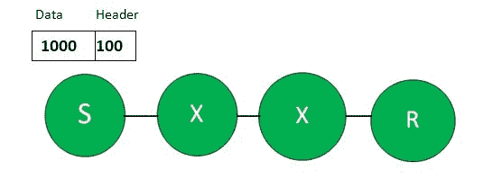
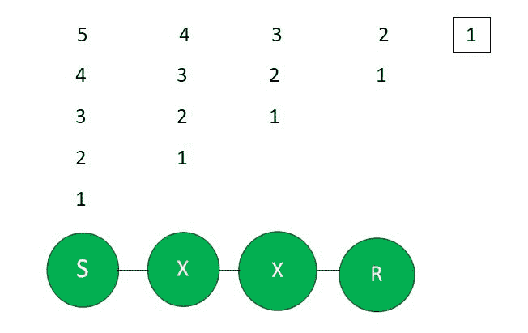

# 分组交换中的流水线操作

> 原文:[https://www . geesforgeks . org/分组交换中的流水线操作/](https://www.geeksforgeeks.org/pipelining-in-packet-switching/)

**分组交换:**
一种数据传输模式，在这种模式下，一条消息被分成若干部分，通过对每个分组来说最佳的路由独立发送，并在目的地重新组装。分组交换在交换分组时使用存储转发技术；在转发分组时，每一跳首先存储该分组，然后转发。

我们知道，数据被分成许多小数据包，以减少总延迟。那么，你怎么看？数据包数量越大，延迟越小？
不，其实这不是真的。好吧，让我们用例子来理解。

**示例:**

```
Given,

Data size = 1000 Bytes
Bandwidth = 1 MBps
Header size = 100 Bytes
Number of Hops = 3
assume Propagation delay = 0
```

**说明:**这些是不同的场景，如下。

**情况-1:** 如果数据包数量= 1



```
Size of the Data Packet, 
= Data size + Header size 
= 1000 + 100 = 1100 Bytes

Transmission delay 
= L/BW = 1100/10^6 = 1.1 ms 

Total time taken 
= number of Hopes * Transmission delay 
= 3 * 1.1 = 3.3 ms 
```

**情况-2:** 如果数据包数量= 5

```
Size of each Data Packet 
= (1000/5) + 100 = 300 Bytes

Transmission Delay for each Packet 
= 300/10^6 = 0.3 ms 
```



```
Time taken by 1st Packet, 
= No of Hops * Transmission delay 
= 3*0.3 = 0.9 ms

Time taken by the remaining 4 Packets 
= 4*Transmission delay 
= 4*0.3 = 1.2 ms

Total Time Taken, 
= 0.9+1.2 = 2.1 ms 
```

**情况-3:** 如果数据包数量= 10

```
Size of each Data Packet 
= (1000/10) + 100 = 200 Bytes

Transmission delay for each packet  
= 200/10^6 = 0.2 ms

Time Taken by first Packet 
= 3*0.2 = 0.6 ms

Time Taken by remaining Packets 
= 9*0.2 = 1.8ms

Total Time Taken 
= 0.6+1.8 = 2.4 ms 
```

**情况-4:** 如果数据包数量= 20

```
Size of each Data Packet 
= (1000/20) + 100 = 150 Bytes

Transmission delay for each Packet 
= 150/10^6 = 0.15 ms

Time Taken by 1st Packet 
= 3*0.15 = 0.45 ms

Time Taken by remaining 19 Packets 
= 19*0.15 = 2.85 ms

Total Time Taken 
= 0.45 + 2.85 = 3.3 ms 
```

正如我们所看到的，存在一个总时间减少的阈值，如果我们在该限制后增加数据包的数量，总时间就会开始增加。最初，时间会因为某些限制而减少，之后时间会增加。如果数据包的数量非常大，那么传输单个数据包所需的时间可能会更长。