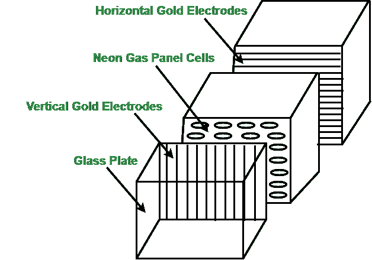

# 计算机图形中的等离子显示面板

> 原文:[https://www . geeksforgeeks . org/等离子体-显示-电脑面板-图形/](https://www.geeksforgeeks.org/plasma-display-panel-in-computer-graphics/)

等离子体显示面板是一种发射型显示器，这意味着面板本身就是光源。与透射式显示器相比，在透射式显示器中，光源是分离的，光穿过面板以产生图像，PDP 是极其明亮和耐光的平板显示技术，其利用气体放电原理，因此也被称为**气体放电显示器**。

等离子显示屏幕的长度很大，通常从 42 英寸到 63 英寸。它在光线昏暗的房间里工作正常，非常适合看电影，给出了过高的评估比率，华丽的饱和色调，并允许广阔的视角。住宅内的每个座位都是一个巨大的视角。

因为它可以在没有运动模糊的情况下跟踪快速移动的图像，所以等离子体非常适合观看动作类运动或玩电子游戏。

**等离子显示面板工作如下:**

等离子面板显示器

*   等离子体显示板由两块平行的玻璃片组成，玻璃片包围着由氦、氖和氙组成的放电气体混合物。
*   玻璃板的内侧是**肋**，有助于保持玻璃板平行。
*   电极组以直角位于玻璃板之间，在玻璃板之间形成矩形隔间或单元。
*   磷被嵌入每个细胞中，每个细胞分别发出红色、绿色或蓝色的光，共同形成一个单一颜色的像素。
*   选择性地向电极施加电压会使它们在面板的介电层及其保护表面上产生放电。这会产生紫外光，激发磷光体，刺激它们发光。
*   图像清晰度存储在刷新缓冲器中，每秒施加电压刷新像素位置 60 次。

**等离子显示面板优势:**

*   等离子显示面板薄而轻，比其他显示器占用更少的空间，这使得它们易于安装在任何地方。
*   等离子显示面板提供均匀的亮度。
*   它们显示的图像没有失真，避免了诸如颜色配准错误和焦点不足等问题。
*   它们还能抵抗磁场的干扰，没有失真，可以从很宽的角度观看。
*   等离子体显示面板能够产生更深的黑色，对比度更高。
*   它提供了比液晶显示器更宽的视角，因此图像在高角度下不会退化。
*   等离子显示面板适合多媒体应用，因为它们可以显示计算机图像以及全色、全动态图像。

**等离子显示面板的缺点:**

*   等离子显示面板比液晶电视消耗更多的电能。
*   早期的等离子显示面板更容易受到屏幕老化和图像残留的影响，最近的型号有一个像素轨道器，它可以比人眼更快地移动整个图像，这减少了老化的影响，但并不能防止它。
*   早期显示器的磷光体随着时间的推移会失去亮度，导致绝对亮度逐渐下降。
*   由于技术标准固有的强红外辐射，红外中继器系统不能用于观看室。需要使用更贵的**“等离子兼容”**传感器。