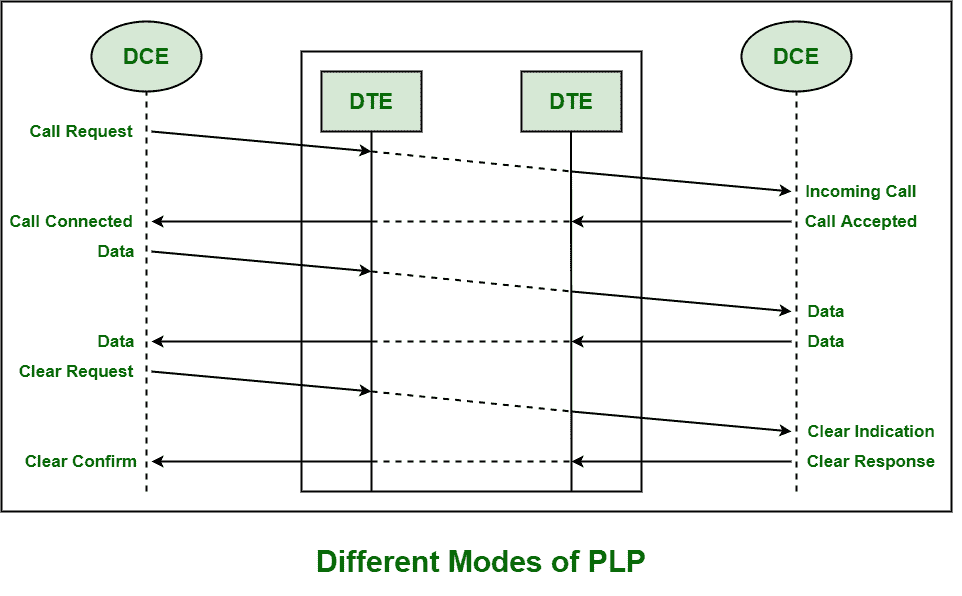
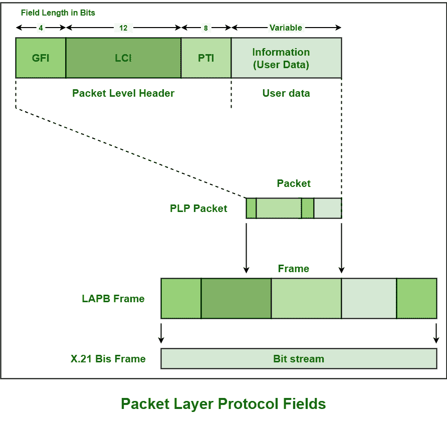

# x . 25 网络的 PLP

> 原文:[https://www.geeksforgeeks.org/plp-of-x-25-network/](https://www.geeksforgeeks.org/plp-of-x-25-network/)

**分组层协议(PLP)** 基本上是 X.25 协议套件的网络层协议，处理虚电路。它还提供多路复用功能。该层还负责呼叫建立和终止，以及处理数据包或帧的传输。PLP 的基本设计是管理和处理两个数据终端设备(DTE)站之间通过虚拟电路的数据交换。借助于链路接入程序 D 信道(LAPD)，它也可以在综合业务数字网上使用。

**PLP 的不同模式:**

1.  **呼叫建立模式–**
    该模式由两个 DTE 站之间的 PLP 借助 14 位 X.21 寻址方案进行管理，通常用于建立虚拟电路。它只使用静止无功补偿器完成，而不使用聚氯乙烯，因为聚氯乙烯在建造后已经连接。每个呼叫也独立于其他呼叫，因此，

*   **呼叫请求数据包:**
    呼叫的 DTE 发送此请求，因为它用于在 SVC 上建立连接。它还包括要联系的远程数据终端设备的地址。
*   **呼叫接受包:**
    此包用于接受呼叫。
*   **清除请求数据包:**
    此数据包用于清除呼叫。

*   **数据传输模式–**
    该模式由 PLP 在一个静止无功补偿器和聚氯乙烯之间的两个数据传输站之间进行管理。在这种模式下，填充分段和重组、错误和流控制被管理和处理。*   **空闲模式–**
    是连接和数据传输模式之间的中间模式。这种模式基本上用于建立虚拟呼叫但没有数据传输的情况。*   **呼叫清除模式–**
    这种模式基本上是用来拆掉一条虚电路，也可以结束两个 DTE 站之间的呼叫。换句话说，它用于结束数字地面站之间的会话和终止虚电路。每当远程终端设备想要终止或结束呼叫时，呼叫请求包就被发送到远程终端设备。*   **Restarting Mode –**
    This mode is used for transmission synchronization among two DTE stations. This mode is locally connected to DCE (Data Communication Equipment’s). This mode is used prior to entering data transfer mode and also to re-establish synchronization whenever it is lost.

    **PLP 数据包字段:**

    基本上有四个不同的 PLP 数据包字段，如下所示:

    

    1.  **通用格式标识符(GFI) :**
        它包含是否使用模 8 或模 128 序列号的指示，以及 Q 位和 D 位。该标识符用于识别数据帧或数据包的不同参数，无论数据包是否包含数据或控制信息。它还用于识别所执行的窗口类型，并确保是否需要使用交付确认。
    2.  **逻辑信道标识符(LCI) :**
        该标识符由 4 位 LCGN(逻辑信道组号)和 8 位 LCN(逻辑信道号)组成。它基本上是用来识别局部虚电路的。
    3.  **Packet Type Identifier (PTI) :**

        它用于从呼叫接受、呼叫请求、清除确认、清除请求、中断请求、接收就绪或接收未就绪等 17 种不同的 PLP 分组类型中仅识别一种分组类型。

    4.  **用户数据:**
        用户数据字段只存在或存在于数据包中。它还包含来自上层协议的封装数据，如 [TCP/IP](https://www.geeksforgeeks.org/tcp-ip-model/) 。