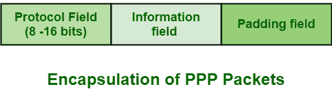

# 点对点协议封装

> 原文:[https://www . geesforgeks . org/点对点协议-PPP-封装/](https://www.geeksforgeeks.org/point-to-point-protocol-ppp-encapsulation/)

**[点对点协议(PPP)](https://www.geeksforgeeks.org/ppp-full-form/)** 基本上是一种[广域网(WAN)](https://www.geeksforgeeks.org/wan-full-form/) 协议，通过简单地封装帧进行传输或通过不同的物理链路或连接(如串行电缆、手机、光缆等)进行传输，从而在第 2 层执行或工作。

封装基本上是一个过程，其中低层协议基本上从高层协议接收数据，然后进一步将该数据部分放入其帧中。

简而言之，我们可以说封装是借助于其他类型的包来封装一种类型的包装的过程。PPP 通常提供封装，以便网络上的各种协议同时得到支持。PPP 连接还按顺序传递或传输数据包，并提供全双工同时双向操作。PPP 通常将任何网络层数据包封装在其帧中，这使得 PPP 第三层协议变得独立，甚至能够通过单个链路或连接承载多层第三层数据包。

**PPP 封装**还需要消除多协议数据报的歧义，即消除歧义，使多协议数据报清晰易懂。PPP 将数据放在帧中，并通过 PPP 连接或链路进行传输。帧基本上被定义为[现场视察](https://www.geeksforgeeks.org/osi-model-full-form-in-computer-networking/)协议栈的数据链路层中的传输单位。为了形成封装，总共需要 8 字节。数据通常在帧中从左向右传输。PPP 封装的总体结构如下:

PPP 封装框架基本上包含三种类型的字段，如下所示:

1.  **Protocol Field –**
    This field is of 1 or 2 bytes i.e., 8 or 16 bits that are used to identify datagram that is being encapsulated in the information field of packet.

    它只是指示帧中使用的协议。低位字节的最低有效位通常设置为 1，另一方面，最高有效位通常设置为 0。可以存在的协议类型有链路控制协议(LCP)、[密码认证协议(PAP)](https://www.geeksforgeeks.org/password-authentication-protocol-pap/) 、[挑战握手认证协议(CHAP)](https://www.geeksforgeeks.org/challenge-handshake-authentication-protocol-chap/) 等。

    

    | 协议号 | 协议名称 |
    | --- | --- |
    | 0001 | 填充协议 |
    | 0003 至 001f | 保留(透明度低) |
    | 00cf | 保留(NLPID 购买力平价) |
    | 8001 到 801 | 不用的 |
    | 807d | 不用的 |
    | 0021 | 互联网协议 |
    | Eight thousand and twenty-one | IPCP(互联网协议控制协议) |
    | 002d | 范·雅各布森 TCP/IP 报头压缩(RFC 1144) |
    | 002f | 范·雅各布森 IP 报头压缩 |
    | c021 | 链路控制协议 |
    | c023 | 密码认证协议 |
    | c025 | 链接质量报告 |
    | c223 | 挑战握手认证协议 |

    

2.  **信息字段–**
    该字段为 0 字节或更多字节。它也有 1500 字节的最大长度，包括填充和排除协议字段。它通常包含协议字段中指定和标识的协议的数据报。数据报基本上是一个与网络相关的传输单元。
3.  **填充字段–**
    该字段为可选字段。传输时，信息字段可以填充到最大接收单位(MRU)。两个对等体都必须能够识别和区分填充字节与真实数据或真实信息。