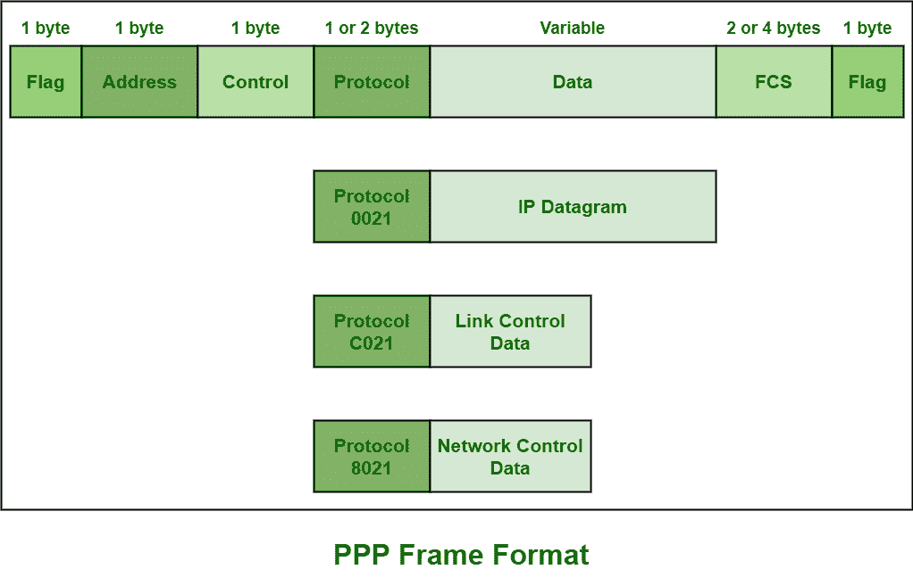

# 点对点协议(PPP)帧格式

> 原文:[https://www . geesforgeks . org/点对点协议-ppp-frame-format/](https://www.geeksforgeeks.org/point-to-point-protocol-ppp-frame-format/)

[点对点协议(PPP)](https://www.geeksforgeeks.org/ppp-full-form/) 一般是 [Windows](https://www.geeksforgeeks.org/interesting-facts-about-windows/) 中的默认 RAS 协议，也是[数据链路层](https://www.geeksforgeeks.org/data-link-layer-in-osi-model/)最常用的协议，需要封装更高的网络层协议，只是为了通过同步和异步通信线路。在 PPP 中，链路建立主要由链路控制协议(LCP)控制和处理。还需要通过调制解调器将家用电脑连接到互联网服务提供商的服务器。互联网服务提供商也采用它来简单地提供拨号上网。

**PPP 帧格式:**
PPP 帧一般需要封装简单包含配置信息或数据的信息或数据分组。PPP 基本采用与 [HDLC](https://www.geeksforgeeks.org/basic-frame-structure-of-hdlc/) 相同的基本格式。PPP 通常包含一个附加字段，即协议字段。该协议字段出现在控制字段之后，信息或数据字段之前。

框架的各个字段如下所示:

1.  **Flag field –**
    PPP frame similar to HDLC frame, always begins and ends with standard HDLC flag. It always has a value of 1 byte i.e., 01111110 binary value.
2.  **Address field –**
    Address field is basically broadcast address. In this, all 1’s simply indicates that all of the stations are ready to accept frame. It has the value of 1 byte i.e., 11111111 binary value. PPP on the other hand, does not provide or assign individual station addresses.
3.  **Control field –**
    This field basically uses format of U-frame i.e., Unnumbered frame in HDLC. In HDLC, control field is required for various purposes but in PPP, this field is set to 1 byte i.e., 00000011 binary value. This 1 byte is used for a connection-less data link.
4.  **Protocol field –**
    This field basically identifies network protocol of the datagram. It usually identifies the kind of packet in the data field i.e., what exactly is being carried in data field. This field is of 1 or 2 bytes and helps in identifies the PDU (Protocol Data Unit) that is being encapsulated by PPP frame.
5.  **数据字段–**
    它通常包含上层数据报。对于常规的 PPP 数据帧，网络层数据报特别封装在该字段中。这个字段的长度不是恒定的，而是变化的。
6.  **FCS 字段–**
    该字段通常包含校验和，仅用于识别错误。它的大小可以是 16 位或 32 位。它也是通过地址、控制、协议甚至信息字段来计算的。字符被添加到框架中，用于控制和处理错误。

**备注:**

*   它能够动态协商 IP 地址。
*   它包含链路控制协议(LCP)，只是为了开发链路选项。
*   它包含每个 PPP 帧的错误检查。
*   它还能够在单个串行连接上传输多个协议。