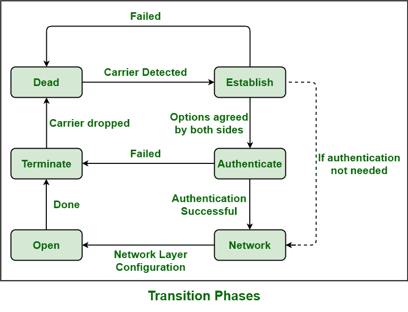

# 点对点协议(PPP)相图

> 原文:[https://www . geesforgeks . org/点对点协议-PPP-相图/](https://www.geeksforgeeks.org/point-to-point-protocol-ppp-phase-diagram/)

**[点对点协议(PPP)](https://www.geeksforgeeks.org/ppp-full-form/)** 一般是由互联网工程任务组(IETF)发明的，只是为了创建和开发点对点线路的数据链路协议，这有助于解决 SLIP 中存在的许多问题。

PPP 可以在不同的 DTE/DCE(数据终端设备/数据电路终端设备)物理接口上运行，以及异步串行、同步串行、ISDN 等。它也可以运行在各种网络层协议上，如 IPX、苹果对话，而另一方面，SLIP 只运行在基于[的 TCP/IP](https://www.geeksforgeeks.org/tcp-ip-in-computer-networking/) 协议上。所有利用 PPP 协议的点对点链路都需要能够支持全双工通信。

**PPP 阶段图:**
PPP 连接一般会经历不同的阶段，可以在过渡阶段图中看到，如下图所示:

1.  **Dead –**
    In this phase, link basically starts and stops. Carrier Detection is an event that is used to indicate that physical layer is ready, and now the PPP will proceed towards establishment phase. Disconnection from modem line must bring back the line or connection to this phase. LCP automation is usually in the initial or starting phase during this phase.
2.  **建立–**
    链路，然后在检测到对等体存在后进入该阶段。当其中一个节点开始通信时，连接进入这个阶段。通过交换 LCP 帧或包，所有的配置参数都被协商。如果协商在某一点上相遇，链路被开发，然后系统进入认证协议或网络层协议。这个阶段的结束简单地表示 LCP 的打开状态。
3.  **认证–**
    在 PPP 中，认证是可选的。一个或两个端点可以请求对等身份验证。如果配置了密码认证协议或挑战握手认证协议，PPP 将进入认证阶段。
4.  **Network –**
    PPP basically sends or transmits NCP packets to choose and configure one or more network-layer protocols such as IP, IPX, etc. once LCP state is being open and link or connection is established. This is especially required to configure the appropriate network layer.

    在此阶段，每个网络控制协议都可能随时打开和关闭，并且这些协议的协商也在进行。在网络层，PPP 还支持各种协议，因此 PPP 指定两个节点在网络层交换数据之前建立或发展网络层协议。

5.  **Open–**
    通常在这个阶段进行数据传输。一旦端点想要结束连接，连接就被转移到终止阶段，直到连接保持在这个阶段。
6.  **终止–**
    根据任一端点的请求，可以在任何时间点终止连接。LCP 基本上需要通过交换终止包来关闭或终止链路。