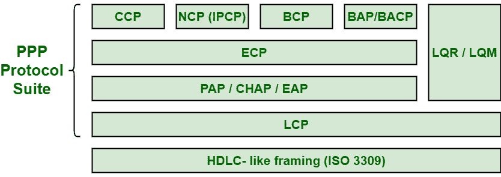
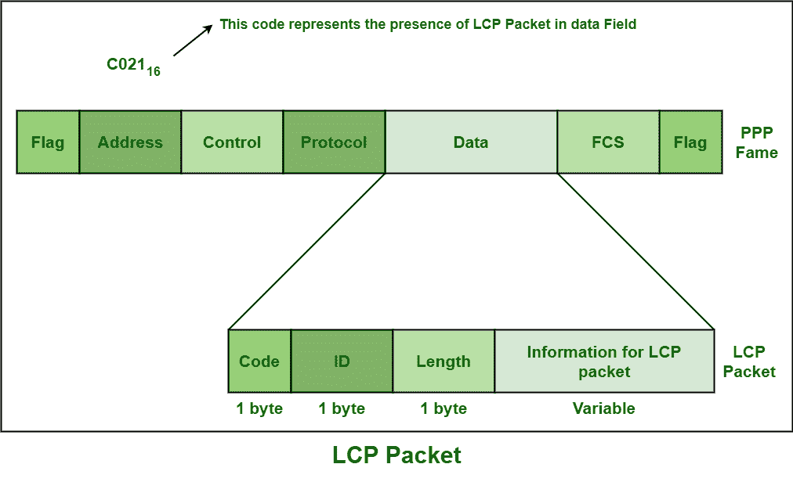
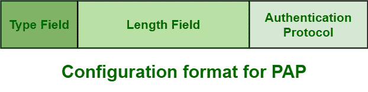

# 点对点协议(PPP)套件

> 原文:[https://www . geesforgeks . org/点对点协议-ppp-suite/](https://www.geeksforgeeks.org/point-to-point-protocol-ppp-suite/)

**[【点对点协议】](https://www.geeksforgeeks.org/ppp-full-form/)** 基本上是一个不对称的协议套件，适用于不提供任何成帧的不同连接或链路，即原始位管道。PPP 还希望其他协议建立连接、认证用户，以及承载网络层数据。PPP 不是一个单一的协议，而是一个协议套件，其中包括简单地解决点对点第 2 层通信的不同方面的协议。PPP 会话中基本上有 2 个路由器，即发起方(主要是客户端)和响应方(主要是服务器)。

PPP 操作通常使用三个不同的参数进行，如下所示:

**1。链路控制协议(LCP) :**
LCP 主要负责建立、维护、测试、配置和终止物理连接。它通常工作在第 1 层之上。它还协商基本上由网络控制点控制的所有其他[广域网(WAN)](https://www.geeksforgeeks.org/wan-full-form/) 选项。所有的链路控制协议数据包都在 PPP 帧的数据字段中传输。LCP 数据包如下所示:

不同的 LCP 协议如下所示:

*   **带宽分配协议(BAP)–**
    BAP 基本上是一种机制，在该机制中，任何通过一层多链路(MP)捆绑进行通信的设备，一条链路都可以请求在捆绑中添加或删除单个链路。
*   **带宽分配控制协议(BACP)–**
    BACP 基本上允许这些设备配置并明确它们想要如何使用 BAP。
*   **环节质量监控(LQM)–**
    LQM 基本上是一个确定数据丢失的过程。它通常用于监控链路质量。
*   **链接质量报告(LQR)–**
    LQR 允许两台计算机相互连接。它通常指定质量报告机制，但不是连接质量的特定标准，因为不依赖于实现。

**2。网络控制协议(NCP):**
NCP 协议基本上是配置各种通信协议所必需的。每个网络控制点都是特定的，并且特定于一个网络层协议，如 IP 或 IPX/SPX 或 Apple Talk。IP 是正在协商的最常见的第 3 层协议。对于 PPP 支持的每个更高层协议，至少有一个网络控制点始终存在。不同的网络控制点协议如下:

*   **压缩控制协议(CCP)–**
    CCP 主要负责配置、启用、禁用或协商以及控制或维护 PP 连接两端的数据压缩算法。

*   **桥接控制协议(BCP)–**
    BCP 主要负责配置、启用、禁用或协商以及控制或维护 PP 连接两端的桥接控制模块。它类似于 IPCP，但不是路由，而是初始化桥接。*   **互联网协议控制协议(IPCP)–**
    该协议特别要求在连接的每一端配置、启用和禁用 IP 协议模块。路由器还交换 IPCP，只是为了协商特定于 IP 的选项。*   **Encryption Control Protocol (ECP) –**
    This protocol is especially requiring to configure, enable, disabling or negotiating and controlling or maintaining data encryption algorithms on both of the ends of the PP connection.

    **3。认证协议:**
    认证协议只需要验证，即检查想要访问资源的用户的身份。这些协议也只是为服务的用户验证端点。下面给出了不同的身份验证协议:

    *   **可扩展认证协议(EAP)–**
        有几种由客户端即对等方发起的认证协议，但 EAP 认证一般由服务器发起即认证。它是一种基本上支持多种身份验证协议的协议。
    *   **[Password Authentication Protocol (PAP)](https://www.geeksforgeeks.org/password-authentication-protocol-pap/) –**
        This protocol is especially required to verify the identity and password of the peer or client that might result in success or either failure. It is also symmetric and does not even allow asymmetric settings with authenticator and peer.

        

    *   **[挑战握手认证协议(CHAP)](https://www.geeksforgeeks.org/challenge-handshake-authentication-protocol-chap/)–**
        该协议特别需要借助 3 次握手来验证对等方或客户端的身份。它是不对称的。