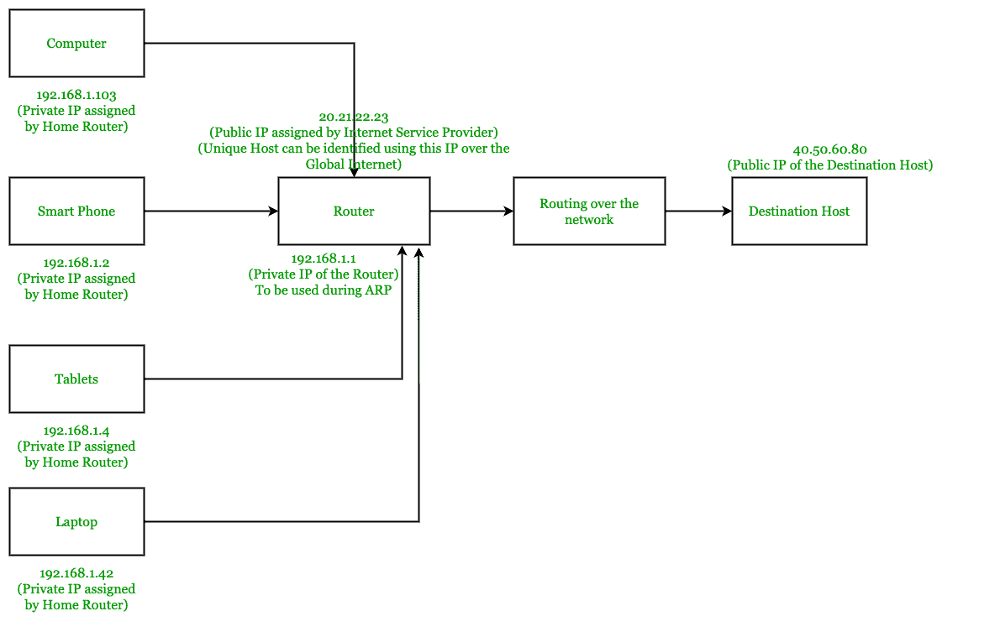
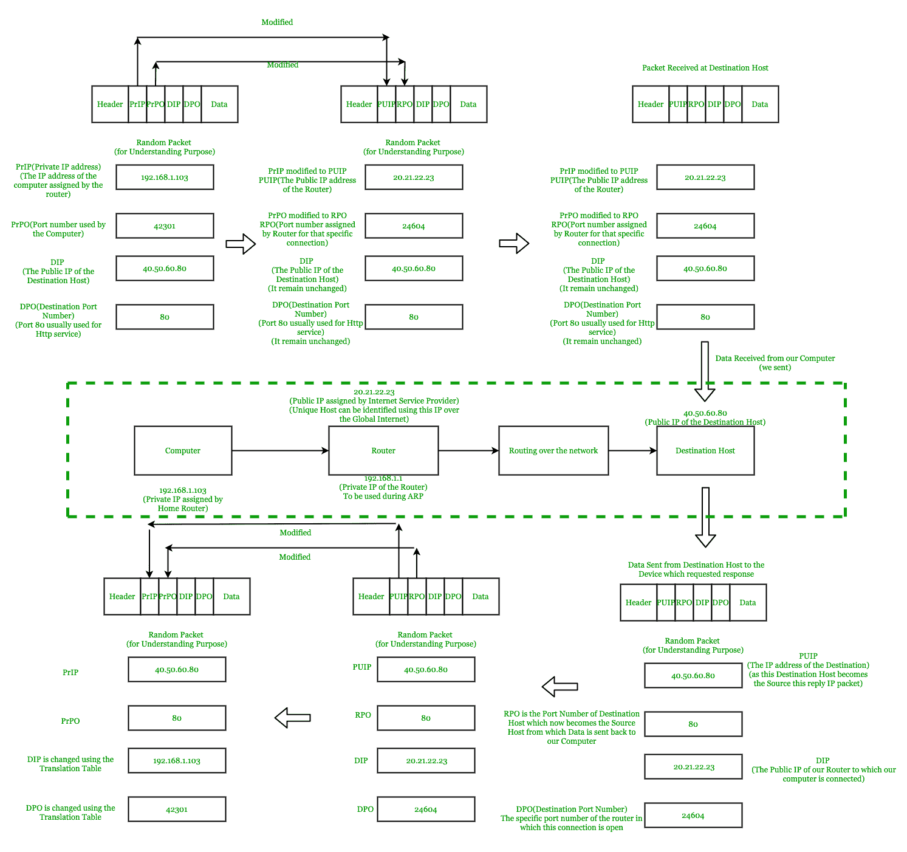
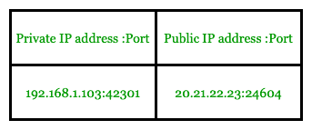

# 端口地址转换(PAT)到私有 IP 的映射

> 原文:[https://www . geesforgeks . org/port-address-translation-pat-mapping-to-private-IPS/](https://www.geeksforgeeks.org/port-address-translation-pat-mapping-to-private-ips/)

在本文中，我们将学习家庭网络是如何工作的。

首先，我们应该记住，当我们将笔记本电脑、智能手机、平板电脑等连接到家庭网络时，都会获得一个 IP 地址。分配给这些设备的 IP 地址不是公共 IP 地址，而是私有 IP 地址。这个家庭网络是一个**局域网**。

**家庭网络中私有 IP 的使用:**
[私有 IP](https://www.geeksforgeeks.org/difference-between-private-and-public-ip-addresses/) 未注册，因此不能用于在互联网上唯一地查找用户。私有 IP 通常在 **192.168.X.X 和 10 的范围内。X.X.X** 。这些私有 IP 由路由器分配给连接到路由器的每个设备。

那么，我们的设备是如何连接到互联网的呢？分配给它们的私有地址在互联网上是无法唯一识别的。
这就是**端口地址转换(PAT)** 或者更通俗的说法 **[网络地址转换](https://www.geeksforgeeks.org/network-address-translation-nat/)过载**出现的地方。

**注意:**
需要记住的重要一点是，我们唯一连接到互联网的路由器被赋予了一个公共 IP。

因此，局域网中的所有设备只使用一个公共 IP 与互联网通信。

**局域网中私有 IP 的必要性:**
为了节省可用的 IPv4 地址，家庭网络中的每个设备都没有分配公共地址，因此我们必须使用 PAT。

**端口地址转换(PAT):**
这解决了具有私有 IP 地址的设备如何使用分配给边缘路由器的单一公共地址连接到互联网的问题。

**私有 IP 解析中的步骤:**

1.  当专用网络中的设备想要连接到网站时，它会根据设备本身的现场视察模型执行所有步骤(创建一个 IP 数据包)，然后将该 IP 数据包提供给家庭网络中的路由器。
2.  端口地址转换在路由器中实现。
    因此，现在路由器接收到的 IP 数据包有一个私有 IP 和一个端口号(由我们的计算机给出)，所以现在路由器将使用路由器的公共 IP 替换私有 IP，并且特定端口被分配给该设备的连接。
3.  在*转换表*中创建一个条目，映射路由器的哪个私有 IP 和端口映射到哪个公共 IP 和端口。
4.  因此，最终在端口字段中的 IP 数据包被路由器分配的新端口号所取代。
5.  根据网络规则，数据包在互联网中被路由。

**注:**

*   只有在特定主机与另一个特定目标主机之间建立连接时，才会首次在转换表中创建条目。
*   目标 IP 和目标端口不变。

**按目的主机回复 IP 数据包:**
目的主机回复，在回复 IP 数据包中，目的 IP 地址是路由器公共地址，端口号是路由器为该特定设备中的特定连接分配的端口号。

IP 数据包最终是如何返回给特定设备的，该设备曾向该特定网站请求响应？

1.  通过查看网络地址转换(NAT)表可以找到特定的设备，因为我们在边缘路由器的特定端口收到了 IP 数据包。
2.  通过检查具有分配的端口号和(实际目的主机)目的 IP 地址(IP 包来自哪里)的相应转换表条目，我们可以唯一地找到该特定设备的设备和特定端口。

如果专用网络中的所有设备都希望连接到同一个目标主机和目标主机的同一个端口，该怎么办？

没有问题，因为在转换表中，每种连接都有一个条目。路由器为每个连接分配了唯一的端口号，这一事实可以将连接与其他连接区分开来。

通过下面的图表，整个上述概念将变得清晰。

转换表看起来像(条目是上面的示例 IP 地址):-

这样，仅使用一个公共 IP，我们就可以将专用网络中的设备连接到互联网。