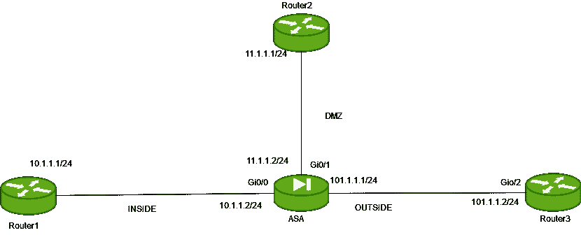

# 自适应安全设备(ASA)上的端口地址转换(PAT)

> 原文:[https://www . geesforgeks . org/port-address-translation-pat-on-adaptive-security-appliance-asa/](https://www.geeksforgeeks.org/port-address-translation-pat-on-adaptive-security-appliance-asa/)

**端口地址转换(PAT)** 是[网络地址转换(NAT)](https://www.geeksforgeeks.org/computer-network-network-address-translation-nat/) 的一种，在公共 IP 地址短缺时使用。同一子网的公共 IP 地址之一或接口地址用于转换。

**端口地址转换(PAT):**
这也称为 NAT 过载。在这种情况下，许多本地(私有)IP 地址被转换为单个公共 IP 地址。有时，私有地址被转换成接口地址(单个)。在这种情况下，端口号用于区分流量，即哪个流量属于哪个 IP 地址。

**过程:**
过程几乎与动态 NAT 相同，但请记住，在 PAT 中，多个私有 IP 地址被转换为一个公共 IP 地址。

*   **步骤 1:配置访问列表**
    建立访问列表，说明许可条件，即谁应该被许可以及什么协议应该被许可。

*   **步骤 2:将访问列表应用于界面**
    访问组命令将用于说明动作(如上所述)应该发生的方向(出或入)。*   **步骤-3:创建网络组或网络对象**
    网络组将说明将应用 PAT 的子网或不同子网。而网络对象表示单个子网，该子网可以进一步用于 PAT 过程进行转换。可以说，网络组包含多个网络对象。*   **Step-4: PAT statement**
    This step will specify the direction in which PAT should takes place and on what IP address (Public IP address) the private IP address should be translated.

    **配置:**

    

    三个路由器，即路由器 1 (IP 地址–10 . 1 . 1 . 1/24)、路由器 2 (IP 地址–11.1.1.1/24)和路由器 3 (IP 地址–101.1.1.1)连接到 ASA (IP 地址- 10.1.1.2/24，名称–内部和安全级别–Gi0/0 上的 100，IP 地址–11.1.1.2/24,名称–非军事区和安全级别–Gi0/1 上的 50，IP 地址–101.1.1.2/24,名称–外部和安全级别–Gi0/2 上的 0)，如上图所示。

    在本任务中，我们将为从内部到外部产生的流量以及从非军事区到外部的流量启用 PAT。

    在所有路由器和 ASA 上配置 IP 地址。

    在路由器 1 上配置 IP 地址:

    ```
    Router1(config)#int fa0/0
    Router1(config-if)#ip address 10.1.1.1 255.255.255.0
    Router1(config-if)#no shut 
    ```

    在路由器 2 上配置 IP 地址:

    ```
    Router2(config)#int fa0/0
    Router2(config-if)#ip address 11.1.1.1 255.255.255.0
    Router2(config-if)#no shut 
    ```

    在路由器 3 上配置 IP 地址:

    ```
    Router3(config)#int fa0/0
    Router3(config-if)#ip address 101.1.1.1 255.255.255.0
    Router3(config-if)#no shut 
    ```

    在 ASA 接口上配置 IP 地址、名称和安全级别:

    ```
    asa(config)#int Gi0/0
    asa(config-if)#no shut
    asa(config-if)#ip address 10.1.1.2 255.255.255.0
    asa(config-if)#nameif INSIDE 
    asa(config-if)#security level 100
    asa(config-if)#exit
    asa(config)#int Gi0/1
    asa(config-if)#no shut
    asa(config-if)#ip address 11.1.1.2 255.255.255.0
    asa(config-if)#nameif DMZ
    asa(config-if)#security level 50
    asa(config-if)#exit
    asa(config)#int Gi0/2
    asa(config-if)#no shut
    asa(config-if)#ip address 101.1.1.2 255.255.255.0
    asa(config-if)#nameif OUTSIDE
    asa(config-if)#security level 0
    ```

    现在给路由器静态路由。配置到路由器 1 的静态路由:

    ```
    Router1(config)#ip route 0.0.0.0 0.0.0.0 10.1.1.2 
    ```

    配置到路由器 2 的静态路由:

    ```
    Router2(config)#ip route 0.0.0.0 0.0.0.0 11.1.1.2 
    ```

    配置到路由器 3 的静态路由:

    ```
    Router3(config)#ip route 0.0.0.0 0.0.0.0 101.1.1.2 
    ```

    最后配置静态路由到 ASA:

    ```
    asa(config)#route INSIDE 10.1.1.0 255.255.255.0 10.1.1.1
    asa(config)#route OUTSIDE 101.1.1.0 255.255.255.0 101.1.1.1
    asa(config)#route DMZ 11.1.1.0 255.255.255.0 10.1.1.1
    ```

    对于 ICMP，检查或使用 ACL 来允许从较低安全级别到较高安全级别的 ICMP 回应回复(这样做是因为默认情况下，不允许从较低安全级别到较高安全级别的流量)。

    配置访问列表:

    ```
    asa(config)#access-list traffic_out permit icmp any any 
    asa(config)#access-list traffic_dmz permit icmp any any 
    ```

    这里有两个访问列表。

    第一个访问列表名是流量输出，允许从外部到内部的 ICMP 流量(具有任何 IP 地址和任何掩码)。
    第二个访问列表被命名为 traffic_dmz，允许 ICMP 流量从外部进入 dmz(具有任何 IP 地址和任何掩码)。

    将这些访问列表应用于 ASA 接口:

    ```
    asa(config)#access-group traffic_out in interface OUTSIDE 
    asa(config)#access-group traffic_dmz in interface DMZ
    ```

    第一条语句说明访问列表流量 _out 在向内的方向上应用于外部接口
    第二条语句说明访问列表流量 _dmz 在向内的方向上应用于 dmz 接口。
    内部设备将能够 ping 通外部和非军事区设备。

    任务是在 ASA 上启用 PAT 每当整个子网(10.1.1.0/24)的流量从内部流出到外部，以及网络(11.1.1.0/24)的流量从非军事区流出到外部时，都应该将其转换为外部接口地址。

    ```
    asa(config)#object network inside_nat
    asa(config-network-object)#subnet 10.1.1.0 255.255.255.0
    asa(config-network-object)#exit
    ```

    首先，指定应该转换哪个子网。

    将指定 NAT 转换的方向:

    ```
    asa(config)#nat (INSIDE, OUTSIDE) source dynamic INSIDE interface
    ```

    对从非军事区到外部的流量应用网络地址转换:

    ```
    asa(config)#object network dmz_nat
    asa(config-network-object)#subnet 11.1.1.0 255.255.255.0
    asa(config-network-object)#exit
    ```

    正在为此流量创建 NAT 池:

    ```
    asa(config)#object network dmz_nat_pool
    asa(config-network-object)#range 120.1.1.1 120.1.1.4
    asa(config-network-object)#exit
    ```

    指定了 nat 转换的部分。

    ```
    asa(config)#nat (DMZ, OUTSIDE) source dynamic DMZ interface 
    ```

    上面的命令指定应该使用 PAT 将 dmz_nat 中的子网转换为 dmz 接口的 IP 地址。借此，配置 PAT 的过程几乎类似于动态 NAT。主要区别在于配置外部接口的 IP 地址，而不是 NAT 池，其中一个 IP 地址将从 NAT 池中转换。

    **优势:**
    这是最常用的，因为它具有成本效益，因为数千名用户只需使用一个真实的全球(公共)IP 地址就可以连接到互联网。