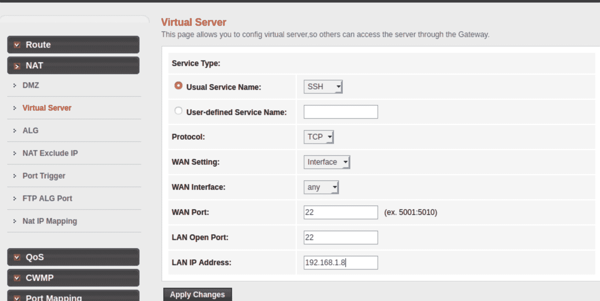

# 路由器上的端口转发以及我们为什么需要它

> 原文:[https://www . geesforgeks . org/port-forwarding-on-router-and-why-we-do-it/](https://www.geeksforgeeks.org/port-forwarding-on-router-and-why-do-we-need-it/)

路由器端口转发用于允许远程计算机连接到局域网上的特定服务或计算机。现在的问题是我们为什么需要它。我们将逐一讨论所有这些事情。

**用例:**

1.  假设你在办公室，想连接到你家里的电脑，家里的电脑连接到房子的 [WiFi](https://www.geeksforgeeks.org/difference-between-wifi-and-wimax/) ，房子是一个[局域网](https://www.geeksforgeeks.org/local-area-network-lan-technologies/)连接到你家电脑的方法之一是将路由器中的 ssh(端口 22)端口转发到你的电脑的 IP 地址，并在你的电脑上打开 ssh 端口。现在，任何试图 ssh 到你的公共 IP 地址的人都会被转发到你家的电脑上。
2.  假设你想在你的电脑上托管一个网站，你希望互联网上的每个人都可以访问你的网站，这可以通过端口转发来实现。你要做的是端口转发 [HTTP](https://www.geeksforgeeks.org/difference-between-http-and-https/) (端口 80)或 HTTPS(端口 443)从你的路由器到你的电脑上，你的网站部署。华友世纪知道任何拥有你的公共 IP 地址的人都可以访问你的网站。

这只是解释端口转发需求的两个使用案例，您可以做更多的事情，比如访问连接到您局域网的摄像机，从世界任何地方访问连接到您局域网的打印机，您还可以在您的机器上托管一台《我的世界》服务器，并邀请朋友与之连接。

**如何在路由器上实现端口转发:**

在开始如何实现端口转发之前，需要做两件基本的事情:

1.  您的公共 IP 地址必须是静态的，因为大多数正常的互联网连接都有动态的公共地址，即 IP 地址在几个小时或几天后会发生变化，因此每次您必须连接到又蓝的机器时，都必须获得您的公共 IP 地址。虽然对于一些用户来说，动态 IP 地址不是什么大问题，但是如果你不想一次又一次地知道这个 IP，那么你可以要求你的 ISP 提供一个静态 IP。
2.  第一个要求没那么必要，第二个要求非常必要。您必须为您的机器(您想远程连接到的机器)分配一个静态私有 IP 地址，这可以通过您的路由器和机器本身轻松完成。这个要求是必要的，因为在路由器上的端口转发过程中，我们必须提到我们要将端口转发到的机器的 IP 地址，因此如果机器的私有 IP 地址是动态的，我们必须一次又一次地在路由器上配置端口转发，这是可行的。

**程序:**

**第一步:**

打开你的 WiFi 路由器的默认网关通常大多数路由器的默认网关的 IP 地址是 [http://192.168.1.1](http://192.168.1.1) 找到你的路由器的网关地址并在你的浏览器中打开它这将打开路由器设置页面登录到这个页面。

**第 2 步:**

登录后，搜索 NAT、虚拟服务器，然后输入要转发的端口或服务，之后输入要转发的机器的 IP 地址。转发该端口(请注意，这是每台路由器的常规步骤，对于您的路由器可能略有不同)

**第三步:**

现在，您可以使用您的公共 IP 地址轻松地远程访问您的机器

**注–**

请注意，如果您的机器(您想远程连接到的机器)安装了防火墙，那么您必须管理该防火墙以允许远程请求