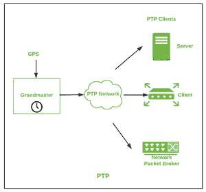

# 精确时间协议(PTP)

> 原文:[https://www.geeksforgeeks.org/precision-time-protocol-ptp/](https://www.geeksforgeeks.org/precision-time-protocol-ptp/)

先决条件–[应用层协议](https://www.geeksforgeeks.org/protocols-application-layer/)

**精确时间协议** (PTP)是一种在整个计算机网络中促进时钟同步的协议。该协议用于同步不同类型设备的时钟。PTP 在 1588 年由约翰·爱迪生领导标准化，并于 2002 年出版。这是在同步介质中通过通信介质实现消息交换所必需的。

**PTP 的特色:**
PTP 的一些特色是–

*   它有一个交替的时间尺度功能。
*   它使用一个大师时钟来同步通信。
*   它适用于主从架构。
*   它使沟通的路径可追溯。

**PTP 的工作方式:**
PTP 是一种协议，用于不同设备之间的无缝通信。它使用时间资源的主从系统并提供同步。该系统由一个或多个通信设备和一个由主控设备提供的单个网络连接组成。这位特级大师负责根时序参考。主控器将同步信息传输到驻留在通信介质中的设备。这种安排方案通过补偿整个网络的交付可变性来提供精确的分配。

**精确时间协议的架构:**

**PTP 的申请:**

*   用于各种信息技术应用中，实现设备间的有效通信。
*   它提供通用时间戳应用程序，用于计算机同步等。
*   它是用硬件和软件实现的，以做出巨大的应用。
*   它用于路由器和交换机。
*   它用于各种微处理器、网卡和协议栈。
*   它用于射频仪器、飞机监控仪器和全球定位系统链接时钟。

**PTP 优势:**

*   它提供精确的时间戳。
*   这是一个众所周知的时钟同步协议。
*   它加强了房屋内部的安全。
*   提供设置同步通信的协调动作的可能性。

**PTP 的劣势:**

*   如果主时钟出现故障，整个通信将停止。
*   同步操作是可能的。
*   新主人的选择是不确定的，因为它会延长不确定的时间。