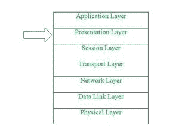
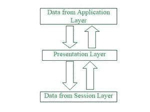

# OSI 模型中的表示层

> 原文:[https://www . geesforgeks . org/presentation-layer-in-OSI-model/](https://www.geeksforgeeks.org/presentation-layer-in-osi-model/)

**先决条件:** [现场视察模型](https://www.geeksforgeeks.org/layers-of-osi-model/)

**简介:**
表示层是开放系统互连(OSI)模型中的第 6 层。该层也称为转换层，因为该层充当网络的数据转换器。该层从应用层接收的数据在这里被提取和处理，作为通过网络传输所需的格式。该层的主要职责是提供或定义数据格式和加密。表示层也被称为语法层，因为它负责维护它接收或传输到其他层的数据的正确语法。

**表示层功能:**

表示层是现场视察模型中的第六层，执行几种功能，如下所述

*   表示层格式化并加密要通过网络发送的数据。
*   该层注意数据的发送方式，以便接收方能够理解信息(数据)，并能够高效和有效地使用数据。
*   该层管理抽象数据结构，并允许定义或交换高级数据结构(例如银行记录)。
*   该层在发送端执行加密，在接收端执行解密。
*   该层执行数据压缩，以减少要传输的数据的带宽(数据压缩的主要目标是减少要传输的位数)。
*   该层负责编码方法之间的互操作性(计算机交换和利用信息的能力)，因为不同的计算机使用不同的编码方法。
*   这一层主要处理数据的表示部分。
*   表示层，执行数据压缩(传输时位数减少)，从而提高数据吞吐量。
*   这一层还处理字符串表示的问题。
*   表示层还负责将所有格式集成到一个标准化的格式中，以实现高效和有效的通信。
*   对于不同系统之间的通信，该层将消息从用户相关格式编码为通用格式，反之亦然。
*   这一层处理消息的语法和语义。
*   这一层还确保了要呈现给上层和下层的消息应该是标准化的，也应该是准确的格式。
*   表示层还负责翻译、格式化和传递信息以供处理或显示。
*   该层还执行序列化(将数据结构或对象转换为易于存储或传输的格式的过程)。

**OSI 模型中表示层的特点:**
表示层作为 OSI 模型中的第六层，在网络中两台设备之间进行通信时起着至关重要的作用。

表示层提供的功能列表有–

*   表示层可以应用某些复杂的压缩技术，因此当信息通过网络发送时，只需要更少的数据字节来表示信息。
*   如果两个或多个设备通过加密连接进行通信，则该表示层负责在发送端添加加密，并在接收端对加密进行解码，以便它可以用未加密的可读数据表示应用层。
*   该层格式化并加密要通过网络发送的数据，从而避免兼容性问题。
*   这个表示层还协商传输语法。
*   该表示层还负责压缩从应用层接收的数据，然后将其传送到会话层(OSI 模型中的第五层)，从而通过最大限度地减少要传输的数据量来提高通信速度和效率。

**OSI 模型中表示层的工作:**
OSI 模型中的表示层作为翻译器，基于适用的网络协议和架构，将发送节点应用层发送的数据转换为可接受、兼容的数据格式。到达接收计算机后，表示层将数据翻译成应用层可接受的格式。换句话说，基本上，当传输的数据必须以不同于原始格式的格式查看时，该层会处理出现的任何问题。作为现场视察模式的功能部分，表示层执行大量数据转换算法和字符翻译功能。该层主要负责管理两个网络特征:协议(规则集)和架构。

**表示层协议:**
表示层是第六层，但在现场视察模型中最重要的一层执行几种类型的功能，这确保正在传输或接收的数据对于封闭网络中的所有设备都应该是准确或清晰的。
为了执行翻译或其他指定功能，表示层需要使用以下定义的特定协议–

1.  [**苹果备案协议(AFP)**](https://www.geeksforgeeks.org/afp-fullform/)**–**
    苹果备案协议是为 macOS 或经典 macOS 提供服务的专有网络协议(通信协议)。这基本上是专门为基于 Mac 的平台设计的网络文件控制协议。
2.  **轻量级呈现协议(LPP)–**
    轻量级呈现协议是用于在基于 TCP/IP 的协议栈之上提供 ISO 呈现服务的协议。
3.  [**NetWare Core Protocol(NCP)**](https://www.geeksforgeeks.org/introduction-of-novell-netware/#:~:text=NetWare%20Core%20Protocol%20(NCP)%20%E2%80%93,NetWare%20Operating%20systems%20(OS).)**–**
    NetWare Core Protocol 是用于访问文件、打印、目录、时钟同步、消息传递、远程命令执行等网络服务功能的网络协议。
4.  **网络数据表示(NDR)–**
    网络数据表示基本上是 OSI 模型中表示层的实现，它提供或定义了各种原始数据类型、构造的数据类型以及几种类型的数据表示。
5.  **外部数据表示(XDR)–**
    外部数据表示(XDR)是数据描述和编码的标准。它对于在计算机体系结构之间传输数据非常有用，并且已经被用于在非常不同的机器之间传递数据。从局部表示转换为 XDR 称为编码，而将 XDR 转换为局部表示称为解码。
6.  [**【安全套接字层(SSL)**](https://www.geeksforgeeks.org/secure-socket-layer-ssl/#:~:text=Secure%20Socket%20Layer%20(SSL)%20provide,SSL%20record%20protocol)**–**
    安全套接字层协议为网络浏览器和服务器之间传输的数据提供安全性。SSL 对网络服务器和浏览器之间的链接进行加密，这确保了它们之间传递的所有数据都是私有的，不会受到攻击。