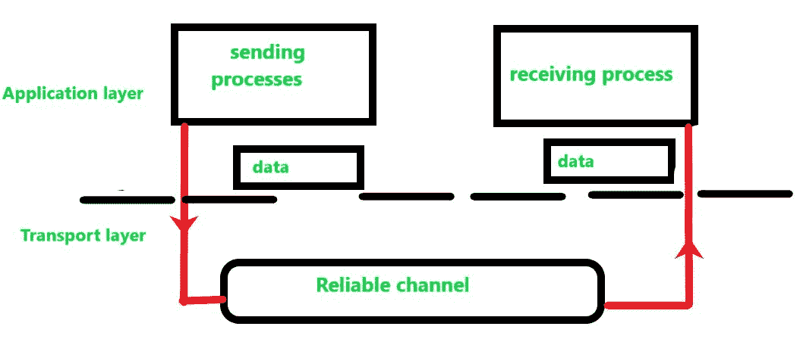
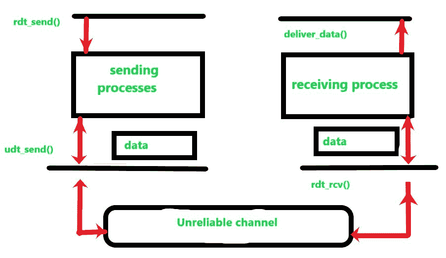

# 可靠数据传输协议的原理

> 原文:[https://www . geesforgeks . org/可靠数据传输协议原则/](https://www.geeksforgeeks.org/principle-of-reliable-data-transfer-protocol/)

[传输层协议](https://www.geeksforgeeks.org/computer-network-transport-layer-responsibilities/)是分层架构的核心部分，它们提供应用程序进程之间的逻辑通信。这些进程使用逻辑通信将数据从传输层传输到网络层，这种数据传输应该是可靠和安全的。数据以数据包的形式传输，但问题出现在可靠的数据传输中。

传输数据的问题不仅发生在传输层，也发生在应用层和链路层。当可靠服务在不可靠的服务上运行时，会出现这个问题。例如，TCP(传输控制协议)是一种可靠的数据传输协议，它在不可靠的层上实现，即互联网协议(IP)是一种端到端的网络层协议。

**Figure:** Study of Reliable Data Transfer

在这个模型中，我们通过可靠的信道设计了协议的发送方和接收方。在可靠的数据传输中，该层从上面的层接收数据，以段的形式分解消息，并将报头放在每个段上并传输。下层接收数据段，从每个数据段中删除报头，并通过添加到报头中使其成为数据包。

从上面传输的数据没有传输的数据位损坏或丢失，所有数据都以发送到下层的相同顺序传送。这是可靠的数据传输协议。这种服务模型由 TCP 提供给调用这种数据传输的互联网应用程序。

**Figure:** Study of Unreliable Data Transfer

同样，在不可靠的信道中，我们设计了发送端和接收端。协议的发送端从上面的层被调用到 rdt_send()，然后它将把要传递的数据传递到接收端的应用层(这里 rdt-send()是一个发送数据的函数，其中 rdt 代表可靠的数据传输协议，而 _send()用于发送端)。

在接收端，当数据包从不可靠信道的接收端到达时，将调用 rdt_rcv() (rdt_rcv()是用于接收数据的函数，其中-rcv()用于接收端)。当 rdt 协议想要向应用层传递数据时，它将通过调用 deliver_data()(其中 deliver_data()是向上层传递数据的函数)来实现。

在可靠的数据传输协议中，我们只考虑单向数据传输的情况，即数据从发送端传输到接收端(即只在一个方向上)。在双向(全双工或两侧数据传输)的情况下，数据传输在概念上更加困难。虽然我们只考虑单向数据传输，但需要注意的是，我们协议的发送和接收端需要双向传输数据包，如上图所示。

为了交换包含需要传输的数据的分组，rdt 的两个(发送和接收)侧也需要在两个方向(即，来回)交换控制分组，rdt 的两个侧通过调用 udt_send() (udt_send()是用于向另一侧发送数据的函数，其中 udt 代表不可靠的数据传输协议)向另一侧发送分组。