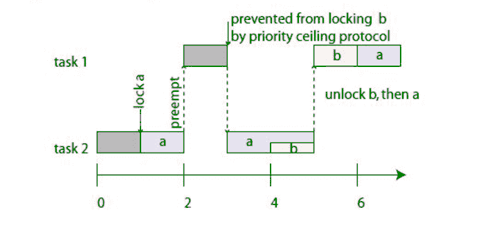

# 优先级上限协议

> 原文:[https://www.geeksforgeeks.org/priority-ceiling-protocol/](https://www.geeksforgeeks.org/priority-ceiling-protocol/)

**优先级上限协议**是一种实时系统中的作业任务同步协议，在很多方面优于优先级继承协议。实时系统是多任务系统，涉及使用信号量变量、信号和事件进行作业同步。

在**优先级上限协议**中，假设系统中的所有作业都有固定的优先级。它不会陷入死锁状态。

优先级上限协议解决了优先级继承协议的链式阻塞问题。

**优先级上限协议的基本属性是:**

1.  系统中的每个资源都被分配了优先级上限。
2.  分配的优先级上限由可能获取资源的所有作业中的最高优先级决定。
3.  它利用了多个资源或信号量变量，从而消除了链阻塞。
4.  如果没有其他作业获得资源锁，则为该作业分配资源锁。
5.  只有当作业的优先级严格大于其他作业持有的所有锁的优先级上限时，作业 J 才能获得锁。
6.  如果高优先级作业已被资源阻止，则拥有该资源的作业将获得高优先级任务的优先级。
7.  一旦资源被释放，优先级被重置回原来的优先级。
8.  在最坏的情况下，当 J 1 必须访问 T 个信号量来完成其执行时，最高优先级作业 J 1 可以被系统中的 T 个较低优先级任务阻塞。

与优先级继承协议不同，优先级调度协议可以用来解决优先级反转问题。它利用信号量与实时系统中的作业共享资源。