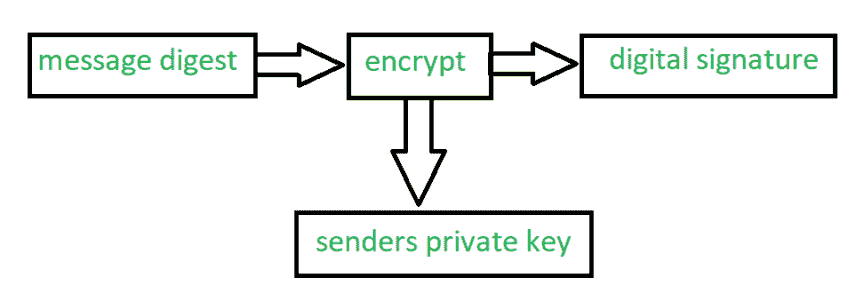
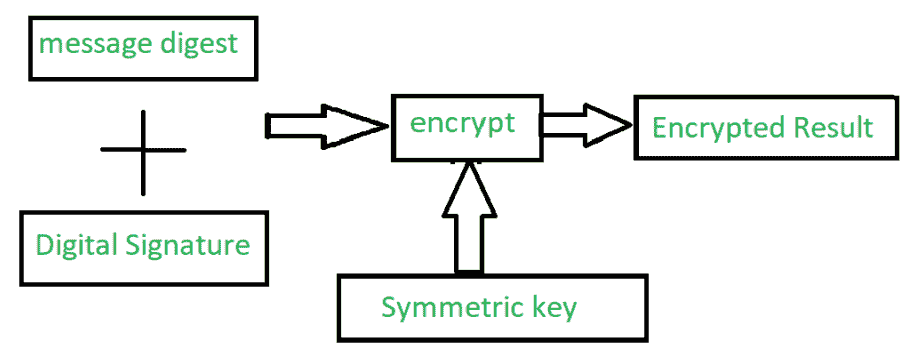

# 隐私增强邮件(PEM)及其运行

> 原文:[https://www . geesforgeks . org/privacy-enhanced-mail-PEM-and-it-work/](https://www.geeksforgeeks.org/privacy-enhanced-mail-pem-and-its-working/)

**隐私增强邮件(PEM)** 是一种通过互联网提供安全电子邮件通信的电子邮件安全标准。如今，电子邮件的安全性变得极其重要。为了处理电子邮件的安全问题，互联网架构委员会采用了它。

质子交换膜主要提供以下服务

1.  **机密性–**
    机密性是指防止未经授权访问信息从而保护信息的行为。通过使用各种标准算法(如[数据加密标准(DES)](https://www.geeksforgeeks.org/data-encryption-standard-des-set-1/) )对消息进行加密，在 PEM 中获得机密性。密码块链接模式下的 DES 目前正被 PEM 使用。
2.  **完整性–**
    数据完整性是指数据在其整个生命周期中的一致性。这是通过使用称为消息摘要的独特概念来实现的，其中消息摘要是一个散列函数，它将消息转换为一个称为摘要的图像，并将消息作为输入。质子交换膜使用 RSA 加密、MD2 和 MD5 散列函数来生成摘要。从散列函数中产生一个八位位组值，然后对其进行加密，然后由接收者根据消息摘要运行，以确保所传输消息的完整性。

**质子交换膜的工作:**
质子交换膜基本上分 4 个主要步骤工作。

1.  **Canonical Conversion –**
    This step involves the conversion of the message into a standard format that is independent of the computer architecture and the operation system of the sender and the receiver. If the sender and receiver has different computer architecture or operating system. It may lead to generation of different message digest due to difference in their interpretation because of syntactical difference from one operating system to an other.
2.  **[Digital Signature](https://www.geeksforgeeks.org/digital-signatures-certificates/) –**
    In this step, the digital signature is generated by encrypting the message digest of an email message with the sender’s private key.

    

3.  **[Encryption](https://www.geeksforgeeks.org/public-key-encryption/) –**
    The encrypted message is generated by encrypting the original message and digital signature together along with the symmetric key as shown in the figure below.This step is very crucial in order to obtain the confidentiality.

    

4.  **Base-64 编码–**
    这是二进制输出转换为字符输出的最后一步。24 位的二进制输出被分成 4 个相等的组，并与 8 位字符输出映射，产生一个十进制代码。现在，PEM 使用一个单独的映射表，生成的代码中的每个数字都与映射表中相应的值进行映射，并写入与字符的 8 位 ASCII 相对应的二进制等效内容。