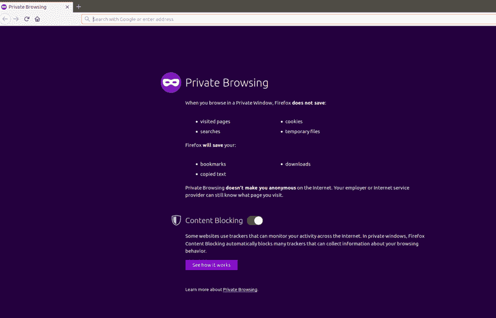

# 私人浏览

> 原文:[https://www.geeksforgeeks.org/private-browsing/](https://www.geeksforgeeks.org/private-browsing/)

**隐私浏览概述:**
随着互联网浏览的使用日益增多，人们越来越意识到自己的隐私，保护个人信息。没有人愿意透露他们正在浏览的网站以及与之相关的本地数据，这些数据可以用来检索个人敏感信息。

例如，如果在一个计算机系统上，一个用户正在访问一个银行网站，很明显，他不希望任何其他用户知道他的凭证，这些凭证默认由网络浏览器存储(通过询问允许)。为了保护用户访问过的网站的历史和与之相关的本地数据，我们使用私人浏览。

**缓存是如何维护的？**
每当用户第一次访问网站时，浏览器都会创建一个名为缓存的临时文件。它的维护是为了加快浏览速度，因此每当用户再次访问该网站时，该页面将从其缓存副本中加载，而不是再次从互联网上下载。但是，如果您使用的是公共系统，那么它会将一些个人敏感信息提供给另一个用户，因为它可以存储密码等敏感信息，因此，为了维护隐私，应该清除缓存。基本上，私人浏览向访问同一台机器的另一个用户隐藏了用户的浏览历史。

**私人浏览:**
私人浏览是一个禁用浏览器历史、删除 cookies 和不存储网页缓存的概念。如果启用了私人浏览，浏览器将不会存储浏览信息(会话信息)，例如用户或访问过的网站的凭据，或者您在表单中输入的数据。私人浏览不会让你匿名，因为你的互联网服务提供商仍然可以跟踪你。此外，这是一个常见的神话，它将保护用户免受键盘记录器或间谍软件，但它不会。

与可被私人浏览阻止的已访问网站相关联的本地数据有:

*   **浏览历史–**
    是用户最近访问过的网址列表。

*   **缓存–**
    可以由多媒体文件或完整网页组成的临时文件。它被用来加速互联网浏览。启用私人浏览时，不会保存缓存。

*   **Cookies–**
    这些被网站用来维护特定于用户的设置、信息(如凭据)以及跟踪。它还可以被第三方用来跟踪不同网站的用户。这些被暂时保存在内存中，并在会话结束时启用私人浏览时被丢弃。

*   **密码–**
    与特定网站相关联的凭据不会通过私人浏览保存。

**注意–**在私人浏览会话结束时，保存和下载的书签文件不会被丢弃(仅当保存在私人浏览会话中时)。但是最近的研究表明，即使启用了私人浏览模式，它也不能完全保护用户的数据。当私人浏览被启用时，研究人员能够找到足够的关于所访问网页的信息。

**私密浏览怎么不完全私密？**
有研究表明，即使启用了私密浏览模式，也有足够多的残留痕迹。当用户想要访问一个网站并且只知道该网站的名称时，就会运行一个称为域名服务(DNS)的协议。域名被转换成 32 位的 IP 地址，网络设备进一步使用该地址来转发域名请求和回复。

机器会为此目的维护一个名为 DNS 缓存的特殊表，其中会维护一个域名及其相应的转换后的 IP 地址。如果一个技术用户访问了你的机器，他可以在很大程度上利用这些信息，并可以发现哪些网站被访问过。

另一个漏洞是机器的操作系统可以在使用私有模式时将信息写入硬盘。这可能包含链接到网站的图像或某些 HTML 代码。在这两种情况下，网络浏览器本身不会删除这些信息，因为它没有权限访问操作系统的这些部分。

**被称为面纱:**
为了解决当前系统的这些问题，麻省理工学院的研究人员开发了一种被称为“被称为面纱”的技术。有人建议加强公共机器上用户的隐私。拟议项目涉及的流程如下:

维尔通过一个“盲服务器”向机器发送网页。每当用户输入一个网址，相关的页面就会从盲服务器中被检索出来。bling-server 是一个代理，它将检索请求的网页，并在将其传输到浏览器之前对其进行加密。此外，一个特殊的垃圾代码将被注入到页面中，通过它页面看起来与用户相似，但是 HTML 代码将被修改。这样就可以隐藏源代码和网站的相关浏览历史。

**支持不同浏览器的私密浏览:**

*   **谷歌 Chrome–**
    如果用户不希望谷歌 Chrome 记住网站搜索等活动，那么谷歌 Chrome 允许一个名为隐姓埋名模式的选项用于私人浏览。通过启用此模式，它将不会存储站点 cookies、浏览历史等，但会存储下载的文件或书签。用户必须手动删除这些。

*   **游猎:**
    游猎也是如此。在 safari 私人浏览模式下，所有临时文件、浏览历史、表单数据等都将被清除。

*   **Opera:**
    Opera 提供了额外的保密级别，因为它提供了一个虚拟专用网选项(称为 Opera VPN，一种代理服务)，该选项将加密浏览器运行的所有流量，但注意仅针对 Opera 的流量。所有流量都是通过虚拟专用网提供商 SurfEasy 引导的。

*   **Mozilla Firefox:**
    除了擦除浏览历史、cookies 等，Firefox 还有一个额外的功能叫做内容拦截。它阻止追踪者收集用户数据。

*   **Internet Explorer 和 Edge:**
    对微软的浏览器 Internet Explorer 同样有所暗示。它不像 cookies 那样存储临时文件。此外，它还会在私人会话中禁用第三方工具栏。