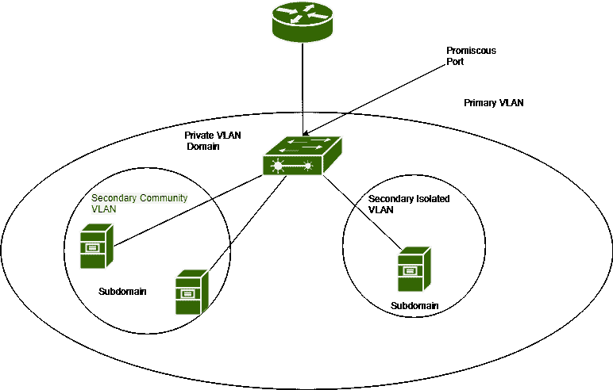
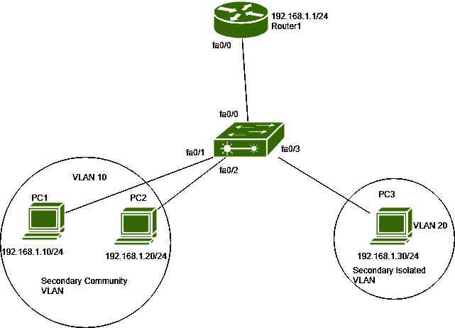

# 二等兵 VLAN

> 原文:[https://www.geeksforgeeks.org/private-vlan/](https://www.geeksforgeeks.org/private-vlan/)

先决条件–[虚拟局域网(VLAN)](https://www.geeksforgeeks.org/virtual-lan-vlan/)
虚拟局域网(VLAN)用于在第 2 层将广播域分解为更小的域。只有(所有)属于同一个 VLAN 的主机能够相互通信，同时与其他 VLAN 主机通信，内部 Vlan 路由完成。但是在同一个 VLAN，如果我们希望某些主机不能在第 2 层与其他主机(在同一个 VLAN)通信，则使用 VLAN 访问列表或私有 VLAN 的概念。

**二等兵 VLAN–**
二等兵 VLAN 用来把二层广播域分成小子域。子域由一个主 VLAN 和一个或多个次 VLAN 组成。

**虚拟局域网的类型–**



专用虚拟局域网有两种类型:

1.  **主 VLAN–**
    私人 VLAN 的所有港口都属于一个主 VLAN。一个私人 VLAN 只能有一个初选 VLAN。私有 VLAN 域中的所有虚拟局域网共享同一个主 VLAN。
2.  **二级 VLAN–**
    一个二级 VLAN 可以有一个或多个二级虚拟局域网。它在属于同一私有 VLAN 域的端口之间提供隔离。
    有两种类型:
    1.  **隔离 VLAN–**
        属于隔离 VLAN 的主机只能与其关联的混杂端口通信，不能直接与第 2 层的其他主机(属于其他隔离或社区 VLAN)直接通信。通常，单个端口被分配给隔离的虚拟局域网，但是可以有多个端口与之相关联。
    2.  **社区 VLAN–**
        一个私人 VLAN 可以有一个或多个社区 VLAN。属于同一团体虚拟局域网的主机可以相互通信，也可以与其关联的混杂端口通信，但属于不同团体虚拟局域网的主机不能在第 2 层相互通信。

# 端口类型–

私人 VLAN 中的端口类型有:

1.  **混杂港–**
    属于初级 VLAN。这些端口可以与所有接口通信，这些接口是与混杂端口和主 VLAN 相关联的辅助虚拟局域网的一部分。一般用于交换机与路由器、防火墙等的连接。
2.  **隔离端口–**
    隔离端口属于二级隔离 VLAN。这些主机端口的流量被转发到混杂端口。私有 VLAN 只允许来自相关混杂端口的流量进入隔离端口。
3.  **社区港口–**
    该港口属于 VLAN 二级社区。这些主机端口可以与同一个 VLAN 社区中的其他端口通信，也可以与其关联的混杂端口通信。这些端口与其他社区 VLAN 端口和隔离端口完全隔离。

**注意–**
VTP(VLAN 中继协议)应该在透明或关闭模式下运行，以便配置专用虚拟局域网。

**配置–**



如图所示，路由器 1 (IP 地址- 192.168.1.1/24)、PC1(IP 地址- 192.168.1.10/24)、PC2(IP 地址- 192.168.1.20/24)、PC3 (IP 地址- 192.168.1.30/24)和交换机相互连接。
在本任务中，我们将把 VLAN 10 分配给 fa0/1、fa0/2，把 VLAN 20 分配给 fa0/3 和 fa0/0，作为 VLAN 100。然后，我们将 VLAN 10 作为社区 VLAN，VLAN 20 作为孤立的 VLAN，VLAN 100 作为主要的 VLAN。

在交换机上配置专用 VLAN:

```
switch(config)#vlan 10
switch(config-vlan)#private-vlan community
switch(config-vlan)#exit

```

在这里，我们创建了 VLAN 10，并将其配置为社区 VLAN。现在，配置孤立的 VLAN。

```
switch(config)#vlan 20
switch(config-vlan)#private-vlan isolated
switch(config-vlan)#exit
```

现在，创建 vlan 100 并将其配置为主 vlan，并将辅助 vlan 10、20 关联到它。

```
switch(config)#vlan 100
switch(config-vlan)#private-vlan primary
switch(config-vlan)#private-vlan association 10, 20
switch(config-vlan)#exit 
```

现在，将端口配置为专用 vlan 主机端口，并将它们与主 VLAN 和辅助相关联。首先配置 fa0/1 和 fa0/2，并将 vlan 10(辅助 vlan)与其主 VLAN (vlan 100)相关联。

```
switch(config)#int range fa0/1-2
switch(config-vlan)#switchport mode private-vlan host
switch(config-vlan)#switchport Private-vlan host-association 100 10
```

现在，配置 fa0/3 并将 vlan 20(辅助 vlan)与其主 VLAN (vlan 100)相关联。

```
switch(config)#int fa0/3
switch(config-vlan)#switchport mode private-vlan host
switch(config-vlan)#switchport Private-vlan host-association 100 20
```

现在，最后我们将接口 fa0/0 配置为混杂端口，并将该端口与主 vlan (vlan 100)和辅助 vlan (vlan 10，20)相关联。

```
switch(config)#int fa0/0
switch(config-vlan)#switchport mode private-vlan promiscuous 
switch(config-vlan)#switchport Private-vlan mapping 100 10, 20
```

我们可以通过命令验证与辅助虚拟局域网相关联的端口。

```
switch#show vlan private-vlan
```

如果要验证主 VLAN 和次 VLAN(孤立或社区)，请使用命令。

```
switch# show vlan private-vlan type 
```