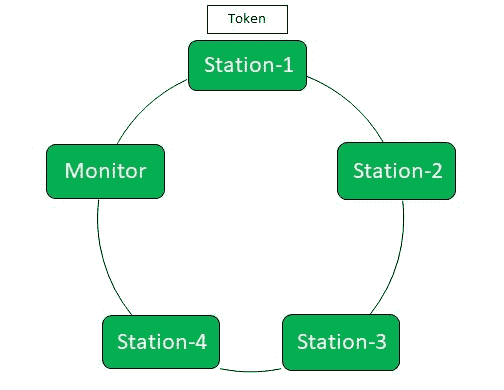
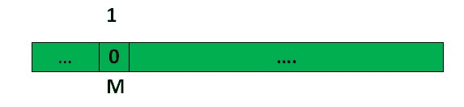

# 令牌环出现问题

> 原文:[https://www.geeksforgeeks.org/problems-with-token-ring/](https://www.geeksforgeeks.org/problems-with-token-ring/)

先决条件–[令牌环帧格式](https://www.geeksforgeeks.org/?p=203832)、[令牌环的效率](https://www.geeksforgeeks.org/?p=192462)、
T5【令牌环协议】是局域网中使用的通信协议。在令牌环协议中，网络拓扑用于定义站点发送的顺序。这些站在一个环中相互连接。它使用一种特殊的三字节帧，称为“令牌”，在环上传输。

1.  **使用的拓扑:**环
2.  **访问控制:**令牌解析
3.  **数据流:**单向
4.  **数据速率:** 4Mbps，6Mbps
5.  **确认:**背驮式确认
6.  **编码:**差分曼彻斯特编码

在本文中，我们将讨论关于令牌环的一些问题。有四种类型的问题:源问题、目标问题、令牌问题和监控问题。这些解释如下。

**1。来源问题:**有两种类型:

*   **(i)孤立包问题:**
    如果一个站关闭，那么源端传输的数据将在环内长时间循环。为了解决这个问题，环内引入了一个特殊的站，称为*监控站*。

数据包中有一个监控位，当监控器遇到数据包时，它会将监控位更改为 **1** ，最初为 **0** ，之后如果监控器遇到监控位为 **1** 的数据包，它会将其丢弃。

这就是我们如何删除孤立数据包。

*   **(ii) Stray Packet Problem:**
    Data get corrupted in such a manner that sender can’t recognize it. Hence it will circulate in the ring for infinite time. To solve this problem, the Monitor compute the **CRC** every time and when the CRC is changed, Monitor is going to remove it.

    **2。目的地问题:**通常有三种目的地问题:

    *   **(i)如果目的地繁忙:**
        如果目的地繁忙或其所有缓冲区已满，则在这种情况下，发送方将再次重新传输数据&。这是对中央处理器和时间的浪费。

    *   **(ii) If the Destination is Down:**
    If the Destination is Down the sender will also re transmit the Data again & again, assuming that destination is Busy.*   **(iii) If there is some error in the Data:**
    In case of corrupted Data, Destination is not going to accept it. It will discard the packet.

    为了在目的地级别解决这些问题，在帧中添加了三位，让发送方知道目的地是否关闭或者数据中是否有错误。
    这三位是 **A** (可用) **C** (已复制)和 **E** (错误)。

    最初所有的位都是 **0** 。如果数据被目的地复制或接受，A & C 位将变为 1。
    如果发送方可用，并且由于数据中的某些错误或所有缓冲区已满而未复制数据，则位 A 将变为 1，位 C 将保持为 0。为了检测数据包中是否有错误或者目的地是否繁忙，我们使用错误位。如果数据中有任何错误，错误位将变为 1，否则将保持为 0。表示目的地正忙。

    |  | **A** (可用) | **C** (已复制) | **E** (错误) |
    | --- | --- | --- | --- |
    | 最初的 | Zero | Zero | Zero |
    | 忙碌的 | one | Zero | Zero |
    | 错误 | one | Zero | one |
    | 复制 | one | one | Zero |

    在确认这些比特后，发送器将有效地工作。

    **3。令牌问题:**令牌可能有三种类型的问题。

    *   **(i) Captured Token Problem:**
        One station holds the Token and send lot of Data without giving the chance to others. It will lead to *Monopolisation*.
        To avoid this problem we have the *maximum Token Holding Time*. A station can hold the Token maximum for that time limit. Hence, there will be no Monopolisation.
    *   **(ii) If Token is lost:**
        It may be possible hat after taking the Token, Station Switched Down. In this case the token will be lost.
        To deal with such situations, it is the responsibility of Monitor to generate new Token. Monitor will wait for *Max Token Return Time* and if the token is not received then it will generate a new Token.
    *   **(iii) If Token got Corrupted:**
        Monitor will assume that this is a disturbance in Ring so, it’ll remove it. and after the Maximum Token Return Time it will generate a new Token.

    **注意:** Token 很小(3 字节)，CRC 是 4 字节，所以为了防止 Token，我们不能使用 CRC。这将增加令牌的大小。
    **4。监控问题:**有两种类型的问题。

    *   **(i)监视器不工作:**
        如果监视器关闭，则整个通信都会关闭。为了克服这一点，监视器向环上的所有系统提供心跳信息。
        此心跳数据包称为活动监控数据包。
        如果监视器关闭，轮询完成，任何一个系统都将像监视器一样工作。*   **(ii)显示器故障:**
    如果显示器被黑客攻击，则称之为显示器故障。这个问题的唯一解决方案是人工干预，即我们必须手动将其恢复到正常状态。