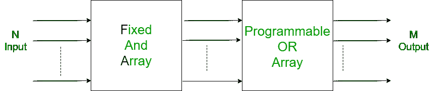

# 舞会全形式

> 原文:[https://www.geeksforgeeks.org/prom-full-form/](https://www.geeksforgeeks.org/prom-full-form/)

**PROM** 代表**可编程只读存储器**

它是一个存储芯片，信息可以像以前一样在上面组成。一旦一个程序被编写到一个可编程只读存储器上，它就一直存在到时间的尽头。一点也不像 Ram，当计算机关闭时，PROMs 会保留它们的内容。一个可编程只读存储器被制作成空白存储器，之后，一个不常见的刻录机被用来对其进行一次合成。PROMS 通常存储特定设备的低级小工具驱动程序，并且只刻录一次。

可编程只读存储器可以是高级存储器的框架，其中每个位的设置由 meld 或反熔丝栓接。这是一种只读存储器。它们里面的信息是不变的，是不能改变的。可编程只读存储器可以是一种只读存储器，在内存建立后会被修改。可编程只读存储器芯片有几种不同的应用，包括手机计数、视频娱乐支架、射频识别标签、恢复性小工具和其他小工具。它们直接暗示了电子设备的编程

#### 可编程只读存储器框图

#### 可编程只读存储器的应用

*   为客户提供特定选择的手机。
*   植入式恢复装置。
*   射频识别标签。
*   高清多媒体接口

#### 可编程只读存储器的特点

*   它有可编程随机存取存储器
*   在 prom 中，“与”门是固定的，“或”门是可编程的
*   舞会是一种记忆
*   它不可重复使用。
*   可编程只读存储器的存储耐久性高
*   很少有功能可以实现(当要实现的工作(即最小项)必须具有所有变量时，它是有效的)。

#### 可编程只读存储器的优点

*   编程可以利用多种程序来完成，并且不依赖于将程序连接到芯片的困难。
*   由于不可能解开这种纠结，所以信息的真实性仍然是凹刻的，而且疏散或修改这种物质是很奇怪的。

#### 可编程只读存储器的缺点

*   可编程只读存储器是指一旦被刻录的数据被识别出错误，就不能被删除或更改。