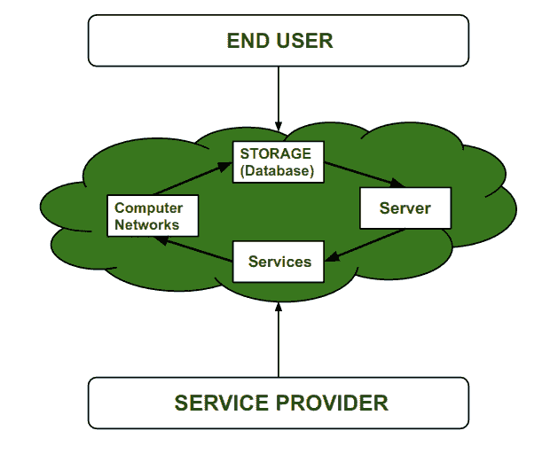

# 云计算中虚拟化的利弊

> 原文:[https://www . geeksforgeeks . org/云计算中虚拟化的利弊/](https://www.geeksforgeeks.org/pros-and-cons-of-virtualization-in-cloud-computing/)

[虚拟化](https://www.geeksforgeeks.org/virtualization-cloud-computing-types/)是对服务器、桌面、存储设备、操作系统等的虚拟版本的创建。

因此，虚拟化是一种允许我们在多个客户和组织之间共享资源或应用程序的单个物理实例的技术。虚拟化通常从一个物理资源创建许多虚拟资源。

*   **主机–**
    虚拟机将要创建的机器称为主机。

*   **来宾机–**
    在主机上创建的虚拟机称为来宾机。

**云计算为什么要虚拟化？**
虚拟化是云计算中非常重要的概念。在云计算中，提供云服务的云供应商拥有服务器、存储设备、网络设备等所有物理资源。而且这些物理服务是由云供应商租用的，这样用户就不用担心这些物理服务了。

但是，为每位客户提供租赁的实物服务成本非常高，因为首先，它会变得非常昂贵，而且用户也不会完全使用这些服务。所以这个问题可以通过虚拟化来解决。这是一种非常酷的方法，不仅可以有效利用物理服务，还可以降低供应商的成本。因此，云供应商可以激活他们的单个大型服务器，并向多个客户提供较小规格的服务器

**云计算中虚拟化的优势:**

*   **高效利用硬件–**
    借助虚拟化，用户和云服务提供商都能高效利用硬件。在这种情况下，用户对物理硬件系统的需求减少，从而降低了成本。从服务提供商的角度来看，他们将使用硬件虚拟化来激活硬件，从而降低供应商向用户提供的硬件需求。在虚拟化之前，公司和组织必须设置他们自己的服务器，这需要额外的空间来放置它们，工程师检查其性能并需要额外的硬件成本，但是在虚拟化的帮助下，所有这些限制都被云供应商消除了，他们提供物理服务而不设置任何物理硬件系统。
*   **可用性随着虚拟化而提高–**
    虚拟化的主要优势之一是它提供了高级功能，允许虚拟实例始终可用。它还能够将虚拟实例从一个虚拟服务器移动到另一个服务器，这在基于服务器的系统中是一项非常繁琐和危险的任务。在数据从一台服务器迁移到另一台服务器的过程中，它确保了数据的安全性。此外，我们可以从任何位置和任何时间从任何设备访问信息。
*   **灾难恢复高效轻松–**
    借助虚拟化，数据恢复、备份、复制变得非常容易。在传统方法中，如果由于某种原因导致服务器系统损坏，那么数据恢复的保证是非常少的。但是，借助虚拟化工具，实时数据备份、恢复和镜像变得非常容易，并保证了零数据丢失率。
*   **虚拟化节能–**
    虚拟化将有助于节能，因为从物理服务器转移到虚拟服务器时，由于每月电力和冷却成本降低，服务器数量减少，这也将节省资金。随着冷却成本的降低，这意味着设备产生的碳也减少了，从而产生新鲜无污染的环境。
*   **快速轻松设置–**
    在传统方法中，设置物理系统和服务器非常耗时。等待装运后，首先成批购买。装运完成后，等待设置，然后再次花时间安装所需的软件等。这将消耗大量时间。但是在虚拟化的帮助下，整个过程可以在很短的时间内完成，从而实现高效的设置。
*   **云迁移变得容易–**
    大部分已经在服务器上投入了大量资金的公司都有向云迁移的疑虑。但是，转向云服务更具成本效益，因为服务器中的所有数据都可以轻松迁移到云服务器中，从而节省维护费用、功耗、冷却成本、服务器维护工程师成本等。

**虚拟化的缺点:**

*   **数据可能面临风险–**
    在共享资源上处理虚拟实例意味着我们的数据托管在第三方资源上，这使我们的数据处于易受攻击的状态。任何黑客都可以攻击我们的数据或试图执行未经授权的访问。如果没有安全解决方案，我们的数据将面临威胁**。**
*   **学习新基础架构–**
    随着组织从服务器转向云。他们需要能够轻松使用云的熟练员工。他们要么雇佣具有相关技能的新的信息技术人员，要么提供关于该技能的培训，这增加了公司的成本。
*   **高初始投资–**
    虚拟化确实会降低公司成本，但云的高初始投资也是事实。它提供许多不需要的服务，当不熟练的组织试图在云中建立时，他们会购买甚至不需要的不必要的服务。