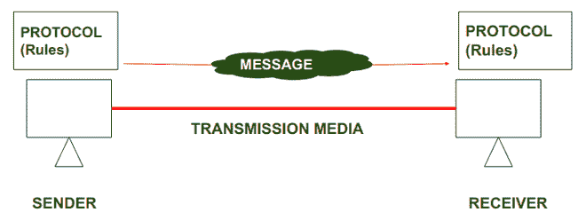

# 计算机网络中的协议和标准

> 原文:[https://www . geesforgeks . org/计算机网络中的协议和标准/](https://www.geeksforgeeks.org/protocol-and-standard-in-computer-networks/)

**协议:**
为了使设备之间的通信成功，应该在系统的发送端和接收端商定一些规则和程序。这些规则和程序被称为协议。不同类型的协议用于不同类型的通信。

在上图中，协议显示为一组规则。使得没有协议**，发送方和接收方之间的通信是不可能的。**

**标准:**

标准是设备之间交换信息所需的一组数据通信规则。重要的是要遵循各种标准组织制定的标准，如电气和电子工程师协会、国际标准化组织、美国国家标准协会等。

**标准类型:**

标准有两种类型:

*   事实标准。
*   法律标准。

**事实标准:**作品的含义*“事实上”*是“按事实”或“按惯例”。
这些是未经任何组织批准的标准，但由于其广泛使用而被采纳为标准。此外，有时这些标准通常由制造商制定。

**比如:**苹果和谷歌是两家公司，对各自不同的产品建立了自己的规则。他们也使用一些相同的标准规则来制造他们的产品。

**法律标准:**单词*“法律上的”*的意思是“通过法律”或“通过规章”。
因此，这些标准已经由官方认可的机构批准，如美国国家标准协会、国际标准化组织、美国电气和电子工程师协会等。如果需要，这些是必须遵循的标准。

**例如:**所有的数据通信标准协议，如 SMTP、TCP、IP、UDP 等。当我们需要他们的时候，遵循同样的原则是很重要的。