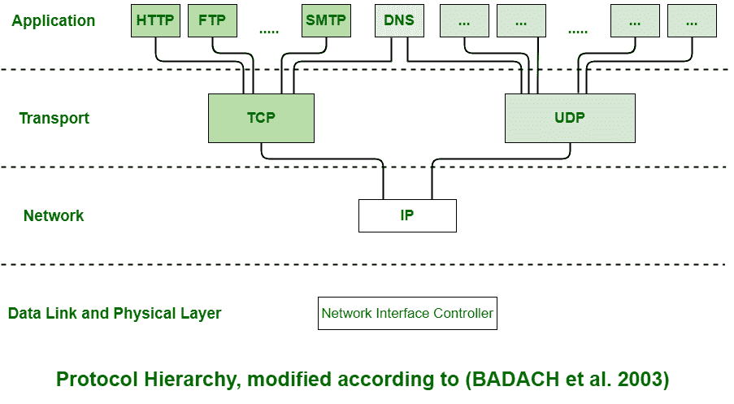
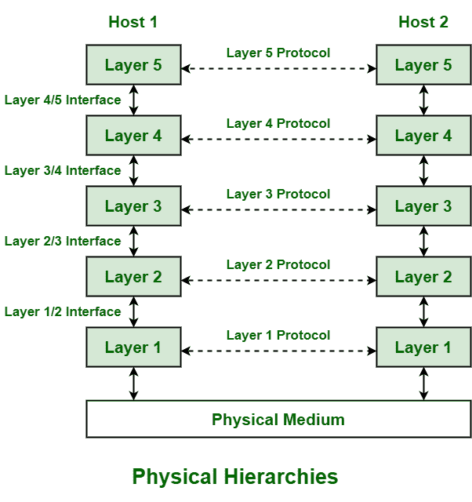

# 计算机网络中的协议层次结构

> 原文:[https://www . geesforgeks . org/protocol-hierarchy-in-computer-network/](https://www.geeksforgeeks.org/protocol-hierarchies-in-computer-network/)

前提–[OSI 模型的层](https://www.geeksforgeeks.org/layers-of-osi-model/)、[ISO-OSI 模型的工作](https://www.geeksforgeeks.org/working-of-iso-osi-model/)、T4【A】**协议**简单定义为一套数据通信的规则和规定。规则基本上是为两台或多台计算机之间通信时的每个步骤和过程定义的。网络需要遵循这些协议才能成功传输数据。所有协议都可以使用硬件、软件或两者的组合来实现。下面给出了协议的三个方面:

*   **语法–**
    用于解释需要发送或接收的数据格式。
*   **语义–**
    它用于解释通常传输的位的每个部分的确切含义。
*   **计时–**
    用于解释数据传输的准确时间以及传输速度。

**协议层次:**
通常，计算机网络由大量硬件和软件组成或包含大量硬件和软件。为了简化网络设计，各种网络被组织和排列成硬件和软件的堆叠层，一个在另一个之上。每层的数量、名称、内容和功能可能会有所不同，并且每个网络之间可能会有所不同。每一层的主要目的仅仅是向更高层提供服务。每一层都有特定的任务或功能。在编程中，这个概念非常常见。网络被组织和安排为不同的层或层次，只是为了减少和最小化网络软件设计的复杂性。

**例:**
下图为五层网络示意图。该图显示了主机 1 和主机 2 之间的通信。数据流从一台主机到另一台主机要经过许多层。虚拟通信用对等层之间的虚线表示。物理通信用相邻层之间的实线箭头表示。通过物理媒介，实际的交流发生了。同一级别的层通常称为对等层。对等体基本上有一套通信协议。每个层之间都有一个接口，用于解释较低层向较高层提供的服务。

**优势:**

*   这些层通常降低了网络间通信的复杂性
*   它增加了网络寿命。
*   它还能高效利用能源。
*   它不需要对网络有全面的了解和理解。