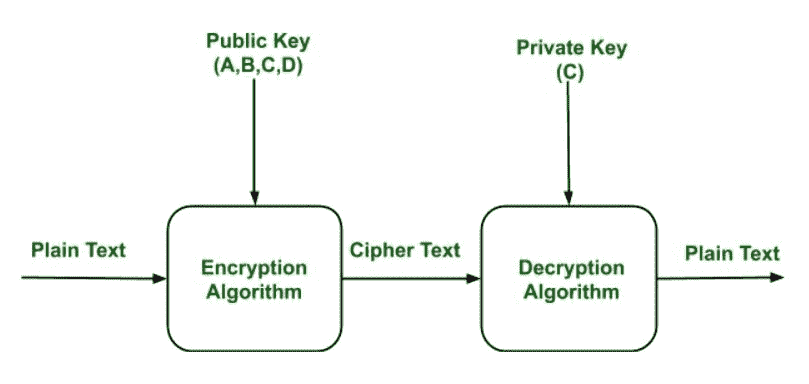

# 公钥加密

> 原文:[https://www.geeksforgeeks.org/public-key-encryption/](https://www.geeksforgeeks.org/public-key-encryption/)

当双方相互通信以传输可理解或可感知的消息时，被称为明文，出于安全目的被转换成明显随机的无意义信息，被称为**密文**。

**加密:**
将明文变为密文的过程称为**加密。**
加密过程由算法和密钥组成。密钥是一个独立于明文的值。

**常规加密的安全性取决于两大因素:**

1.  加密算法
2.  钥匙的秘密

一旦密文产生，它就可以被传输。加密算法将根据当时使用的特定密钥产生不同的输出。改变键会改变算法的输出。
密文一旦产生，就可能被传输。接收后，通过使用解密算法和用于加密的相同密钥，密文可以被转换回原始明文。

**解密:**
将密文改为明文的过程该过程称为**解密**。

**公钥加密:**非对称是一种密码系统，其中加密和解密是使用不同的密钥来执行的——公钥(人人都知道)和私钥(秘密密钥)。这被称为**公钥加密。**

**加密和公钥加密的区别:**

<figure class="table">

| **基础** | **加密** | **公钥加密** |
| *工作所需:* | 

*   Use the same algorithm and the same key for encryption and decryption.
*   The sender and receiver must share the algorithm and key.

 | 

*   One algorithm is used for encryption, and the other algorithm is used for decryption with a pair of keys, one for encryption and the other for decryption.
*   The receiver and the sender must each have a pair of matching keys (different).

 |
| *安全所需:* | 

*   The key must be kept secret.
*   If the key is secret, it is very impossible to decipher the message.
*   The knowledge of algorithm plus ciphertext samples is certainly impractical for determining the key.

 | 

*   One of the two keys must be kept secret.
*   If one of the keys is kept secret, it is very impossible to decipher the message.
*   Knowledge plus one of the keys plus ciphertext samples to determine another key is certainly unrealistic.

 |

**公开加密密钥的特征:**

*   公钥加密很重要，因为仅根据加密算法和加密密钥的知识来确定解密密钥是不可行的。
*   两个密钥(公钥和私钥)中的任何一个都可以用于加密，其他密钥用于解密。
*   由于公钥密码系统，公钥可以自由共享，为用户提供了一种简单方便的加密内容和验证数字签名的方法，私钥可以保密，确保只有私钥的所有者才能解密内容和创建数字签名。
*   最广泛使用的公钥密码系统是[RSA(Rivest–Shamir–Adleman)](https://www.geeksforgeeks.org/rsa-algorithm-cryptography/)。寻找一个复合数的素因子的困难是 RSA 的支柱。

**示例:**
每个用户的公钥都存在于公钥寄存器中。如果乙想向丙发送机密消息，那么乙就用丙的公钥加密消息。当 C 收到来自 B 的消息时，C 可以使用自己的私钥解密它。除了 C 以外，没有其他收件人可以解密消息，因为只有 C 知道 C 的私钥。

**公钥加密的组成部分:**

*   **纯文本:**
    这是可读或可理解的信息。该消息作为输入提供给加密算法。
*   **密文:**
    密文作为加密算法的输出产生。我们不能简单地理解这个信息。
*   **加密算法:**
    加密算法用于将明文转换为密文。
*   **解密算法:**
    它接受密文作为输入和匹配密钥(私钥或公钥)并产生原始纯文本
*   **公钥和私钥:**
    一个密钥(私钥)或公钥(众所周知)用于加密，另一个用于解密

**公钥加密的弱点:**

*   公钥加密容易受到暴力攻击。
*   当用户丢失私钥时，该算法也会失败，这时公钥加密成为最脆弱的算法。
*   公钥加密对中间人攻击也很弱。在这种攻击中，第三方可以中断公钥通信，然后修改公钥。
*   如果在公钥基础设施(公钥基础设施)服务器层次结构中用于证书创建的用户私钥被泄露或意外泄露，那么“中间人攻击”也是可能的，使得任何从属证书完全不安全。这也是公钥加密的弱点。

**公钥加密的应用:**

*   **加密/解密:**
    使用公钥加密可以实现保密性。在这种情况下，纯文本使用接收者公钥加密。这将确保除了接收者私钥之外，没有人能够解密密文。
*   **数字签名:**
    数字签名是为了发件人认证的目的。在这种情况下，发件人使用自己的私钥加密纯文本。此步骤将确保发送方的身份验证，因为接收方只能使用发送方的公钥解密密文。
*   **密钥交换:**
    该算法可用于密钥管理和安全传输数据。

</figure>