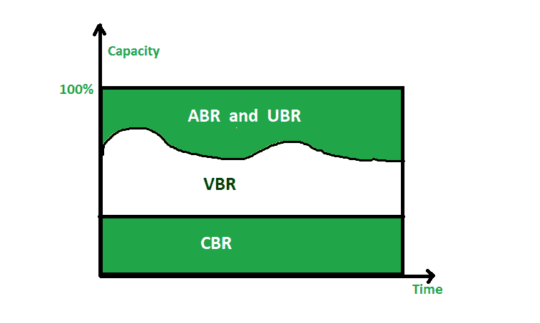

# ATM 中的服务质量

> 原文:[https://www . geeksforgeeks . org/服务质量-atm 中的 QoS/](https://www.geeksforgeeks.org/quality-of-service-qos-in-atm/)

**服务质量(QoS)** 是一种网络技术，可以保证特定连接、路径或流量类型的特定输出水平。服务质量机制提供对带宽质量和可用性的控制，而另一个网络只提供尽力而为的交付。

当网络中存在流量拥塞时，使用服务质量特性，它优先考虑某些实时媒体。在传输实时多媒体时，使用高水平的服务质量来消除延迟和掉线。[异步传输模式(ATM)](https://www.geeksforgeeks.org/asynchronous-transfer-mode-atm-in-computer-network/) 是一种在数据传输中使用一定级别 QoS 的组网技术。

自动柜员机中的服务质量基于以下内容:类别、用户相关属性和网络相关属性。
这些解释如下。

**1。类别:**
自动柜员机论坛定义了四种服务类别，解释如下–

1.  **恒定比特率(CBR)–**
    CBR 主要面向想要实时音频或视频服务的用户。专线提供的服务。比如 T 线类似于 CBR 类服务。
2.  **可变比特率(VBR)–**
    VBR 类分为两个子类–
    *   **(i)实时(VBR-RT) :**
        需要音频和视频等实时传输服务的用户，他们也使用压缩技术来创建可变比特率，他们使用 VBR-RT 服务等级。
    *   **(ii)非实时(VBR-NRT) :**
        不需要实时传输服务但使用压缩技术创建可变比特率的用户，然后使用 VBR-NRT 服务类别。
3.  **可用比特率(ABR)–**
    ABR 用于以特定的最小速率传送信元，如果有更多的网络容量可用，则可以超过最小速率。ABR 非常适合流量大的应用。
4.  **未指定比特率(UBR)–**
    UBR 类，是不保证任何东西的尽力交付服务。



上图显示了不同类别与网络总容量的关系。

**2。用户相关属性:**
ATM 定义了两套属性，用户相关属性是其中之一。它们是定义用户希望以何种速度传输数据的类型属性。这些是在网络和客户签订合同期间协商的。

以下是一些与用户相关的属性

1.  **持续细胞率(SCR)–**
    SCR 是长时间间隔内的平均细胞率。原始电池速率可以小于或大于可控硅值，但平均值必须等于或小于可控硅值。

*   **峰值细胞率(PCR)–**
    PCR 定义为发送者的最大细胞率。只要保持 SCR，用户的小区速率就能达到这个峰值。*   **最小信元速率(MCR)–**
    MCR 定义发送方可接受的最小信元速率。例如，如果 MCR 为 50，000，网络必须保证发送方每秒至少可以发送 50，000 个信元。*   **Cell Variation Delay Tolerance (CVDT) –**
    CVDT is a measure of the variation in cell transmission times. Let’s take an example if value of CVDT is 8 ns, this signifies that difference between minimum and maximum delays in delivering the cells should not be greater then 8 ns.

    **3。网络相关属性**
    用于定义网络不同特征的属性称为网络相关属性。
    以下是一些网络相关属性–

    1.  **细胞丢失率(CLR)–**
        CLR 定义了细胞在传输过程中丢失(或传输过晚而被认为丢失)的比例。例如，发送方发送 100 个信元，其中一个丢失，CLR 为

        ```
        CLR = 1/100
        ```

    2.  **信元传输延迟(CTD)–**
        一个信元从源到目的地的平均传输时间称为信元传输延迟。最大 CTD 和最小 CTD 也被认为是属性。
    3.  **细胞延迟变异(CDV)–**
        CDV 是 CTD 最大值和 CTD 最小值之差。
    4.  **细胞错误率(CER)–**
        CER 定义了错误递送细胞的比例。