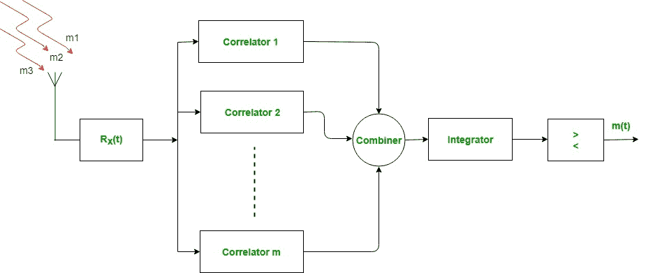

# 瑞克接收机

> 原文:[https://www.geeksforgeeks.org/rake-receiver/](https://www.geeksforgeeks.org/rake-receiver/)

耙子的字典意思是*收集或收集某物*，实际上是一种收集树叶的园艺工具。但就计算机网络而言，它是为了从到达接收端的多条路径收集信号，并专门用于码分多址蜂窝系统。

瑞克接收机是一种无线电接收机，其设计目的是抵消多径衰落的影响。由于来自环境中多个障碍物的反射，无线电信道可以由具有不同振幅、相位或延迟的发射信号的多个副本组成。

rake 接收机可以解决这个问题并将其结合起来。为此，使用了几个被称为“手指”的子接收器。基本瑞克接收机的想法最早是由**普莱斯**和**格林**提出的。

当发射机发射信号时，信号穿过由各种障碍物组成的环境，发射的信号被障碍物反射，并被瑞克接收机从多条路径接收。瑞克接收机然后将它们馈送到不同的指(相关器)。每个接收信号中的延迟被补偿，并被馈送到组合器、积分器和比较器，该组合器、积分器和比较器以不同的适当时间延迟适当地组合它们。

**应用:**
补偿 CDMA 和 W-CDMA 中出现的多径衰落。

**优势:**

*   提高效率和性能。
*   信噪比提高。

**缺点:**

*   整个系统成本增加。
*   使得系统更加复杂。