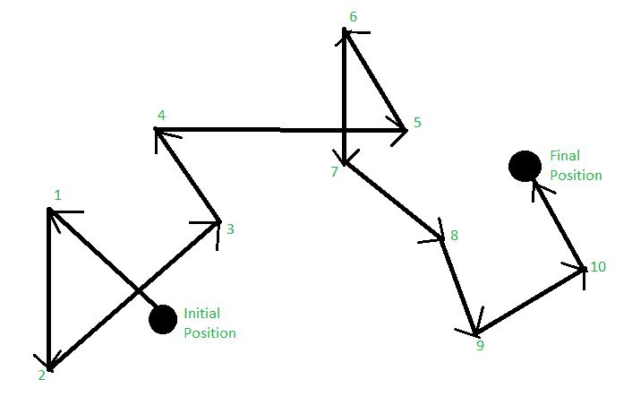

# 随机漫步

> 原文:[https://www.geeksforgeeks.org/random-walk/](https://www.geeksforgeeks.org/random-walk/)

**随机行走**是室内移动模型的一部分。在室内移动模型中，有 3 个部分-随机行走，随机路-点，随机方向。

移动模型是描述移动用户的移动以及他们的位置、速度和加速度如何随时间变化的模型。用户运动的行为或活动可以使用分析和模拟模型来描述。在本主题中，我们将讨论随机漫步模型。

**随机漫步:**
这个模型最早是爱因斯坦在 1926 年描述的。移动节点通过随机选择方向和速度从当前位置移动到新位置，因为它是动态的。它捕捉从 0 到 2pi 的最小速度或最大速度和方向的属性，即 360 度。恒定的时间间隔“t”和距离“d”。

有三种类型的随机漫步- 1D，2D，三维。

*   2D 随机漫步广泛应用于移动领域。
*   这是一种无记忆的移动模式。
*   当前速度与其过去无关。
*   这也会产生不切实际的动作，如突然停车和急转弯。

假设，有一个初始位置，有一个特定的角度，比如说，α，有一些速度，比如说，5 米/秒到达点 1。现在，节点站在点 1，然后以某个特定的角度和速度，从点 1 移动到点 2。然后从点 2 到点 3，以此类推，直到到达最终位置。这整个场景被称为随机漫步。之所以这么叫，是因为在这个方向上，速度和加速度也是动态的。随机游走中的暂停时间为 0。
为什么会这样？因为它不会暂停或停止，节点会立即从一个点移动到另一个点。

它们也有急转弯参见第 5、6、7 点。预测它似乎很难，因为他们突然急转弯，因为它非常陡峭。这是随机漫步的主要缺点。主要优点是使用简单，可以轻松处理复杂边界周围的流。