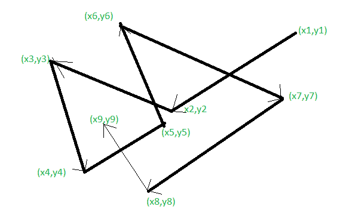

# 随机航路点模型

> 原文:[https://www.geeksforgeeks.org/random-waypoint-model/](https://www.geeksforgeeks.org/random-waypoint-model/)

**随机航路点模型**改变方向和/或速度之间的暂停时间。移动节点从在一个位置停留一段时间开始。这在室内移动模型中被广泛使用。我们可以随机选择目的地和速度(最低速度或最高速度)。

起始点为(x1，y1)。它正朝着特定的方向发展。当它到达(x2，y2)时，它必须再次改变方向，因为从起始点到(x2，y2)然后从(x2，y2)到(x3，y3)的角度不同。速度也可能不同。我们可以说，首先它以 10 米/秒的速度运动，其次它以 5 米/秒的速度运动。因此，对于特定的时间段，即暂停时间，比如说 x 米/秒。它将在该时间内停止，然后将继续进一步处理。这是它的工作方式，直到最终目的地到达，即(x9，y9)。
MN 在模拟区域周围随机分布。此外，邻居 MN 在传输范围内。邻居百分比的高可变性会影响性能。

从上面给出的图中，让每个箭头被称为节点，整体被称为在模拟区域下。数据分布在各个区域。很明显，我们可以将数据从(x7，y7)传输到(x8，y8)，但不能传输到(x5，y5)，因为传输范围是从一个点到另一个点。当我们在波点随机移动时，距离也可以改变。因此，也有可能在某个时间点(x5，y5)接近点(x7，y7)后。

因此，尽管每个节点都是分布式的，但由于其可变性，性能损失的百分比很高。

**初始化问题补救:**

*   长时间执行后保存 MN 的位置。
*   以三角形分布或类似的方式分布 MN。
*   放弃最初 1000 秒的模拟。

**需要记住的两个要点:**

*   稳定的网络–缓慢的网络–长暂停时间(在方向和速度时间上)。
*   不稳定的网络–快速移动网络–更短的暂停时间。