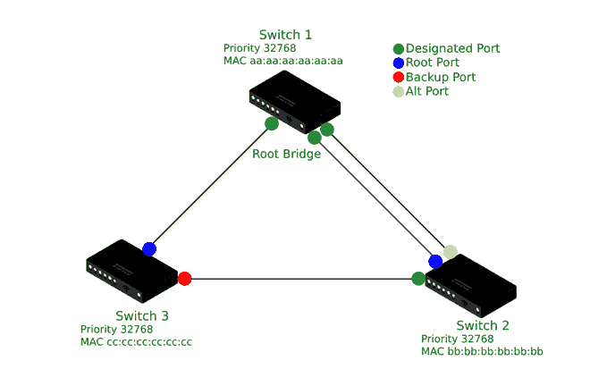

# 快速生成树协议

> 原文:[https://www.geeksforgeeks.org/rapid-spanning-tree-protocol/](https://www.geeksforgeeks.org/rapid-spanning-tree-protocol/)

RSTP 是 STP 的改进和高级版本，STP 是一种第 2 层协议，可防止具有冗余连接的本地网络中的桥接环路和广播风暴。快速生成树协议具有更快的收敛速度，并且向后兼容 STP。为了确保无环路拓扑，快速生成树协议(RSTP)排除了一些只允许任意两台设备之间有一条活动路径的连接。所有这些禁用的连接都可以用作备用路径，以防活动连接失败。快速生成树协议的 IEEE 标准是 802.1w

**STP 与 RSTP 的相似之处:**

*   在 STP 和 RSTP 中，具有最低网桥标识的网桥被选为根网桥。
*   STP 和 RSTP 中的 BPDUs 都在交换机之间转发。
*   根端口和指定端口的选择方式与它们在 STP 中的选择方式相同，它们的功能也与 STP 相同。

### **RSTP 工作**

RSTP 遵循一套严格的规则，根据这些规则，交换机决定在没有任何冗余的情况下转发网络流量的最佳方式。在网络上启用 RSPT 时，生成树算法会自动决定生成树的配置。

生成树的最上层是 RSTP 的根桥，它负责将所有网络拓扑信息发送到网络中的其他交换机。当出现硬件故障或其他拓扑变化时，这一点非常重要。因此，没有任何延迟地建立了最有效的替代路径。

### **RSTP 的港口角色**

RSTP 有四个港口

1.  **根端口:**选择路径开销最好的端口作为根端口。非根桥只能有一个根端口。根端口将数据转发到网桥。
2.  **指定端口:**它是非根端口，用作每个局域网网段的转发端口。
3.  **备份端口:**它是到已经连接了另一个网桥端口的网段的备份路径。这些端口从它们的交换机接收 BPDUs，但是它们保持阻塞状态。
4.  **备用端口:**这是一个备用端口，路径开销不太理想。所有这样的端口都保持阻塞状态。

### **RSTP 港口国**

快速生成树协议支持三种端口状态。

1.  **丢弃:**在丢弃状态下，没有用户数据通过端口发送。
2.  **学习:**在学习状态下，端口会学习 MAC 地址，但不会转发任何帧。
3.  **转发:**在转发状态下，端口可以发送数据并完全运行。

### **港口国工作:**

首先，交换机端口开始处于丢弃状态，丢弃端口不转发任何帧，也不学习媒体访问控制地址，它还监听 BPDUs。备份和备用端口保持丢弃状态。

在 RSTP，如果一个端口被选为根端口或指定端口，则从丢弃状态到学习状态的转换将直接发生。因此，RSTP 不需要倾听状态。学习端口将媒体访问控制地址添加到内容可寻址存储器表中；但是，它不能转发帧。

在下一阶段，学习端口转换到转发状态。转发端口是完全正常的，即它学习媒体访问控制地址，发送和监听数据包，并转发帧。

### **RSTP 的好处:**

*   防止网络环路。
*   防止冗余。
*   更快的收敛。
*   向后兼容 STP。
*   每台交换机都会生成 BPDU，并在 hello 间隔发送出去。
*   开关不需要人工前向延迟定时器。

在 STP 中，BPDUs 仅由根桥生成。如果非根桥从其根端口上的根桥接收到一个 BPDU，它会将该 BPDU 向下游传递给它的邻居。这个收敛过程比较慢，STP 依赖转发延迟计时器来确保无环路环境，这需要很多时间。

在 RSTP，交换机只需与相邻交换机直接握手，这样就可以在拓扑中实现快速同步。这使得端口迅速从丢弃状态变为转发状态，而无需延迟定时器。

### **RSTP 港口类型**

RSTP 有三种港口

1.  **Edge:** 是连接主机的端口。
2.  **根:**是连接到另一台交换机的端口，它到根桥的路径开销最好。
3.  **点对点:**是连接到另一台交换机的端口，有可能成为某个网段的指定端口。

### **RSTP 算法**

RSTP 算法遵循一些一般步骤:

*   **确定根桥:**选择网桥优先级最低的交换机作为根桥。在平局的情况下，基于媒体访问控制地址的平局决胜器用于决定根桥，即具有最低媒体访问控制地址的交换机被选为根桥。
*   **所有根桥接口都处于转发状态:**在转发状态下，所有端口都学习 MAC 地址，也发送和接收数据。
*   **所有非根交换机选择一个根端口:**根据根开销，根端口是到根桥的最佳路径。非根交换机中只有一个根端口。
*   **选择指定端口:**允许这些端口转发流量，根据端口成本进行选择。所有剩余的根桥端口都是指定端口。
*   **其余端口处于阻塞状态:**这些端口不会向其他交换机传递任何数据，也不会学习 MAC 地址。