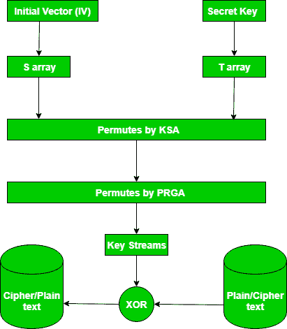

# RC4 加密算法

> 原文:[https://www.geeksforgeeks.org/rc4-encryption-algorithm/](https://www.geeksforgeeks.org/rc4-encryption-algorithm/)

**RC4** 是一种流密码和变长密钥算法。该算法一次加密一个字节(或一次加密更大的单元)。
密钥输入是伪随机位发生器，它产生一个 8 位数字流，在不知道输入密钥的情况下是不可预测的。发生器的输出称为密钥流，使用 X-OR 运算一次将一个字节与明文流密码组合在一起。
**例:**

```
RC4 Encryption 
10011000 ? 01010000 = 11001000    

RC4 Decryption 
11001000 ? 01010000 = 10011000

```

**密钥生成算法–**
1 到 256 字节的可变长度密钥用于初始化 256 字节的状态向量 S，元素为 S[0]到 S[255]。对于加密和解密，通过系统地选择 255 个条目中的一个，从 S 中生成一个字节 k，然后 S 中的条目被再次置换。

1.  **Key-Scheduling Algorithm:**
    **Initialization**: The entries of S are set equal to the values from 0 to 255 in ascending order, a temporary vector T, is created.
    If the length of the key k is 256 bytes, then k is assigned to T. Otherwise, for a key with length(k-len) bytes, the first k-len elements of T as copied from K, and then K is repeated as many times as necessary to fill T. The idea is illustrated as follow:

    ```
    for
        i = 0 to 255 do S[i] = i;
    T[i] = K[i mod k - len];
    ```

    我们使用 T 来产生 S 的初始排列，从 S[0]到 S[255]开始，对于每个 S[i]算法，根据 T[i]规定的方案，用 S 中的另一个字节交换它，但是 S 仍然包含从 0 到 255 的值:

    ```
    j = 0;
    for
        i = 0 to 255 do
        {
            j = (j + S[i] + T[i])mod 256;
            Swap(S[i], S[j]);
        }
    ```

2.  **伪随机生成算法(流生成):**
    向量 S 一旦初始化，就不使用输入键。在该步骤中，对于每个 S[i]算法，根据 S 的当前配置规定的方案，将其与 S 中的另一个字节交换。在到达 S[255]之后，该过程继续，再次从 S[0]开始

    ```
    i, j = 0;
    while (true)
        i = (i + 1)mod 256;
    j = (j + S[i])mod 256;
    Swap(S[i], S[j]);
    t = (S[i] + S[j])mod 256;
    k = S[t];
    ```

3.  **Encrypt using X-Or():**

    

**新闻**:
2015 年 9 月，微软宣布停止在微软 edge 和 internet explorer 11 中使用 RC4。

这个视频给出了一个清晰的 RC4 算法的例子