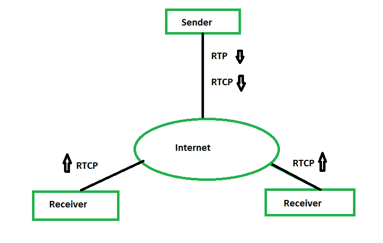

# 实时传输控制协议(RTCP)

> 原文:[https://www . geesforgeks . org/real-time-transport-control-protocol-RTCP/](https://www.geeksforgeeks.org/real-time-transport-control-protocol-rtcp/)

**实时传输协议(RTP)** 只允许这种类型的消息，它将数据从源传送到目的地。但是在某些情况下，我们在会话中需要一些其他类型的消息。这些消息可以控制数据的传输和质量，还允许接收者向一个或多个源发送反馈。为此目的设计的协议，称为**实时传输控制协议(RTCP)** 。

上图展示了 RTP 和 RTCP 协议的流程结构。

RTCP 有五种信息类型，如下所示:

1.  **发送方报告:**
    发送方报告由会议中的活动发送方在固定时间间隔后发送，以报告该时间段内发送的所有 RTP 数据包的传输和接收统计。发件人发送的报告包含绝对时间戳的详细信息，即自 1970 年 1 月 1 日午夜以来经过的秒数。在接收方接收到实时传输协议消息后，绝对时间戳的这些细节有助于接收方进行同步处理。这在音频视频传输中对于查找相对时间戳非常重要。
2.  **接收方报告:**
    被动参与者是那些不发送 RTP 数据包的参与者，对他们使用接收方报告。该报告用于通知发送方和其他接收方服务质量。
3.  **源描述消息:**
    源在固定的时间间隔内发送源描述消息，给出一些关于自身的额外信息。它包含有关来源名称、邮件 ID、联系号码或来源控制器的详细信息。
4.  **再见消息:**
    要关闭一个流，源会发送一种称为再见消息的消息。消息来源用它来宣布离开会议。此消息是对其他来源关于缺少来源的直接声明。它可以用于组合不同的媒体文件。
5.  **特定应用消息:**
    如果我们想使我们的应用程序可扩展，那么 RTCP 允许由 RTC 3611 引入的特定应用 RTCP 数据包。它可以用来扩展应用程序的类型。

**RTCP 的 UDP 端口:**
RTP 使用一个众所周知的 UDP 端口，但是 RTCP 没有。RTCP 使用一个临时港口。它必须是奇数端口。它使用 UDP 端口号，该端口号是下一个较高的奇数，位于为 RTP 选择的端口号之后。