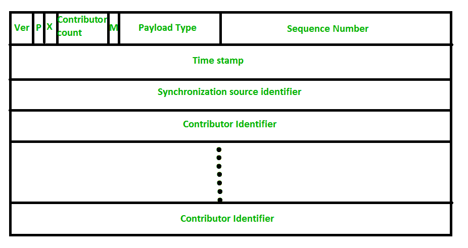
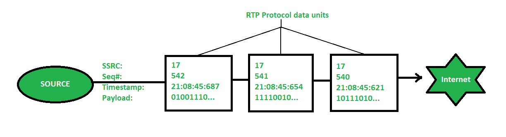

# 实时传输协议(RTP)

> 原文:[https://www . geesforgeks . org/real-time-transport-protocol-RTP/](https://www.geeksforgeeks.org/real-time-transport-protocol-rtp/)

一种协议被设计用来处理互联网的实时流量(如音频和视频)，被称为**实时传输协议(RTP)** 。RTP 必须与 [UDP](https://www.geeksforgeeks.org/user-datagram-protocol-udp/) 一起使用。它没有任何传送机制，如多播或端口号。RTP 支持不同格式的文件，如 MPEG 和 MJPEG。它对数据包延迟非常敏感，对数据包丢失不太敏感。

**RTP 的历史:**
这个协议是由互联网工程任务组(IETF)的四个成员开发的:

1.  南包设计
2.  动词 （verb 的缩写）雅各布森(包设计)
3.  h .学校沟(哥伦比亚大学)
4.  R.弗雷德里克(蓝色涂装系统公司)

RTP 首次出版于 1996 年，被称为 **RFC 1889** 。接下来它于 2003 年以 **RFC 3550** 的名字出版。

**实时传输协议的应用:**

1.  RTP 主要帮助媒体混合、排序和时间戳。
2.  网络电话
3.  互联网视频电话会议。
4.  互联网音频和视频流。

**RTP 报文头格式:**
RTP 报文头格式示意图如下:

RTP 的报头格式非常简单，它涵盖了所有实时应用。标题格式的每个字段的说明如下:

*   **Version :**
    This 2-bit field defines version number. The current version is 2.
    1.  **P–**
        该字段长度为 1 位。如果值为 1，则表示数据包末尾有填充，如果值为 0，则没有填充。
    2.  **X–**
        这个字段的长度也是 1 位。如果该字段的值设置为 1，则它表示数据和基本头之间有额外的扩展头，如果值为 0，则没有额外的扩展头。
    3.  **投稿人计数–**
        该 4 位字段指示投稿人数量。这里贡献者的最大可能数量是 15，因为 4 位字段可以允许从 0 到 15 的数字。
    4.  **M–**
        该字段的长度为 1 位，应用程序将其用作结束标记，以指示其数据的结束。
    5.  **有效载荷类型–**
        该字段长度为 7 位，表示有效载荷的类型。我们列出了一些常见类型的有效载荷的应用。

    

    | 有效载荷类型 | 编码名称 |
    | --- | --- |
    | Zero | 动力系统控制模块微型音频 |
    | one | One thousand and sixteen |
    | Two | G721 音频 |
    | three | GSM 音频 |
    | 5-6 | DV14 音频 |
    | seven | LPC 音频 |
    | eight | PCMA 音频 |
    | nine | G722 音频 |
    | 10-11 | L16 音频 |
    | Fourteen | MPEG 音频 |
    | Fifteen | G728 音频 |
    | Twenty-six | 运动 JPEG |
    | Thirty-one | H.216 |
    | Thirty-two | MPEG1 视频 |
    | Thirty-three | MPEG2 视频 |

    

    有效载荷类型是在实时传输协议报头格式中以 7 位表示的唯一数字。每种有效负载类型都指示音频/视频媒体的特定编码。允许 RTP 源在给定时间发送单个有效载荷类型。该字段主要指定媒体流中使用的编解码器类型。
    例如，如果我们使用“1”作为编码名为 1016 的有效载荷类型，这意味着它将对媒体流使用 FS-1016 语音编码。

    如果我们使用编码名为 H.261 的‘31’有效载荷类型，这意味着它将使用 ITU-T 视频压缩标准。类似地，有效载荷类型的每个数字指示用于音频/视频流的特定编码类型。

    *   **序列号–**
        该字段长度为 16 位。它用于给 RTP 数据包赋予序列号。它有助于测序。第一个数据包的序列号被赋予一个随机数，然后每个下一个数据包的序列号增加 1。该字段主要帮助检查丢失的数据包和顺序不匹配。
    *   **时间戳–**
        该字段的长度为 32 位。用于查找不同 RTP 包的时间之间的关系。第一个数据包的时间戳是随机给定的，然后下一个数据包的时间戳由前一个时间戳和产生当前数据包的第一个字节所用的时间之和给定。1 个时钟周期的值因应用而异。
    *   **同步源标识符–**
        这是一个 32 位字段，用于标识和定义源。该源标识符的值是一个由源自己选择的随机数。这主要有助于解决当两个源以相同的序列号开始时出现的冲突。
    *   **贡献者标识符–**
        这也是一个 32 位字段，用于会话中存在多个源的源标识。混音器源使用同步源标识符，其他剩余源(最多 15 个)使用参与者标识符。

    通过实时传输协议的数据传输如下所示:

    