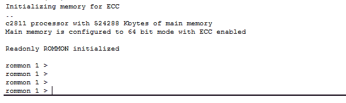
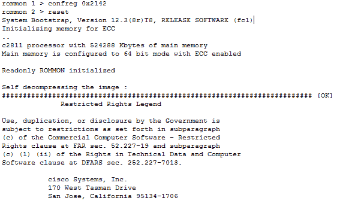
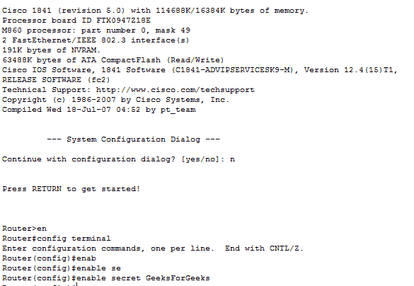
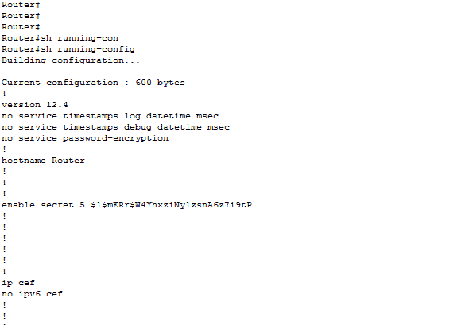

# 在思科路由器中恢复密码

> 原文:[https://www . geesforgeks . org/recovery-password-in-Cisco-routers/](https://www.geeksforgeeks.org/recovering-password-in-cisco-routers/)

有时候，管理员不记得设备的密码，被锁在设备之外。同样的事情也会发生在思科路由器上。无论如何，如果管理员忘记了*启用密码*或*秘密密码*，那么基本上他/她将无法从用户模式进入思科路由器的特权模式。让我们了解一下如何在思科路由器中处理这些情况并恢复密码。

**恢复密码:**
有不同的配置值，告诉路由器从哪个地方加载 IOS，即 NVRAM、flash、rom。默认配置寄存器值为`**0x2102**` ，意味着第 6 个位关闭。路由器将使用默认设置并加载存储在 NVRAM 中的配置(存储在 NVRAM 中的配置称为启动配置)。通过打开第 6位，即将配置寄存器值更改为 0x2142，它将忽略非易失性随机存取存储器的内容。

**恢复密码的基本步骤:**

1.  **Boot the router and interrupt the boot sequence by pressing `**Ctrl + Break**` key combination.**
    
    By pressing this combination, the ROM monitor mode will be seen as shown in the figure. Because we don’t want the old startup-configuration to load as the enable or secret password is not available.

    **注意:**只有通过 COM1 连接到路由器时，`Ctrl+break`组合键才会起作用。

2.  **Now, Change the configuration register value to 0x2142.**

    
    正如已经了解到的，通过打开第 6 位，我们可以忽略启动配置内容。因此，将该值更改为`**0x2142**`，启动配置将被旁路，并将进入设置模式。

3.  **Simply reload the router by typing reset in ROMMON mode.**
    After reloading the router, the router will ask to use setup mode. Answering No to it, we will enter the user mode and by typing enable in user mode, we will enter privilege mode.
4.  **现在，将运行配置(RAM)复制到启动配置(NVRAM)。**
    这意味着现在配置运行在内存中。现在，通过在特权模式和全局配置模式下键入 config terminal 进入全局配置模式，我们可以根据需要更改密码。
    
    进入全局配置模式后，将启用密码更改为 GeeksforGeeks 如图所示。
5.  **将配置寄存器重置为默认值，即 0x2102。**
    这很重要，因为下次我们加载路由器时，配置将从 NVRAM 加载。0x2102(表示 IOS)将从闪存加载，使用速度为 9600 波特(默认配置寄存器值)。
6.  **将配置保存到 NVRAM。**
    更改后的密码当前存储在运行配置(内存)中，因此，将配置移至启动配置(非易失性内存)。通过键入命令，复制 running-config startup-config，将内容移动到 NVRAM。
    

管理员可以通过在用户执行模式下输入`show running-config`来验证密码，如图所示。请记住，密码将是加密形式的(如图所示)。